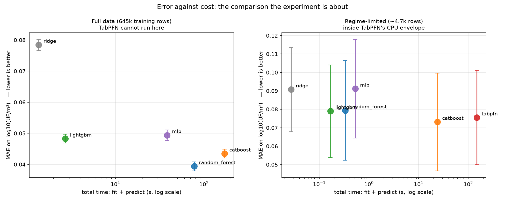
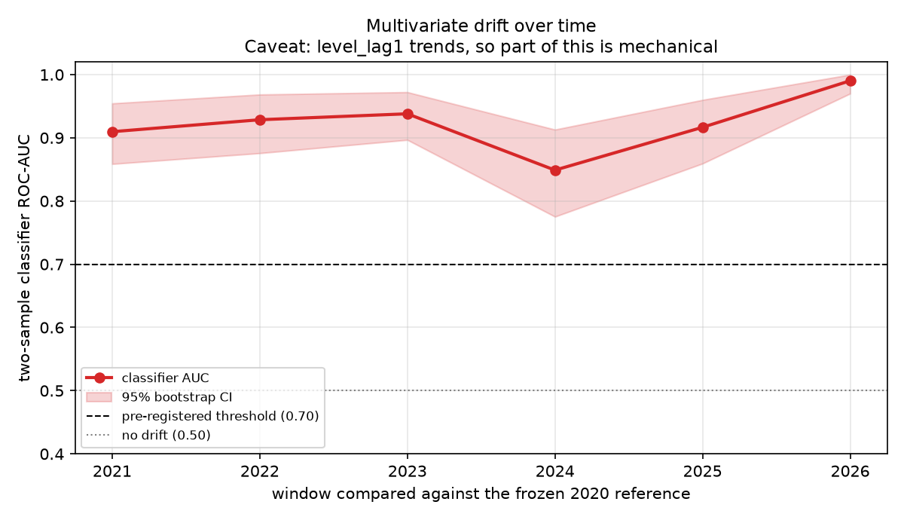
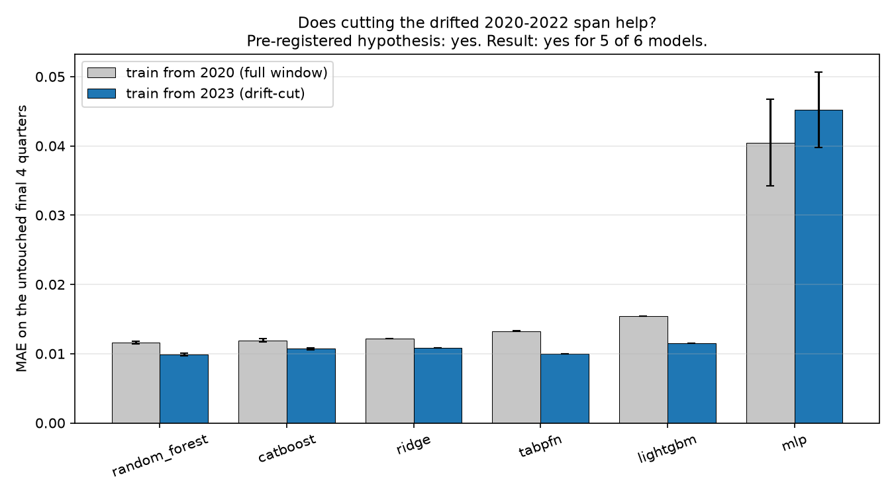
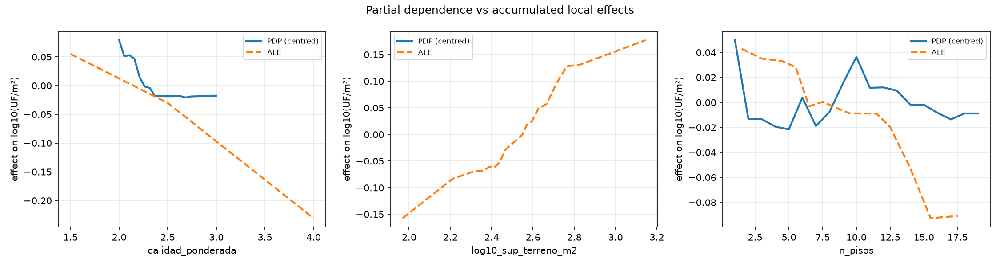

# 02 - Plusvalía: classical ML vs a tabular foundation model

Does a tabular foundation model beat gradient-boosted trees on a real
administrative dataset, and what does the answer cost?

The thesis under test - from Grinsztajn et al. (2022) and Shwartz-Ziv & Armon
(2022) - is that classical methods still win on tabular data, and that the
decisive comparison is **error against cost**, not error alone. TabPFN v2
(Hollmann et al., *Nature* 2025) is the counterexample we test against, not a
foregone conclusion.

**Everything below was decided before any result was seen.** The target,
metrics, win/loss rules, drift cutoff, held-out periods and leakage rules are
frozen in [`CRITERIA.md`](CRITERIA.md), committed before a line of modelling
code existed. Deviations are recorded at the bottom of this file; that file was
never edited.

> **Assessed value is not market price.** The SII's *avalúo fiscal* is an
> administrative tax base set at reavalúo. It is not a transaction price, and
> nothing here estimates what a property would sell for.

## Data

| Source | Role |
|---|---|
| [SII Detalle Catastral](../../datasets/ch/sii_cadastre/) | 905,709 residential *roles* across 8 Región Metropolitana comunas, cycle 2026-1. Cross-sectional arm. |
| [BCCh IPV](../../datasets/ch/bcch_ipv/) | 17 quarterly housing-price series, 2002-2026. Temporal / drift arm. |

Target: **log10 of assessed value per m² built, in UF**. Deflation to UF is
mandatory, not stylistic - nominal pesos carry an inflationary trend that every
model would learn as signal.

Features: built area, land area, construction quality, year, floors, material,
plus comuna. Property type is *derived from evidence*: a rol with zero land
area is an apartment, since a departamento's land sits in the shared *bien
común* rol. Verified in the data - those rows carry a median 8 floors against
1, and 32.1 against 20.5 UF/m².

## Validation

Grouped 5-fold by **manzana** × 5 seeds, on a development split only. A frozen
**10% of manzanas** (1,882) was held out at the start and used exactly once, at
the end. Two arms, because TabPFN cannot see the full dataset:

- **full** - the five classical models on all 645k training rows.
- **regime_limited** - all six on ~4.7k rows, inside TabPFN's CPU ceiling, so
  the comparison is like-for-like rather than against models that saw 170×
  more data.

### Leakage checks, and why they earned their keep

Three rules are enforced before any model is fit, and
[`test_leakage.py`](test_leakage.py) proves each one fires by injecting real
leaks. That test paid for itself immediately: the first empirical detector
**missed the real leak**. `avaluo_exento` equals `avaluo_fiscal_total` in 51%
of rows - and there `exento / area / UF` reconstructs the target with
correlation 1.000000 - but differs in the rest, so a global-R² detector saw
nothing unusual while half the dataset was exactly reconstructible. A
partial-leak detector (the share of rows collapsing onto one constant residual)
now catches it.

## Results

### Error against cost



**Full data** (645k training rows, mean ± sd over 25 fits):

| Model | MAE (log10) | R² | MdAPE | Fit s | Peak MB |
|---|---|---|---|---|---|
| random_forest | **0.0394 ± 0.0015** | 0.893 | 4.7% | 76 | 2,258 |
| catboost | 0.0435 ± 0.0014 | 0.902 | 6.6% | 170 | 676 |
| lightgbm | 0.0483 ± 0.0014 | 0.889 | 7.7% | **2.2** | **88** |
| mlp | 0.0494 ± 0.0017 | 0.883 | 7.8% | 38 | 325 |
| ridge | 0.0784 ± 0.0018 | 0.735 | 13.4% | 1.2 | 334 |

**Regime-limited** (~4.7k rows, all six models):

| Model | MAE (log10) | Fit s | Predict s | Peak MB |
|---|---|---|---|---|
| catboost | 0.0731 ± 0.0265 | 23.8 | 0.004 | 3 |
| tabpfn | 0.0755 ± 0.0256 | 0.86 | **147.5** | 496 |
| lightgbm | 0.0790 ± 0.0251 | 0.16 | 0.008 | 0.1 |
| random_forest | 0.0794 ± 0.0270 | 0.29 | 0.045 | 4 |
| ridge | 0.0907 ± 0.0228 | 0.02 | 0.007 | 0.2 |
| mlp | 0.0911 ± 0.0268 | 0.52 | 0.008 | 0.2 |

### The pre-registered decision: classical methods win

Evaluated on the 20 paired (seed, fold) cells where every model ran:

- best classical (**catboost**): E_c = 0.0702 ± 0.0265
- TabPFN: E_t = 0.0755 ± 0.0256
- pooled spread s = 0.0521; |E_c − E_t| = **0.0053**

Accuracy is statistically indistinguishable, and CatBoost gets there with
**6.1× less total time** and **173× less peak memory**. That triggers rule 2:
**classical methods win**.

The paired subset matters. TabPFN could not run on 5 of 25 folds - whole-manzana
subsampling overshot its 5,000-row CPU ceiling there - and fold-to-fold variance
in this arm is large, so comparing its 20-fold mean against 25-fold means would
compare different folds.

### The finding that actually matters

**TabPFN's binding constraint is not its accuracy - it is that it cannot ingest
the data.** Inside its envelope it is genuinely competitive (second place,
statistically tied with the winner), consistent with what Hollmann et al.
report. But the best any model achieves at its 4.7k-row ceiling is 0.0702,
while a random forest given all 645k rows reaches **0.0394**.

The data TabPFN cannot see is worth roughly **twice** as much as any difference
between architectures. On this problem that is the whole story: a model that
cannot scale to the dataset cannot be deployed on it, whatever its inductive
bias.

Second, the cost asymmetry is structural, not incidental. TabPFN's fit is
trivial (0.86s) because it does no training - the work happens at inference,
where it takes **147s** to predict what CatBoost predicts in 0.004s. For batch
valuation of a national cadastre, that is disqualifying regardless of accuracy.

### Final holdout (used once, at the end)

| Model | MAE | R² | MdAPE | CV MAE |
|---|---|---|---|---|
| random_forest | **0.0399 ± 0.0001** | 0.896 | 4.9% | 0.0394 |
| catboost | 0.0425 ± 0.0002 | 0.912 | 6.7% | 0.0435 |
| lightgbm | 0.0469 ± 0.0003 | 0.899 | 7.6% | 0.0483 |
| mlp | 0.0483 ± 0.0014 | 0.894 | 8.0% | 0.0494 |
| ridge | 0.0768 ± 0.0000 | 0.746 | 12.9% | 0.0784 |

Holdout and cross-validated error agree to within ~0.002 for every model. The
pre-registration held: nothing was overfit to the validation procedure.

TabPFN is absent here, and that absence *is* the result - 806k development rows
against a 5,000-row ceiling.

### Drift




Against a **frozen** 2020 reference window (never rolling):

- **Univariate**: 5-6 of 6 features flagged per window (KS + PSI). The
  Benjamini-Hochberg correction cut significant KS results from 16 to 14 -
  which is exactly why it is applied.
- **Multivariate**: classifier two-sample AUC 0.85-0.99, every window drifted.

**The pre-registered cutoff hypothesis holds.** Training from 2023 beats
training from 2020 on the untouched final 4 quarters, for **5 of 6 models**:

| Model | full 2020 | cut 2023 | Δ |
|---|---|---|---|
| lightgbm | 0.01546 | 0.01147 | +0.0040 |
| tabpfn | 0.01326 | 0.00999 | +0.0033 |
| random_forest | 0.01163 | 0.00987 | +0.0018 |
| ridge | 0.01219 | 0.01083 | +0.0014 |
| catboost | 0.01192 | 0.01070 | +0.0012 |
| mlp | 0.04048 | 0.04523 | **−0.0048** |

### Structure, not just error



SHAP on the best tree model: **`calidad_ponderada` dominates at 0.181 mean
|SHAP|, five times the next feature** (comuna = Las Condes, 0.035). The model
is largely recovering the structure of the SII's own valuation instrument,
whose unit-construction-value tables are indexed by quality - not a market
regularity. (A SHAP value is a local linear attribution, not the model.)

Symbolic regression found a genuinely readable closed form (complexity 5):

```
log10(UF/m²) = 0.6058 / calidad + 1.3136
```

On held-out manzanas, given the same rows and the same numeric-only features,
this **beats a random forest**: MAE 0.0380 vs 0.0745 (0.51×). With few rows and
no locational feature the forest overfits; the two-term formula generalises.

Its limits are equally clear: across quality levels it tracks the ordering well
(Pearson 0.92) but **overpredicts both tails** - 83 UF/m² against a real median
of 56 at *Superior*, 27 against 13.6 at *Inferior* - compressing a 4.1× real
spread into 3.1×. It is a good sketch of the dominant mechanism, not a valuation
model.

## Reproduce

```bash
pip install -r ../../requirements.txt
python run_all.py
```

~4.5 hours on 6 CPU cores, dominated by the CV sweep. Both data sources are
credential-gated, so the raw files are downloaded manually first - see each
dataset's README, and put `TABPFN_TOKEN=<key>` in a local `.env`.

**Do not run anything CPU-heavy alongside it.** Training time is a reported
metric, and contention inflates it. This is not hypothetical: the first sweep
overlapped with TabPFN probes and showed spikes up to 7.5× (LightGBM 14.2s
against a 1.9s median). Those results were discarded and re-run clean; every
fit now records `started_at` so contention is auditable rather than invisible.

## Limitations, and deviations from the pre-registration

`CRITERIA.md` was never edited. These are recorded here instead, as it requires.

1. **The SII bulk download is not "public, no authentication"** as the brief
   assumed. Per-comuna Detalle Catastral sits behind an SII login (RUT + Clave
   Tributaria), so raw files are downloaded manually and parsed locally. The
   loaders never automate a login.
2. **`área homogénea` is unavailable.** It is not in the bulk download (it
   lives in the map viewer's WMS layers), so locational features are comuna
   plus the manzana grouping key. No geocoding was available for
   distance-to-reference-point features either.
3. **TabPFN is capped at 5,000 training rows, not 10,000.** Its inference
   config documents 10k samples / 500 features, but on CPU it additionally
   refuses more than 5,000 "due to slow performance". We respected that rather
   than overriding it, so TabPFN runs in the configuration its authors support
   on this hardware. The regime-limited arm is sized at 5,800 rows accordingly.
4. **TabPFN ran on 20 of 25 regime-limited folds.** Whole-manzana subsampling
   overshot the ceiling on 5 folds. The decision rule is evaluated on the
   paired subset; both figures are reported.
5. **Energy was not measurable** on this machine (no RAPL/NVML exposure on
   Windows) and is recorded as such rather than estimated. FLOPs are derived
   only where the algorithm makes that a meaningful unit (Ridge, MLP); for tree
   ensembles a FLOP count would be theatre.
6. **The IPV export lacks the three non-RM national zones** - the BDE cuadro
   was exported from section 4 (Región Metropolitana) onward. All 8 SII comunas
   are in the RM, so the RM breakdown is the relevant one, but the drift panel
   is 16 series rather than the full 19.
7. **The drift AUC is partly mechanical.** `level_lag1` is a rising index, so a
   classifier can separate windows by level alone. The stationary-by-construction
   `dlog_*` features drift too - and the 2023 detector leans entirely on them -
   so the drift is real, but the AUC alone overstates it.
8. **Interpretability ran on a declared 20k-row subsample**, and symbolic
   regression on 3,433 training rows. PySR is an evolutionary search that needs
   small data by design; exhaustive SHAP over 645k rows of a deep forest buys
   no insight that 20k does not.
9. **Single dataset, single country, single reavalúo cycle.** Nothing here
   establishes that trees beat foundation models in general - only that on this
   problem, at this scale, the cost asymmetry decides it.
