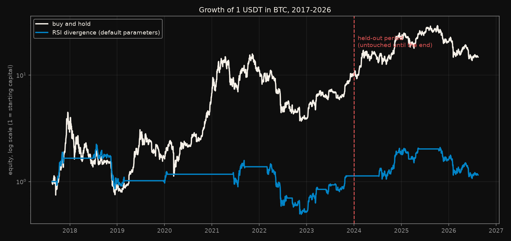
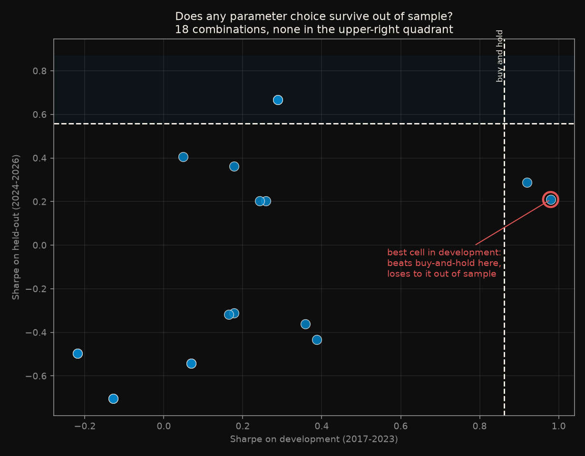
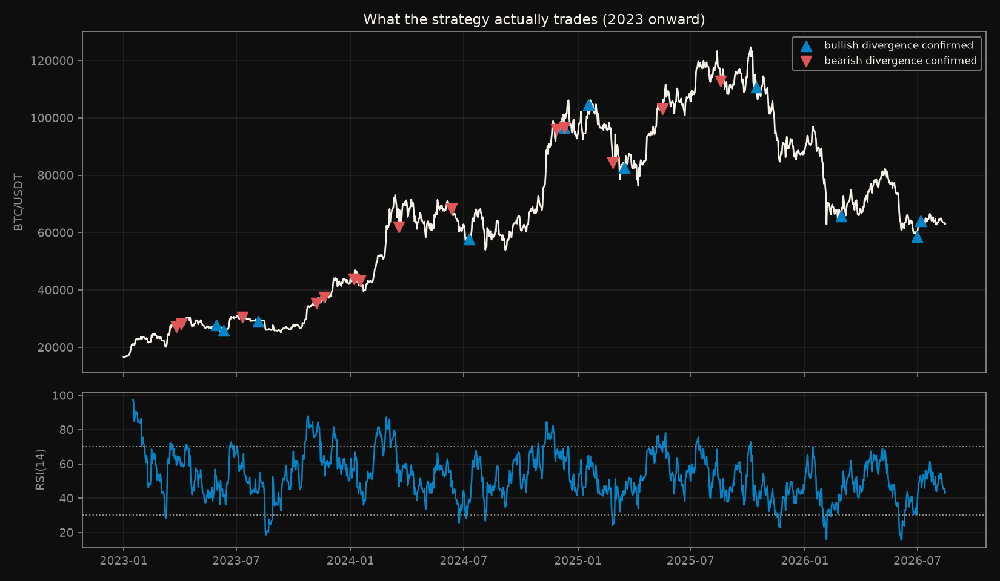
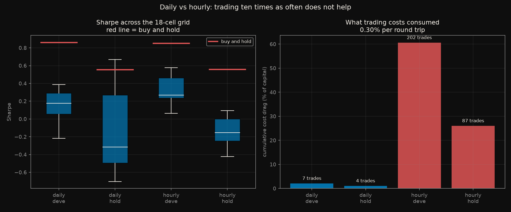

# BTC #1: does RSI divergence beat holding?

*First in a series of small, pre-registered backtests on BTC. Each one asks a
narrow question, freezes the rules before running, and reports what happened.*

---

## Read this first

**This experiment did not produce a positive result. Even if it had, nothing
here is a recommendation to trade it. These are tests, run for the sake of the
method, and in every case each person is responsible for their own trading
decisions.**

A backtest is not a prediction. What follows says what would have happened on
2017-2026 BTC under one set of rules, and nothing at all about what will
happen next.

## What this experiment accounts for

Costs are the difference between a strategy that looks profitable and one that
is. These were fixed before any backtest ran, in
[`CRITERIA.md`](CRITERIA.md):

| | |
|---|---|
| **Exchange fee** | 0.10% per side - Binance spot taker |
| **Slippage** | 0.05% per side |
| **Round trip** | **0.30%** total, charged on entry and on exit |
| **Execution** | A signal at a bar's close is filled at the **next** bar's open, never at the close that generated it |
| **Benchmark** | Buy and hold, charged one entry cost so the comparison is not rigged in its favour |
| **Not modelled** | Leverage, shorts, funding rates, taxes, partial fills, exchange downtime, and any fee tier better than taker |

The strategy is long only: it is either fully in BTC or fully in cash, never
short and never leveraged.

## The goal, and the result

**The goal is to beat buy and hold.** Not to be profitable - a strategy that
makes 20% while BTC makes 50% has lost, because holding was simpler, cheaper
and available to anyone. Buy and hold is the benchmark any active strategy has
to clear before it is worth the effort of running it.

**The result is negative, on both timeframes tested.**

| | Daily | Hourly |
|---|---|---|
| Held-out Sharpe, median of the grid | −0.314 | −0.153 |
| **Buy and hold** | **+0.557** | **+0.559** |
| Held-out return | −33% | −24% |
| **BTC over the same period** | **+49%** | **+49%** |
| Parameter sets beating buy and hold | 2 of 18 | **0 of 18** |

The strategy did not merely underperform. It **lost money over a period in
which BTC rose 49%**.

---

## The question

RSI divergence - price makes a lower low while RSI makes a higher low - is one
of the most widely taught patterns in technical analysis. It propagates
through screenshots of the charts where it worked. This measures it instead.

**Everything was decided before any backtest ran.** The strategy definition,
the costs, the metrics, the parameter grid, the held-out period and the
win/lose rules are frozen in [`CRITERIA.md`](CRITERIA.md).

**Two timeframes were tested, daily and hourly, and both failed.** The hourly
arm was run *after* the daily one had already failed, which makes it a second
test on the same pattern. It was pre-registered separately in
[`CRITERIA-1h.md`](CRITERIA-1h.md) and is disclosed here rather than quietly
folded in - reporting only the arm that happened to look better is the exact
failure mode this experiment exists to demonstrate.

## Setup

| | |
|---|---|
| **Data** | BTC/USDT from Binance's public API, 2017-08-17 → 2026-08-15. Daily: 3,286 candles. Hourly: 78,712 candles |
| **Strategy** | Long only. Enter on confirmed bullish divergence, exit on confirmed bearish |
| **Grid** | RSI period {7,14,21} × pivot window {3,5,8} × max gap {30,60} = 18 cells |
| **Held out** | 2024-01-01 → today, untouched until the final evaluation |
| **Headline statistic** | The **median** across the 18-cell grid, never the best cell |

### The look-ahead trap this is built to avoid

A pivot low at bar `t` is a low that is lower than the bars before it **and the
bars after it**. Those later bars have not happened yet at `t`. Detect pivots
with a centred window, mark the signal at `t`, and the backtest books profits
nobody could have earned. This is the single most common way a divergence
backtest is made to look profitable.

Here a pivot found at `t` is published at `t + window`, and every fill happens
on the following bar's open. [`test_leakage.py`](test_leakage.py) builds the
broken version deliberately and confirms both checks catch it:

```
1. the real implementation passes both checks       PASS
2. pivots published at the pivot bar must be caught PASS
3. entering on the signal bar must be caught        PASS
```

That third test is the load-bearing one. It does not check that the code is
correct in the abstract; it constructs the leak on purpose and asserts the
detector fires.

## Results: the daily arm

The strategy trades rarely - about one signal every four months - so it spends
roughly half the time in cash while BTC compounds.



Median across the 18-cell grid, against buy-and-hold on the same period:

| Period | | Sharpe | Total return | Max drawdown |
|---|---|---|---|---|
| **Development** 2017-2023 | buy and hold | **0.862** | **+891%** | −83.2% |
| | divergence (median) | 0.178 | −16% | −78.6% |
| **Held out** 2024-2026 | buy and hold | **0.557** | **+49%** | −53.0% |
| | divergence (median) | −0.314 | −33% | −49.5% |

One point in its favour, which `CRITERIA.md` required reporting either way:
its maximum drawdown was slightly smaller than buy-and-hold's (−49.5% vs
−53.0%). That is what being in cash half the time buys you. It is not close to
compensating for the return difference.

### The part worth the whole experiment



The best of the 18 parameter combinations on the development period
(RSI 14, pivot window 8, max gap 30) reached a Sharpe of **0.980** - *beating*
buy-and-hold's 0.862. Anyone who tuned parameters on 2017-2023 and reported
the winner would have published a strategy that beats holding BTC.

The same cell on the held-out period: Sharpe **0.210** against buy-and-hold's
0.557, total return **+1%**.

**Zero of 18 cells beat buy-and-hold in both periods.** Two beat it in
development, two beat it out of sample, and they are not the same two. The
correlation between a cell's development Sharpe and its held-out Sharpe is
0.515 - enough to look like signal, nowhere near enough to survive.

This is the mechanism by which technical strategies get "validated": try
enough variants, report the one that worked, and the search itself is
invisible in the write-up.

### What the strategy actually does



## The second test: hourly bars

The daily arm failed, so a second timeframe was tried. That decision is worth
naming, because "try another variant after the first one failed" is precisely
the search this experiment was built to expose. It was therefore
pre-registered before running, in [`CRITERIA-1h.md`](CRITERIA-1h.md), which
records that this is **test 2 of 2**, that a single success out of two tries
would be weak evidence rather than a finding, and what the expected outcome
was:

> Costs bite far harder here. [...] The expectation is therefore **failure by
> a wider margin**, but the outcome is reported whichever way it falls.

Everything except the bar size was held fixed. Only the Sharpe annualisation
changed, from √365 to √8760 - leaving the daily constant in place would have
inflated every hourly ratio by √24 and made the two arms incomparable.

| Period | | Sharpe | Total return | Max drawdown |
|---|---|---|---|---|
| **Development** 2017-2023 | buy and hold | **0.852** | **+893%** | −83.9% |
| | divergence (median) | 0.268 | ±0% | −75.6% |
| **Held out** 2024-2026 | buy and hold | **0.559** | **+49%** | −53.7% |
| | divergence (median) | −0.153 | −24% | −49.9% |

**It failed by a wider margin, exactly as written down beforehand.**



Three things are worse than in the daily arm:

- **No cell beat buy-and-hold in either period.** 0 of 18 in development, 0 of
  18 out of sample. The daily arm at least had two in each.
- **The correlation between a cell's development Sharpe and its held-out
  Sharpe is −0.114** - not weak signal, *no* signal. Daily managed 0.515.
- **The best development cell (Sharpe 0.578) scored −0.410 out of sample**,
  the single worst cell in the grid. Tuning on the past picked the worst
  future.

### The mechanism: costs

Trading more often does not make a pattern more informative, but it does
multiply what it costs to act on. At 0.30% per round trip:

| Arm | Trades (median cell) | Cumulative cost drag | Median return |
|---|---|---|---|
| Daily, development | 7 | 2.1% | −16% |
| Daily, held out | 4 | 1.1% | −33% |
| **Hourly, development** | **202** | **60.6%** | ±0% |
| **Hourly, held out** | 87 | 26.0% | −24% |

Over the development period the hourly strategy paid away **60.6% of capital**
in fees and slippage. That is not a detail of the implementation; it is the
result. A pattern that trades thirty times as often has to be roughly thirty
times better before costs simply to arrive at the same place - and this one is
not better at all. Its hit rate, 52-53%, is what a coin flip looks like.

## Reproduce

```bash
pip install -r ../../requirements.txt

python run_all.py                      # everything: checks, both arms, figures
```

Or step by step:

```bash
python data_loader.py                  # download (cached afterwards)
python test_leakage.py                 # prove the look-ahead checks fire
python run_experiment.py               # daily arm: grid + pre-registered decision
python run_experiment.py --interval 1h # the second, hourly arm
python make_figures.py
```

The daily arm runs in about a minute; the hourly one takes a few. The candles
are committed under `data/`, with a `manifest_*.json` recording when they were
retrieved, so a rerun reproduces these exact numbers without touching the
network.

## Limitations

1. **Few trades on the daily arm.** ~7 in development and ~4 out of sample per
   cell. With samples that small the Sharpe estimates are noisy, and none of
   it would survive a significance test. The hourly arm has the opposite
   problem: 202 and 87 trades give tighter estimates, but of a strategy whose
   costs swamp whatever edge the pattern might carry. Neither result is
   conclusive on its own.
2. **One asset, two timeframes, one variant.** BTC on daily and hourly bars,
   regular divergence, long only. Hidden divergence, other timeframes, other
   assets and combinations with trend filters are all untested - a real
   practitioner would not trade the raw pattern.
   Note the asymmetry this creates: two failures are weak evidence *against*
   the pattern in the same way one success out of two would have been weak
   evidence for it.
3. **No stops or position sizing.** Adding them would help or hurt, but each
   is another free parameter, and the point here was to test the pattern
   rather than a full system built on top of it.
4. **Costs are assumed, not measured.** 0.30% round trip is reasonable for
   liquid BTC spot, but real slippage varies with size and volatility, and fee
   tiers differ per account.
5. **The regime dominates.** 2017-2026 BTC rose enormously; any strategy that
   sits in cash half the time starts far behind. That is a fact about the
   period, and it is precisely why buy-and-hold is the benchmark.
6. **Survivorship in the grid.** Eighteen cells is a small search. A larger
   search would very likely produce a cell that beats buy-and-hold in both
   periods by chance alone - which would say more about the search than the
   strategy.

## Deviations from the pre-registration

None to `CRITERIA.md`. It was written first and not edited, including after
the result was known.

One addition, disclosed rather than hidden: after the daily arm failed, a
second timeframe was run. `CRITERIA.md` was **not** amended to cover it - a
separate pre-registration, [`CRITERIA-1h.md`](CRITERIA-1h.md), was written
before that run, and it states in advance that this is a second test and how a
success would have had to be discounted. Editing the original criteria to make
the new arm look pre-planned would have been the easy version of the same
fraud this experiment is about.

Two data-handling notes, both fixed before the hourly grid ran:

- The validator originally rejected any gap in the series. Nine years of
  hourly candles contain 28 gaps totalling 0.06% of bars, from Binance
  maintenance windows. It now reports gaps always and aborts only above 1%
  missing.
- `PERIODS_PER_YEAR` is set from the timeframe rather than hard-coded, so the
  hourly Sharpe is annualised by √8760.

### Why there is no `config.yaml`

Other experiments in this repository keep their parameters in `config.yaml`.
This one keeps them in code and in `CRITERIA.md` on purpose: the parameters
are the pre-registration. A configuration file that can be edited between runs
is a way to change the rules after seeing the results, which is the thing the
whole design exists to prevent.

## What would change the conclusion

Stated in advance, so it is not decided after the fact: a result that beat
buy-and-hold on median **and** 25th-percentile Sharpe out of sample, on an arm
that was pre-registered before running, would overturn the finding for that
arm only - and would still be reported alongside the count of arms tried.
