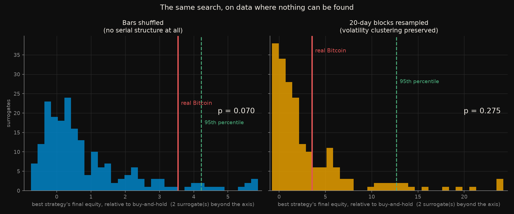
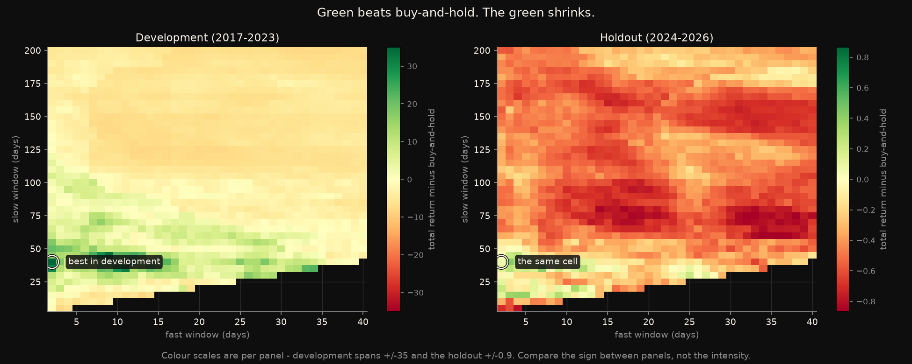
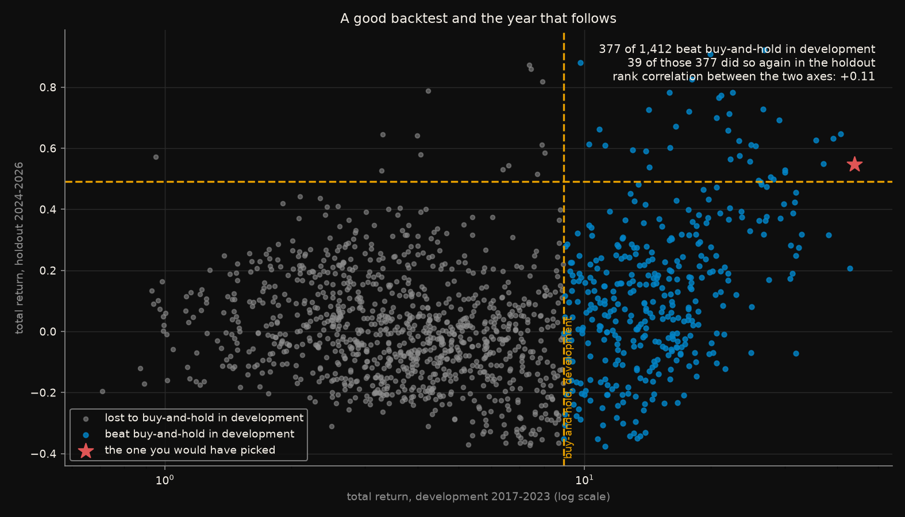

# How good does the best of 1,412 strategies look when none of them work?

## Read this first

**This experiment produced no positive result, and even if it had, it would
not be a recommendation.** These are tests of method, not trading advice.
Nothing here is a strategy anybody should run, a search like this one is
shown below to be very good at manufacturing results that do not survive, and
in every case each user is responsible for their own trading decisions.

## The question

[`btc-01-rsi-divergence`](../btc-01-rsi-divergence/) tested 18 parameter sets
of a widely taught chart pattern. The best of them beat buy-and-hold on the
development period and then **lost 33% over a holdout in which Bitcoin rose
49%.** The usual word for that is "overfitting", which names the outcome
without measuring it.

This measures it:

> Run a search of the same shape on price data where **no timing rule can
> possibly work**, because the order of the bars has been destroyed. How good
> does the best strategy look there?

If the answer is "about as good as the best one looked on real Bitcoin", the
search explains the backtest and no market behaviour needs to be invoked.

Rules frozen in [`CRITERIA.md`](CRITERIA.md) before any strategy was run.
Six predictions; **four held and two failed**, and both failures are more
interesting than the passes.

## What this experiment accounts for

Identical to `btc-01`, so the two are directly comparable. `run_all.py`
checks that the cost constants have not drifted apart, and `test_search.py`
asserts this backtester reproduces btc-01's published buy-and-hold return to
six decimal places.

| | |
|---|---|
| **Exchange fees** | 0.10% per side - Binance spot taker |
| **Slippage** | 0.05% per side |
| **Round trip** | **0.30%**, charged on every change of position |
| **Execution** | signals act on the **next** bar; entries and exits fill at that bar's open |
| **Benchmark** | buy-and-hold, charged one entry, so the comparison is not rigged in its favour |
| **Not modelled** | funding, borrow, taxes, exchange downtime, partial fills, order-book depth, and any slippage beyond the flat 0.05% |

## The goal, and the result

The goal is the same as `btc-01`'s: **beat buy-and-hold after costs.**
Bitcoin returned **890.7%** over the development period and **49.1%** over the
holdout.

**The result is negative, and negative in an instructive way.** The best of
1,412 strategies turned buy-and-hold's 891% into 4,393% in development - and
an identical search on shuffled bars, where no strategy can have an edge,
produces a result at least that good **7% of the time**. The headline number
is inside what searching explains.

## The short version

| | development 2017-2023 | holdout 2024-2026 |
|---|---|---|
| buy-and-hold | **890.7%** | **49.1%** |
| best strategy in development (fast 2, slow 40) | 4,393.4% | 54.8% |
| median of all 1,412 strategies | 479.5% | **1.5%** |
| strategies beating buy-and-hold | 377 of 1,412 | 53 of 1,412 |

Two numbers carry most of the story. The **median strategy returned 1.5% over
a holdout in which simply holding returned 49.1%** - the typical outcome of
this family is not a small loss against the benchmark, it is missing almost
the entire move. And of the 377 strategies that beat buy-and-hold in
development, **39 did so again**: 10.3%.

## What each figure shows

### The same search, on data where nothing can be found



*The distribution of the best strategy's result across 200 surrogate price
series, with the real Bitcoin result marked in red. Left: bars shuffled into
a random order. Right: 20-day blocks resampled, which keeps volatility
clustering alive.*

This is the figure the experiment exists for. Each surrogate is the same
asset - the same bars, the same total move - in an order that carries no
information. The identical 1,412-strategy search runs on each.

**On shuffled bars, the median best strategy still ends with 1.41 times
buy-and-hold's equity, and the top 5% of surrogates reach 5.22 times.** Real
Bitcoin's best reached 4.54 times, which lands at **p = 0.070** - below the
95th percentile, and not significant at the 5% level the pre-registration
named.

The right panel is the harder null. Keeping volatility clustering makes the
search *more* productive, not less: the median best surrogate strategy
reaches 2.41 times buy-and-hold and the real result falls to **p = 0.275**.
Realistic price behaviour with no exploitable timing structure at all
generates better-looking backtests than shuffled noise does.

### Where the optimum was, and where it went



*Every cell is one (fast, slow) pair, coloured by its total return minus
buy-and-hold's over that period. Green beats holding; red loses to it. The
circle is the cell that was best in development, marked in the same place on
both panels.*

The left panel is what a parameter sweep looks like when it works. There is a
coherent green region - fast windows under about 15 days against slow windows
around 40 to 75 - not a scatter of isolated lucky cells. A practitioner
would reasonably conclude the region is real and pick from inside it.

The right panel is the same grid two years later. **The green is almost
gone.** A thin band survives at the very bottom left, which is where the
development optimum was; everything else is red, much of it deep red - those
strategies did not merely underperform, they sat out most of a 49% move.

Colour scales are per panel and the caption in the figure says so. Compare
the sign between panels, not the intensity.

### A good backtest and the year that follows



*Every strategy plotted twice: what it returned in development against what
it returned in the holdout. The dashed lines are buy-and-hold in each period,
so the top-right quadrant is the strategies that beat it both times.*

The rank correlation between the two axes is **+0.11**. A strategy's
development ranking carries almost no information about its holdout ranking,
which is the practical form of the result: the number a backtest reports is
not an estimate of next year's number.

It is not quite nothing, though, and the honest version of this section says
so. Under independence you would expect 14 strategies in the top-right
quadrant; there are **39**. The 50 best strategies in development returned a
median of 44.0% in the holdout against 1.5% for the whole population. **The
top of the ranking really was better than the middle.** It was just not
better than doing nothing, which returned 49.1%.

## What was predicted, and what happened

| | Prediction, written before any strategy was run | Outcome |
|---|---|---|
| **P1** | This backtester reproduces btc-01's buy-and-hold on both periods | **passed** - to six decimal places |
| **P2** | On shuffled bars, the best strategy at least doubles buy-and-hold's equity in ≥90% of surrogates | **FAILED** - it did so in 32% |
| **P3** | The real best is not above the shuffle null's 95th percentile | **passed** - p = 0.070 |
| **P4** | The development-best strategy's holdout return is below the median strategy's | **FAILED** - 54.8% against 1.5% |
| **P5** | Fewer than half of development winners win in the holdout | **passed** - 10.3% |
| **P6** | The count of development winners falls inside the null's central 90% | **passed** - 377, against [0, 765] |

**P2 failed because I overestimated the search.** The prediction assumed
1,412 strategies are 1,412 chances; they are not. Neighbouring parameter
pairs produce nearly identical positions, so the effective number of
independent tries is far smaller, and being out of the market during a
strongly rising asset is expensive enough that the median surrogate's best
strategy only reaches 1.41x. The search is powerful, and it is not as
powerful as the pre-registration assumed.

**P4 failed and is the most useful negative here.** The winner's curse did
not bite: the strategy you would actually have picked, fast 2 against slow
40, returned 54.8% in the holdout and beat buy-and-hold's 49.1%. One data
point, and 53 of 1,412 strategies beat buy-and-hold out of sample, so a top
pick landing among them is not extraordinary - but it did happen, and the
tidier story in which the backtest winner always collapses is not what this
data shows. **The failure mode is subtler than "the winner blows up": it is
that 1,035 of the 1,412 strategies you did not pick would have missed the
move, and nothing in the development results told you which group you were
choosing from.**

P6 passing is worth reading carefully. The null's count of winners spans
[0, 765] - it is enormously wide, because whether crossovers work at all on a
given surrogate is itself a coin flip. 377 is unremarkable against that.

## Full results

1,412 moving-average crossovers: fast from 2 to 40 days, slow every 5 days
from 5 to 200, long or flat, next-bar execution, 0.30% round trip.

| | shuffle null | block null | real Bitcoin |
|---|---|---|---|
| best strategy's equity vs buy-and-hold, median | 1.41x | 2.41x | - |
| ... 95th percentile | 5.22x | 13.68x | - |
| ... observed | - | - | **4.54x** |
| p-value | **0.070** | **0.275** | - |
| surrogates where the best at least doubled buy-and-hold | 32% | 56% | - |
| strategies beating buy-and-hold, median | 10 | 77.5 | **377** |
| ... central 90% | [0, 765] | [0, 1,319] | - |

Persistence from development into the holdout:

| | |
|---|---|
| rank correlation of returns between the two periods | **+0.11** |
| strategies beating buy-and-hold in development | 377 |
| ... and in the holdout as well | 39 |
| ... expected if the two were independent | 14 |
| median holdout return, top 50 by development return | 44.0% |
| median holdout return, all 1,412 | 1.5% |
| buy-and-hold, holdout | 49.1% |
| best strategy in the holdout | fast 3, slow 40 - which ranked 29th of 1,412 in development |

## Reproduce

```bash
pip install -r ../../requirements.txt
python ../btc-01-rsi-divergence/data_loader.py   # bars, cached and checksummed
python run_all.py
```

About two minutes: the whole 1,412-strategy grid runs in 0.2 seconds because
moving averages come from a cumulative sum and the grid is evaluated as one
array operation, so 400 surrogates cost about 90 seconds.

`run_all.py` checks `config.yaml` against the frozen values, checks that the
cost constants have not drifted from btc-01's, and runs the implementation
checks before anything else.

Two of those checks are worth reading:

- **it reproduces btc-01's buy-and-hold to six decimal places.** Without
  that, this experiment and btc-01 would be measuring different things and
  the comparison between them - the entire reason this exists - would be
  meaningless.
- **it builds the look-ahead version deliberately.** Trading on today's
  signal today rather than tomorrow helps 86.7% of the 1,412 strategies and
  lifts the median return from 4.79 to 7.30. That is the single most common
  way a backtest becomes fiction, and it is measured here rather than merely
  guarded against.

## Premises and warnings

**One family, one asset, one bar size.** Moving-average crossovers on daily
BTCUSDT. Nothing here generalises to other rules, other markets, or intraday
data, and a family with genuine edge would look different on these tests.

**A p-value of 0.070 is not proof of absence.** It says the observed result
is not distinguishable from search luck at the level the pre-registration
named. It does not say no edge exists, and with 200 surrogates the p-value
itself has a standard error of about 0.018.

**Long or flat, never short.** Bitcoin rose enormously over the development
period, which makes buy-and-hold a hard benchmark and makes time out of the
market expensive. That is deliberate - it is the benchmark a real holder
faces - but it does mean this test is unkind to any rule that reduces
exposure, independently of whether the rule times anything well.

**The nulls destroy structure that may be real.** Momentum and volatility
clustering exist in real prices. `shuffle` removes both, `block` keeps the
second. If the crossover family exploits genuine momentum, `shuffle`
understates what is achievable - and `block`, the more realistic null, makes
the real result *less* remarkable rather than more.

**The holdout has been looked at now.** It was untouched until the numbers in
this file were produced, and it is no longer a clean holdout for any future
BTC experiment in this series. A `btc-03` would need a new one.

**The benchmark gets one bar the strategies cannot.** btc-01's backtester
assigns a return of zero to the first bar whatever the position, while its
buy-and-hold captures that bar's open-to-close move - 0.55% here. It is
reproduced rather than corrected, because correcting it would break
comparability with btc-01, and it favours the benchmark, which is the
conservative direction.

**200 surrogates is enough for two decimal places and not three.** The
p-values are 0.070 and 0.275; treat them as "about 7%" and "about 28%".

## Deviations from the pre-registration

`CRITERIA.md` was not edited after freezing.

**The grid is 1,412 strategies, not "roughly 1,500".** `CRITERIA.md`
estimated the size of the fast × slow grid before enumerating it. The
parameters it specified - fast 2 to 40, slow every 5 up to 200, slow greater
than fast - produce exactly 1,412 pairs. The parameters are as frozen; only
the estimate of their count was loose.

**Buy-and-hold is recomputed for every surrogate.** `CRITERIA.md` says
shuffling leaves buy-and-hold's total return "identical on every surrogate".
That is true of the price path and not quite true of the benchmark, because
whichever bar lands first carries the single entry cost and its own
open-to-close move. Measured across 30 surrogates the spread is 0.49% of the
total return. Rather than rely on the claim, the benchmark is recomputed per
surrogate everywhere it is used.

**Two implementation-check thresholds were rewritten after they failed, and
neither is a pre-registered quantity.** The first asserted that an
always-long position exactly equals buy-and-hold; it does not, for the
bar-zero reason above, and running btc-01's own code confirms the same
8.852828 against 8.907474 - so the check now asserts equality up to that
term and reports it. The second asserted look-ahead would help 90% of
strategies; it helps 86.7%. Guessing again would have been worse than
changing the question, so the check now measures the effect against the null
it is actually testing - 50%, meaning the shift makes no difference - and
finds it 28 standard deviations away.
