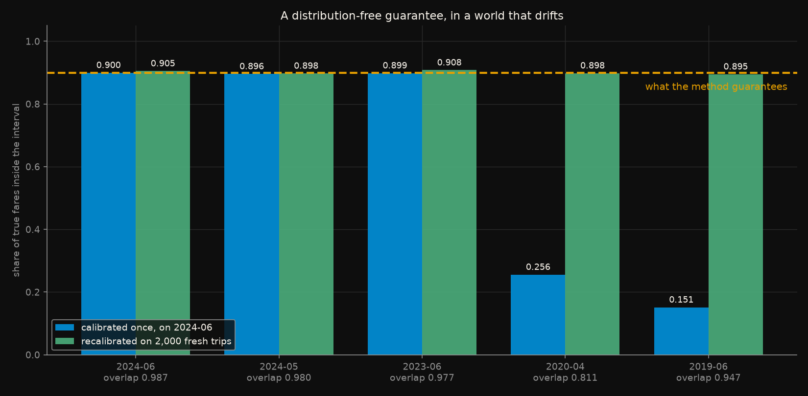
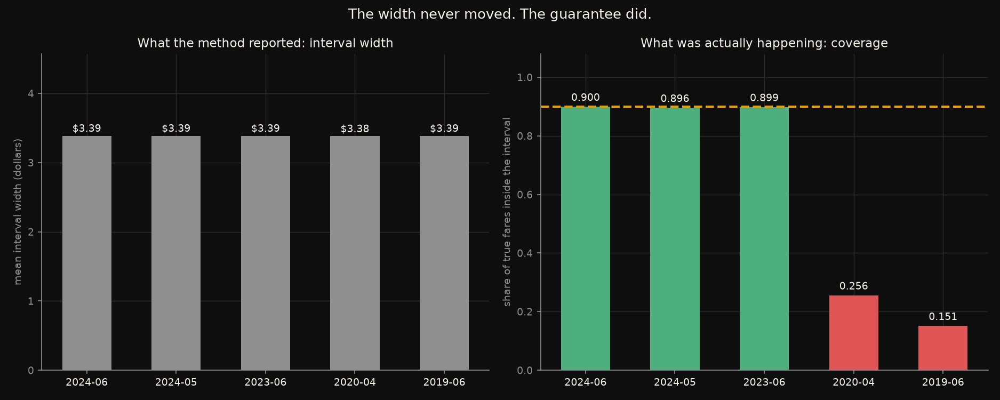
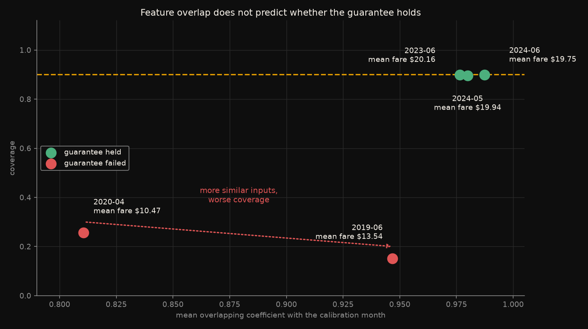

# A distribution-free guarantee, in a world that drifts

Split conformal prediction promises something unusually strong: for a chosen
α, its intervals cover the true value at least 1−α of the time, **whatever the
distribution and whatever the model**, exactly, in finite samples.

It asks one thing in return: that the calibration data and the data being
predicted be exchangeable. Production data is not exchangeable with last
quarter's calibration set, and everyone knows it. **This measures how fast the
guarantee decays when that is false**, on NYC taxi months with drift that was
already measured in [`drift-detector-overlap`](../drift-detector-overlap/).

Rules frozen in [`CRITERIA.md`](CRITERIA.md) before any interval was built.
Five predictions; **four held and one failed**, and the one that failed is the
most useful result here.

## The short version

Calibrated once on June 2024 and never touched again, the same system
delivered:

| Month | Promised | Delivered | Mean fare |
|---|---|---|---|
| 2024-06 (held out) | 90% | **90.0%** | $19.75 |
| 2024-05 | 90% | 89.6% | $19.94 |
| 2023-06 | 90% | 89.9% | $20.16 |
| 2020-04 | 90% | **25.6%** | $10.47 |
| 2019-06 | 90% | **15.1%** | $13.54 |

**On June 2019 the interval that guaranteed 90% coverage delivered 15%.** A
shortfall of 75 points, from a method whose selling point is that its
guarantee needs no assumptions about the data.

The assumption it does need had quietly stopped being true, and nothing in the
output said so.

## What each figure shows

### Promised against delivered



*Blue: calibrated once on 2024-06. Green: recalibrated on 2,000 fresh trips
from the month being predicted. The dashed line is the 90% the method
guarantees. The overlap under each month is its feature-distribution distance
from the calibration month.*

Three months are fine and two are catastrophic. The remedy works completely:
**2,000 labelled trips from the target month restore coverage to 90% every
time**, including on the month where it had fallen to 15%. That is the
practical conclusion - the method is not broken, it is simply making a promise
about a population, and the population has to be the one you are in.

### The failure is silent



*Left: the interval width the method reported. Right: the coverage it actually
achieved. Same months, same order.*

This is the figure the experiment exists for. The width is a property of the
calibration set, so it **cannot** move when the world does: $3.39, $3.39,
$3.39, $3.38, $3.39. Coverage went 90%, 90%, 90%, 26%, 15%.

A monitor watching interval widths would have seen a flat line through the
entire collapse. Nothing the method emits changes as its guarantee stops
holding - there is no widening, no warning, no diagnostic. The output of a
conformal predictor whose assumption has failed is indistinguishable from the
output of one that is working.

### Feature overlap does not predict it



*Coverage against the mean overlapping coefficient with the calibration
month - the quantity a standard drift monitor watches.*

**P2 predicted coverage would fall monotonically as feature overlap fell. It
does not.** June 2019 has **better** feature overlap than April 2020 (0.947
against 0.811) and **worse** coverage (15% against 26%). A drift detector
watching the inputs would have ranked these two backwards and flagged the
wrong month as the emergency.

The reason is in the last column of the table: mean fare $19.75 at calibration
against $13.54 in 2019. Trip distances, durations and pickup hours barely
moved between 2019 and 2024 - people take similar taxi rides. **What changed
was the price of a ride**, which is the relationship between the features and
the target, not the features themselves.

That is concept shift, and it is exactly the category an input-watching
detector is blind to by construction. Here it is, measured: the two
experiments in this repository that watch inputs would both have missed the
worse of these two failures.

## What was predicted, and what happened

| | Prediction, written before building any interval | Outcome |
|---|---|---|
| **P1** | Coverage within 1 point of 90% on held-out calibration-month data | **passed** - 0.8997 |
| **P2** | Coverage falls monotonically as feature overlap falls | **FAILED** |
| **P3** | Coverage on 2019-06 drops below 85% | **passed** - 0.151 |
| **P4** | Interval width does not change while coverage does | **passed** - $3.38-3.39 throughout |
| **P5** | 2,000 fresh trips restore coverage to within 1 point of 90% | **passed** - 0.895 to 0.908 |

P1 was checked before anything else and the run is set to abort if it fails.
A conformal implementation that cannot cover its own held-out data is wrong,
and every other number would have been measuring the bug.

## Full results

α = 0.1, so the target is 90%. Model fitted once on 100,000 trips from
2024-06, half-width set on a disjoint 50,000, evaluated on 50,000 per month.

| Month | Overlap | Coverage | Width | Coverage after recalibrating | Width after |
|---|---|---|---|---|---|
| 2024-06 | 0.987 | 0.8997 | $3.39 | 0.9052 | $3.55 |
| 2024-05 | 0.980 | 0.8960 | $3.39 | 0.8976 | $3.44 |
| 2023-06 | 0.977 | 0.8986 | $3.39 | 0.9081 | $3.64 |
| 2020-04 | 0.811 | **0.2558** | $3.38 | 0.8984 | **$15.55** |
| 2019-06 | 0.947 | **0.1515** | $3.39 | 0.8950 | **$18.55** |

The last column is the honest price. Restoring 90% coverage on 2019 data with
a 2024 model needs intervals **5.5 times wider** - $18.55 instead of $3.39. The
guarantee can always be recovered; what cannot be recovered is the usefulness
of an interval that wide. A conformal predictor under drift does not have to
choose between valid and useful, but it does have to admit which one it is
giving you.

## Reproduce

```bash
pip install -r ../../requirements.txt
python ../../datasets/us/nyc_taxi/load.py     # the months, cached and checksummed
python run_all.py
```

About two minutes. `run_all.py` checks `config.yaml` against the frozen
values, runs the implementation checks, and stops if either fails.

The implementation checks ([`test_conformal.py`](test_conformal.py)) are worth
reading. The third measures what dropping the finite-sample correction costs -
the `⌈(n+1)(1−α)⌉/n` quantile rather than the plain one, which is the
difference between a theorem and a heuristic:

```
n_cal = 50: corrected 0.9031 vs naive 0.8748 (target 0.900)
```

At 50,000 calibration points the two agree to a fraction of a cent. At 50 the
naive version under-covers by nearly 3 points - and 50 is the regime where
somebody reached for a distribution-free guarantee precisely because they had
very little data.

## Premises and warnings

**This is not evidence against conformal prediction.** The method delivered
exactly what it promises, under the condition it states, every time that
condition held - and P5 shows the repair is cheap. The finding is about what
happens when a documented assumption is quietly false, which is the normal
state of a deployed system.

**The fare distribution itself changed.** Fares rose about 46% between 2019
and 2024. Part of the coverage loss is the model being wrong about the level
rather than the interval being miscalibrated, and this experiment does not
separate the two. A model retrained on 2019 with intervals calibrated on 2019
would do far better than either arm here.

**Coverage is marginal, not conditional.** Even the months at 90% may cover
particular kinds of trip far less often - long trips, airport runs, unusual
hours. A passing coverage number is not a per-case guarantee and should not be
read as one.

**One score function.** Absolute residual is the simplest conformal score.
Normalised and quantile-regression variants let the width adapt to the input
and would behave differently here - probably better, and possibly enough to
signal the problem. This result is about the plain version, which is also the
version most people implement first.

**Under-coverage is not the only failure mode.** Calibrating on a harder month
would produce intervals too *wide* elsewhere: coverage above 90% at the cost
of being useless. Only one of those directions gets discussed in practice.

**2020-04 is small.** The pandemic left 238,073 trips before cleaning against
3.5 million in a normal month, so its estimate is noisier than the others. Its
evaluation sample is still 50,000.

## Deviations from the pre-registration

`CRITERIA.md` was not edited after freezing.

**One implementation bug, caught by the synthetic checks before the real run.**
`predict_interval` clipped the lower edge of the interval at zero by default -
a fare cannot be negative - with a comment claiming the clip could only widen
effective coverage. That is backwards: raising the lower edge **narrows** the
interval and can only remove coverage. On synthetic data with negative
targets, coverage came out at 0.798 instead of 0.900.

The clip is correct for this task, where cleaning guarantees every fare is
positive, and wrong as a default in a general function. It now defaults to
off and is passed explicitly at the call site, where the fact that justifies
it lives.
