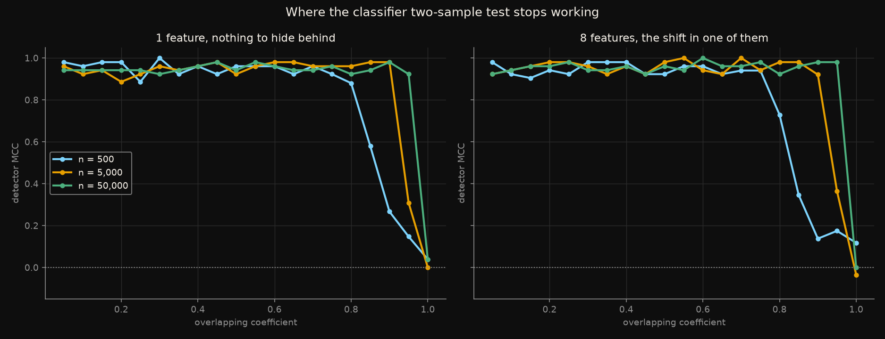
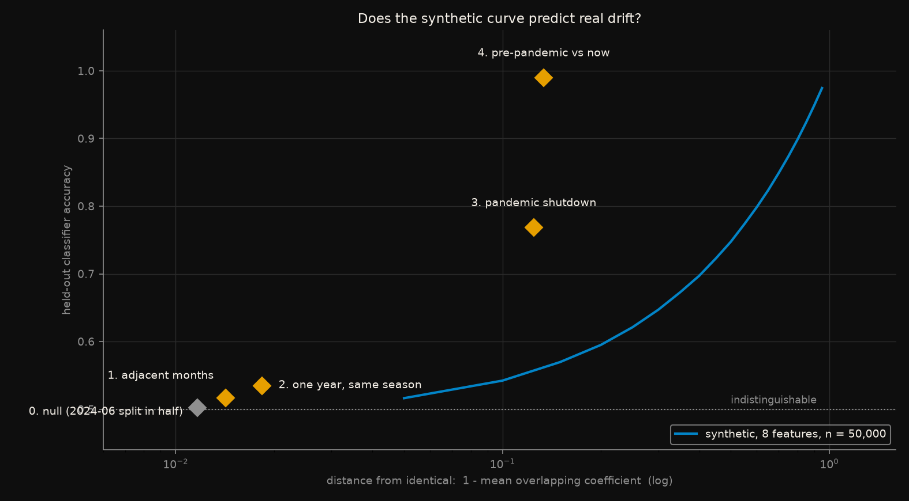
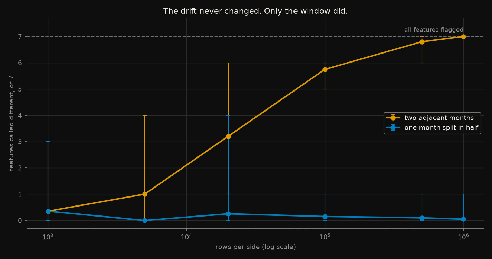

# Where the classifier two-sample test stops working

A drift detector is a classifier that tries to tell last month's data from this
month's. It is known to work. This measures **where it stops working**, and
whether that boundary can be found on synthetic data before trusting it on
real data.

Rules frozen in [`CRITERIA.md`](CRITERIA.md) on 2026-09-05, before the detector
was run once. Six predictions were written down in advance. **Four held, two
failed**, and the two failures are the more useful half.

## The short version

**The synthetic curve gets the ordering right and the level badly wrong.**

Run on Gaussians with the overlap dialled in exactly, the detector is flawless
until the two distributions overlap about 80%, then falls off a cliff. Run on
real NYC taxi months, it ranks the five pairs in exactly the order their
overlap predicts - and then detects far more than the curve says it should:

| Pair | Mean overlap | Detector accuracy | Synthetic curve predicts | Gap |
|---|---|---|---|---|
| 0. null, one month split in half | 0.988 | 0.502 | 0.516 | −0.014 |
| 1. adjacent months | 0.986 | 0.517 | 0.516 | +0.000 |
| 2. one year, same season | 0.982 | 0.535 | 0.516 | +0.018 |
| 3. pandemic shutdown | 0.875 | 0.768 | 0.556 | **+0.212** |
| 4. pre-pandemic vs now | 0.866 | **0.990** | 0.561 | **+0.429** |

At the same mean overlap where the synthetic sweep manages 0.561, the real
2019-vs-2024 pair is separated at **0.990**. Anyone calibrating a detector on
a synthetic sweep and carrying the threshold into production would be
badly miscalibrated, in the direction of missing drift they could have caught.

**The reason is what "mean overlap" throws away.** The synthetic sweep puts the
shift in one feature and fills the rest with noise. Real drift is not like
that. For pair 4 the shift is spread across several features at once:

```
total_amount        0.687     <- the money features moved together
fare_amount         0.769
tip_amount          0.813
passenger_count     0.934
pickup_hour         0.944
trip_duration_min   0.949
trip_distance       0.968
```

A classifier combines that evidence; a mean does not. Mean overlapping
coefficient is **not a sufficient statistic for detectability**, and a
synthetic experiment built on it understates what a detector can do.

## What was predicted, and what happened

| | Prediction, written before running | Outcome |
|---|---|---|
| **P1** | Spearman(overlap, MCC) ≤ −0.9 | **FAILED** |
| **P2** | False-alarm rate at OVL = 1.00 within [0.01, 0.10] | **passed**, all six cells |
| **P3** | A larger window moves the curve right | **passed** |
| **P4** | Seven nuisance features make detection harder | **FAILED at 2 of 3 window sizes** |
| **P5** | Real pairs rank in overlap order; the null is not flagged | **passed** |
| **P6** | Flagged-feature count rises with n on a fixed shift | **passed** |

### P1 failed because the instrument was wrong for the shape

Spearman measures monotone rank correlation. The curve is not a slope, it is a
**cliff**: MCC sits at about 0.95 across the whole range up to overlap 0.80,
and the ranks inside that flat stretch are noise. Correlations came out
between −0.78 and +0.20.

The substance is not in doubt - it is visible in the figure and in the numbers
below - but the pre-registered test of it does not pass, and swapping in a
better statistic now would be exactly the move this design exists to prevent.
So P1 is recorded as failed, and the description that follows is labelled
post-hoc.

*Post-hoc, not pre-registered.* Mean MCC on the plateau (overlap ≤ 0.80)
against MCC at overlap 0.95:

| n per side | plateau | at 0.95 | drop |
|---|---|---|---|
| 500 | 0.948 | 0.147 | 0.800 |
| 5,000 | 0.950 | 0.309 | 0.641 |
| 50,000 | 0.948 | 0.923 | 0.025 |

### P4 failed on its merits

Adding seven pure-noise features to the same one-feature shift was expected to
make detection harder. It only does at the smallest window:

| n per side | 1 feature | 8 features | harder? |
|---|---|---|---|
| 500 | 0.468 | 0.347 | yes |
| 5,000 | 0.808 | 0.811 | no |
| 50,000 | 0.942 | 0.961 | no |

With enough data the gradient-boosted trees simply ignore the distractors.
Dilution is a small-sample problem, not a dimensionality problem.

## The three arms



**Arm A, synthetic.** 20 overlap levels x 3 window sizes x 2 feature counts x
100 trials = 12,000 classifier fits. Half of each cell's trials draw two
samples that genuinely differ; half draw two from the same distribution. The
score is the Matthews correlation of the detector's calls against the truth -
accuracy would give 0.5 to a detector that always says "drift", and MCC gives
it 0.

The window is what decides what is detectable. The overlap at which MCC falls
below 0.5 is **0.90 at n = 500, 0.95 at n = 5,000, and never within range at
n = 50,000**. The same drift is invisible or obvious depending on how much
data you happened to collect.



**Arm B, real.** Five NYC taxi month-pairs, fixed in advance, all compared at
50,000 rows per side. The null - one month cut randomly in half - was **not
flagged** (accuracy 0.502, p = 0.14), which is the control that makes the
other four readable. The ordering by detector accuracy is `[4, 3, 2, 1]`,
exactly the ordering by overlap, exactly the pre-registered expectation.

One number from this arm deserves its own line. Pair 1, two adjacent months,
was separated at **accuracy 0.5165** - 1.7 points above chance - with
**p = 7 x 10⁻¹⁴**. Its mean overlap is 0.9858; the null's is 0.9884. A
difference of 0.0026 in overlap is the whole distance between "no drift" and
"drift, with fourteen zeros of confidence".



**Arm C, sample size.** The same two adjacent months, seen through windows from
1,000 to 1,000,000 rows. Features called different by a KS test at p < 0.05,
out of seven:

| rows per side | 1,000 | 5,000 | 20,000 | 100,000 | 500,000 | 1,000,000 |
|---|---|---|---|---|---|---|
| **two adjacent months** | 0.3 | 1.0 | 3.2 | 5.8 | 6.8 | **7.0** |
| **one month split in half** | 0.3 | 0.0 | 0.2 | 0.1 | 0.1 | 0.1 |

Nothing about the drift changed between the first column and the last. Only
the window did. The control staying flat is what separates "the test is
oversensitive" from "the test is broken" - it is neither; it is answering its
own question correctly, and the question stopped being useful.

## Reproduce

```bash
pip install -r ../../requirements.txt
python ../../datasets/us/nyc_taxi/load.py     # ~330 MB, cached, checksummed
python run_all.py
```

About 25 minutes, most of it the synthetic sweep. `run_all.py` checks
`config.yaml` against the frozen values before doing anything, then runs the
detector self-checks, then the three arms, then the figures. It stops if
either the config has drifted or the null pair gets flagged.

The self-checks are the part worth reading
([`test_detector.py`](test_detector.py)). The fourth one builds the in-sample
version of the detector on purpose - a classifier scored on its own training
rows - and asserts it is visibly broken:

```
in-sample 0.874 (p=0, drift called) vs held-out 0.499 (p=0.54, no drift)
- both samples from the SAME distribution
```

## Limitations

1. **One detector.** A classifier two-sample test with one fixed classifier.
   MMD, per-feature KS with a multiple-testing correction, and the
   density-ratio family are all untested here, and the failure of P4 suggests
   the choice of classifier matters more than the number of features.
2. **Gaussian synthetic data.** The analytic overlap formula needs it. Real
   features are skewed, heavy-tailed and discrete-ish, and the gap between
   arms A and B may be partly that rather than only the correlation effect.
3. **The gap is diagnosed, not decomposed.** Real drift is spread over
   correlated features and synthetic drift was isolated in one. That explains
   the direction of the gap; it does not prove it is the whole cause. A
   synthetic sweep with the shift spread across correlated features would
   settle it, and is not run here.
4. **Yellow taxis only.** Volume in this file fell by half between 2019 and
   2024, and a large part of that is high-volume for-hire trips moving to
   separate files rather than New Yorkers travelling less. Nothing here is a
   statement about demand; only about the distribution of features within the
   trips the file contains.
5. **Five pairs.** The ordering matching is one comparison on four drifted
   pairs. It is consistent with the synthetic curve transferring in rank, not
   proof of it.

## Deviations from the pre-registration

`CRITERIA.md` was not edited after freezing. Three things had to be decided
that it did not cover:

**`early_stopping` was left unspecified, and the default would have confounded
P3.** sklearn turns early stopping on above 10,000 samples. At n = 50,000 the
classifier stopped after 24 iterations (1 feature) or 10 (8 features) instead
of 100 - so "more data" would silently have meant "weaker model", along the
one axis P3 is about. Set to `False`, so the detector is one fixed model at
every window size.

**A cleaning rule was applied with the wrong interval and caught by the
pre-registered row counts.** `CRITERIA.md` writes four rules as `0 < x <= hi`
but passenger count as `1 <= n <= 6`. Applying the half-open convention to all
five excluded every single-passenger trip - 78% of the file - and the loader
completed normally, reporting a clean dataset. The predicted count was
~447,000 rows removed; the observed count was 2,762,219. Fixed before any
detector ran.

**One arm was renamed from "null" to "control".** `pandas.read_csv` parses the
string `"null"` as `NaN`, so the control series was silently dropped when the
results were read back for the figure. Renamed at the source rather than
patched at the reader, since the CSV is meant to be readable by anyone.
