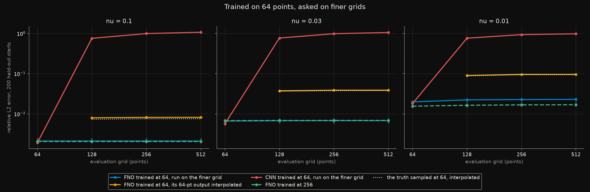
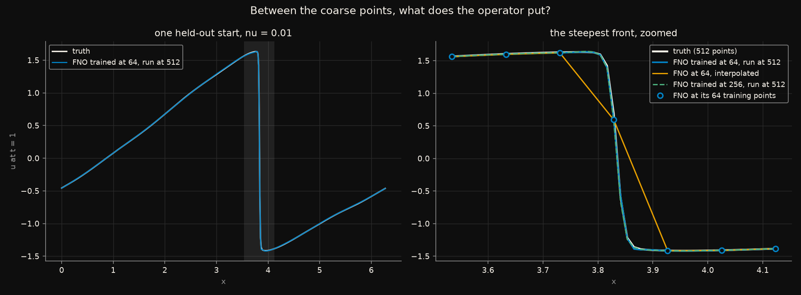
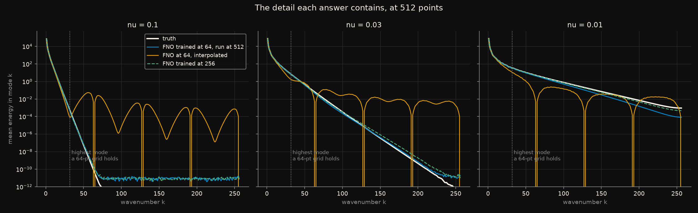

# Trained on 64 points, asked about 256: what a neural operator puts in between

A Fourier Neural Operator (Li et al., 2021) keeps its weights on Fourier
wavenumbers rather than on grid points, so one trained network can be run
on a grid of any size. The paper's headline claim is **zero-shot
super-resolution**: train on a coarse grid, evaluate on a fine one, and the
error stays the same.

That claim has a weak reading and a strong one. The weak one is
*consistency*: the network gives the same answer whatever grid it is asked
on. The strong one is *detail*: on the fine grid it produces structure that
the coarse training data could not show. I expected the first and doubted
the second - an operator that has only ever been shown 64 samples of each
solution should not know what lies between them. The pre-registration says
so in writing: zero-shot output on a finer grid would be no better than
interpolating the network's own coarse answer.

It was four times better.

Rules frozen in [`CRITERIA.md`](CRITERIA.md) before any network was
trained. Five predictions; **two held**. The one the experiment was built
around failed, in the operator's favour.

## The short version

Viscous Burgers' equation at its sharpest setting, where the fronts are
much narrower than one cell of the 64-point training grid. Everything
evaluated on 256 points, 200 held-out starts, median over 3 seeds:

| | relative L2 error at 256 points |
|---|---|
| FNO trained at 64 points, run directly on 256 | **2.3%** |
| the same FNO's 64-point answer, interpolated to 256 | 9.6% |
| the *exact* solution sampled at 64, interpolated to 256 | 9.5% |
| the same FNO architecture **trained** at 256 | 1.7% |
| CNN with the same parameter count, trained at 64, run on 256 | 94% |

The third row is the one to sit with. No method that linearly interpolates
64 values - even the 64 exact ones - gets below 9.5%, because the front
falls between the samples. The operator gets 2.3%, on points it was never
supervised on - an error only about a third higher than that of the same
network trained on the fine grid directly.

The rest is less flattering to the FNO. **On the grid it was trained on, a
convolutional network with the same number of parameters is as accurate,
or slightly better** - the FNO's error is 10 to 16% higher at every
viscosity, where the pre-registration predicted it would be half the
CNN's. And
the CNN, run on any other grid, is useless: its error goes from 0.2% to
100%, because its weights mean "two grid points to the left", and on a
finer grid that is a different distance. The FNO's advantage in this
experiment is not accuracy. It is that it means the same thing on every
grid - and, it turns out, that this lets it say things about the fine grid
that the coarse data never showed directly.

## The data

[`generators/burgers_1d`](../../generators/burgers_1d/): `u_t + u u_x =
nu u_xx` on a periodic line, 1,200 random starts, solved to `t = 1` at
three viscosities, checked against the exact Cole-Hopf solution to
`1e-6` or better.

The starts use Fourier modes 1 to 16 only, so **a 64-point grid holds the
start exactly**: every model sees everything there is to know about the
input, at every resolution. What the coarse grid cannot hold is the
*answer's* detail, and the viscosity sets how much of it there is:

| `nu` | energy of `u(t = 1)` above what a 64-point grid holds | fronts |
|---|---|---|
| 0.1 | 1.8e-8 | broad and smooth |
| 0.03 | 5.4e-4 | about one coarse cell wide |
| 0.01 | 5.6e-3 | much narrower than one coarse cell |

Samples 0-999 train, 1000-1199 are held out. Every coarser grid is an exact
subsample of the stored 512 points, never an interpolation.

## The models

Both take `(u0, sin x, cos x)` on whatever grid they are given and return
`u(t = 1)` on the same grid.

- **FNO**: width 32, 16 Fourier modes, 4 spectral layers with a pointwise
  linear path beside each - 139,777 parameters.
- **CNN**: kernel 5, 63 channels, dilations up to 16, circular padding -
  140,428 parameters. At 64 points every output sees the whole domain.

Same loss (mean relative L2), optimiser, schedule and budget: Adam, 1e-3
halved every 60 epochs, 300 epochs, batch 20.

## What each figure shows

### Error against grid size



*Relative L2 error on 200 held-out starts, evaluated on 64 to 512 points.
Lines are medians over three seeds, dots the seeds. Blue: the FNO trained
at 64 and run on the finer grid. Orange: the same FNO run at 64 and its
answer interpolated. Red: the CNN trained at 64 and run on the finer grid.
Green dashed: the FNO trained at 256. Dotted white: the exact solution
sampled at 64 and interpolated - the best any interpolation of a 64-point
answer can do.*

Two things are visible at once. The blue line is flat in every panel: the
FNO's error does not change with the grid (P3: a ratio of 1.0006 at
`nu = 0.1`). The red line leaves the chart: the CNN is a function of grid
index, not of position. That much was predicted.

What was not predicted is the gap between blue and orange. At `nu = 0.1`
there is nothing between the coarse points to find, and interpolation
costs only a little. At `nu = 0.03` and `0.01` the orange line sits on the
dotted floor - interpolating the FNO's coarse answer is as good as
interpolating the exact one, and no better - while the blue line sits a
factor of four to six below it.

### What the operator puts between the coarse points



*Left: one held-out start at `nu = 0.01`, the FNO trained at 64 points run
on 512. Right: its steepest front, zoomed. Open circles: the FNO's answer at
the 64 points of its training grid. Orange: those 64 values interpolated.*

The front is about half a coarse cell wide; the coarse grid's spacing is
0.098. The 64 training points put one sample on the front and its
neighbours on either side, and interpolation draws straight lines between
them. The
operator, run on 512 points, draws the front - its position, its steepness,
the shoulders either side - on top of the truth, and on top of the network
that was trained at 256.

### The detail, wavenumber by wavenumber



*Mean energy per Fourier mode of each answer on 512 points, over 16
held-out starts. The dotted line is the highest mode a 64-point grid can
represent.*

At `nu = 0.01` the zero-shot FNO's spectrum follows the truth's out to
wavenumber 150 - nearly five times past anything its training data could
represent - before falling under it. Interpolation does something else
entirely: linear interpolation of 64 samples has the comb-shaped response
of its kernel, with zeros at multiples of 64 and spurious energy between
them. It adds detail in the wrong places and none in the right ones. At
`nu = 0.1` the truth has nothing above wavenumber 70, and the flat tail
near 1e-11 is the noise floor of float32 arithmetic inside the networks.

## What was predicted, and what happened

| | Prediction, written before any network was trained | Outcome |
|---|---|---|
| **P1** | Control: at `nu = 0.1`, the FNO at 64 points is below 1% error | **passed** - 0.21% |
| **P2** | At the training resolution the FNO's error is at most half the CNN's, at every viscosity | **failed** - the FNO's error is 1.10, 1.16 and 1.10 times the CNN's |
| **P3** | At `nu = 0.1`, the FNO's error at 256 is within 1.25× its error at 64; the CNN's at least 3× | **passed** - 1.0006× and 521× |
| **P4** | At `nu = 0.01`, zero-shot at 256 is not more than 10% better than interpolating the 64-point answer | **failed** - 0.0228 against 0.0961: 76% better |
| **P5** | At `nu = 0.01`, the FNO trained at 256 has at most half the zero-shot error | **failed** - 0.0168 against 0.0228: a ratio of 0.74 |

**P4 is the overturn the pre-registration named.** It said that the
zero-shot FNO clearly beating interpolation at `nu = 0.01` "would mean it
learned sub-grid structure from data that never showed it ... the strong
reading of the paper's claim, and this would be evidence for it." It did,
in every seed: zero-shot errors of 2.1%, 2.3% and 2.4% against 9.6%, 9.6%
and 9.6%.

**P5 failed for the same reason.** If zero-shot output were interpolation,
training on the fine grid would have halved the error easily. It cut it by
a quarter, because the zero-shot network had most of the fine structure
already.

**P2 failed on its own terms.** The FNO paper compares against a
fully-convolutional baseline and reports the FNO several times more
accurate. The CNN here has dilations that give it the whole domain in view
at 64 points, which the FNO gets from its global Fourier modes; with that,
on the grid it was trained on, it is at least as accurate. The FNO's case
in this experiment rests entirely on P3 and P4 - on what happens away from
the training grid.

## Full results

Mean relative L2 error over 200 held-out starts, median over 3 seeds.

| `nu` | model | trained at | 64 | 128 | 256 | 512 |
|---|---|---|---|---|---|---|
| 0.1 | FNO | 64 | 0.0021 | 0.0021 | 0.0021 | 0.0021 |
| | FNO | 256 | 0.0021 | 0.0021 | 0.0021 | 0.0021 |
| | CNN | 64 | 0.0019 | 0.759 | 0.999 | 1.076 |
| 0.03 | FNO | 64 | 0.0066 | 0.0068 | 0.0068 | 0.0068 |
| | FNO | 256 | 0.0068 | 0.0069 | 0.0069 | 0.0069 |
| | CNN | 64 | 0.0057 | 0.772 | 0.991 | 1.060 |
| 0.01 | FNO | 64 | 0.0199 | 0.0224 | 0.0228 | 0.0230 |
| | FNO | 256 | 0.0156 | 0.0164 | 0.0168 | 0.0169 |
| | CNN | 64 | 0.0181 | 0.766 | 0.939 | 0.985 |

The 64-point answer interpolated linearly to finer grids, and the same
for the exact solution:

| `nu` | | 128 | 256 | 512 |
|---|---|---|---|---|
| 0.1 | FNO at 64, interpolated | 0.0080 | 0.0082 | 0.0082 |
| | exact at 64, interpolated | 0.0074 | 0.0076 | 0.0076 |
| 0.03 | FNO at 64, interpolated | 0.0376 | 0.0389 | 0.0389 |
| | exact at 64, interpolated | 0.0365 | 0.0379 | 0.0379 |
| 0.01 | FNO at 64, interpolated | 0.0904 | 0.0961 | 0.0961 |
| | exact at 64, interpolated | 0.0886 | 0.0948 | 0.0948 |

Trigonometric interpolation (zero-padding the spectrum) is in
`outputs/errors.csv` too. It is better than linear at `nu = 0.1` and worse
at `nu = 0.01`, where it rings at the fronts; P4 was scored against linear,
as pre-registered, which is the stronger of the two where P4 is scored.

## Two checks added afterwards

Not pre-registered; [`posthoc.py`](posthoc.py) reproduces both.

**Where is the zero-shot FNO right?** Its error on the 448 of 512 points
that are *not* on the 64-point grid - points no training target ever
touched - for seed 0 and the 16 held-out starts saved in
`outputs/examples.npz`:

| `nu` | zero-shot | its 64 points, interpolated | trained at 256 | exact at 64, interpolated |
|---|---|---|---|---|
| 0.1 | 0.0015 | 0.0076 | 0.0015 | 0.0074 |
| 0.03 | 0.0049 | 0.0404 | 0.0046 | 0.0394 |
| 0.01 | 0.0199 | 0.0988 | 0.0139 | 0.0988 |

The advantage is not coming from the coarse points. It is on the points in
between.

**Where could the detail come from?** No single training sample shows a
front's profile: at `nu = 0.01` the 64-point grid puts one sample on it,
or none. But the fronts fall at a different place in each sample. The
steepest point of each of the 1,000 training solutions, located within its
64-point cell, lands in each eighth of a cell between 114 and 144 times -
uniformly, near enough. Pooled across the training set, the coarse grid has
seen a front at every sub-grid offset. An operator that applies the same
computation at every position - which the FNO's spectral layers do, up to
the two position channels - can assemble the profile from those offsets the
way a camera assembles a sharper image from several slightly shifted
frames. The CNN applies the same computation everywhere too, but in units
of grid points, so what it assembles does not transfer to another grid.

That is an explanation consistent with the evidence, not a tested one. The
test would train on data where the fronts all fall at the same offset, and
it was not run.

## Reproduce

```bash
pip install -r ../../requirements.txt
python ../../generators/burgers_1d/generate.py     # about forty minutes
python run_all.py
```

About five hours on a six-core laptop CPU, three trainings at a time,
measured while another experiment shared the processor; the CNNs and the
FNOs trained at 256 points are most of it.

`run_all.py` checks `config.yaml` against the frozen values and runs the
implementation checks first. The one that matters most feeds the spectral
layer the same band-limited field on 64 and on 256 points and asserts the
outputs agree at the shared points, to `1e-15`. A spectral layer with the
FFT normalised the wrong way, or its mode count tied to the grid size, would
train exactly as well at 64 points and fail every resolution test for a
reason unrelated to the claim.

## Premises and warnings

**The fairest possible setting, on purpose.** The starts are band-limited,
so the coarse grid shows each model the whole input. With real data a
coarse grid also loses part of the *input*, and no operator can recover
detail that is missing from what it is shown. This experiment measures the
best case for super-resolution, and that is what makes P4 a clean test: it
removes every reason for failure except the one in question.

**The front has one shape.** In Burgers' equation at a fixed viscosity,
every front has the same profile, scaled by its jump. That is what makes
the profile learnable from offsets pooled across samples. Where the fine
structure depends on something the coarse data does not reveal - a
viscosity that varies from sample to sample, or turbulence whose small
scales are not slaved to the large ones - there is no single profile to
assemble, and nothing here says the result would carry over.

**One equation, one dimension.** The FNO paper's own super-resolution
figure is a 2D Navier-Stokes flow. Burgers is its standard first test and
nothing more.

**Not converged.** Training loss was still falling at the end of the
budget - by 13 to 31% over the last 60 epochs, depending on the model and
the viscosity, with no model an exception. The comparisons are at equal
budget; the absolute errors would be somewhat lower with more training.

**Means and medians.** The pre-registered metric is the mean over the 200
held-out starts, which a few hard starts pull up: at `nu = 0.01` the
zero-shot FNO's median error is 1.6% against a mean of 2.3%. The
comparisons point the same way under either.

## Deviations from the pre-registration

`CRITERIA.md` was not edited after freezing, and the experiment ran as
written. The two checks above are additions, made after the results were
in, and are not part of what was scored.
