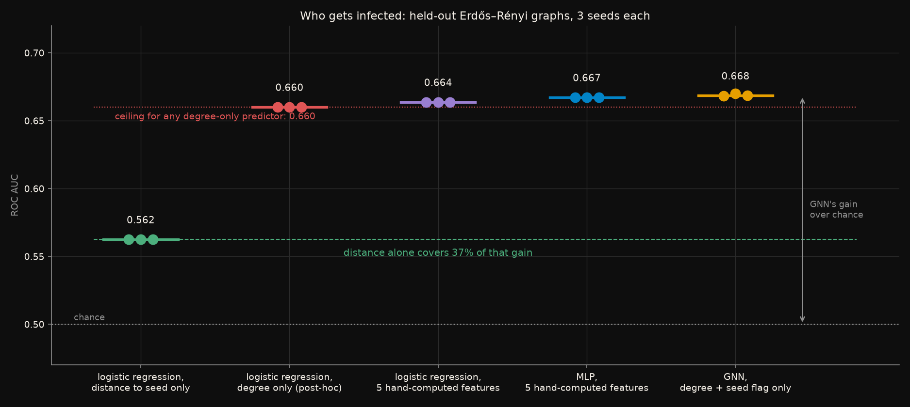
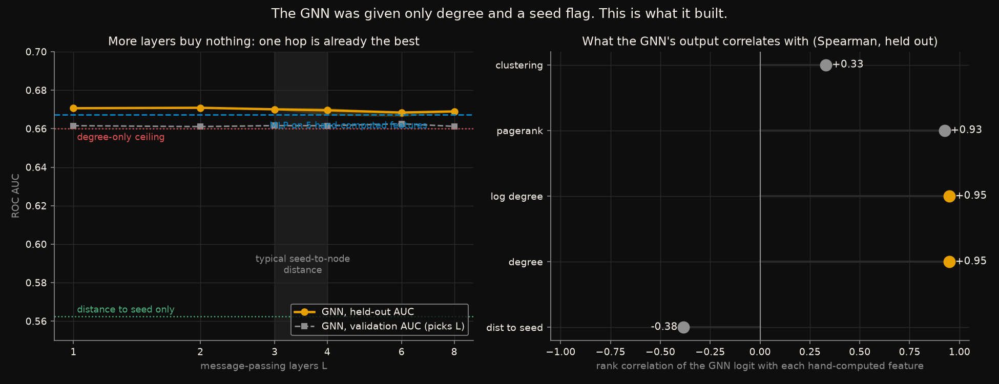
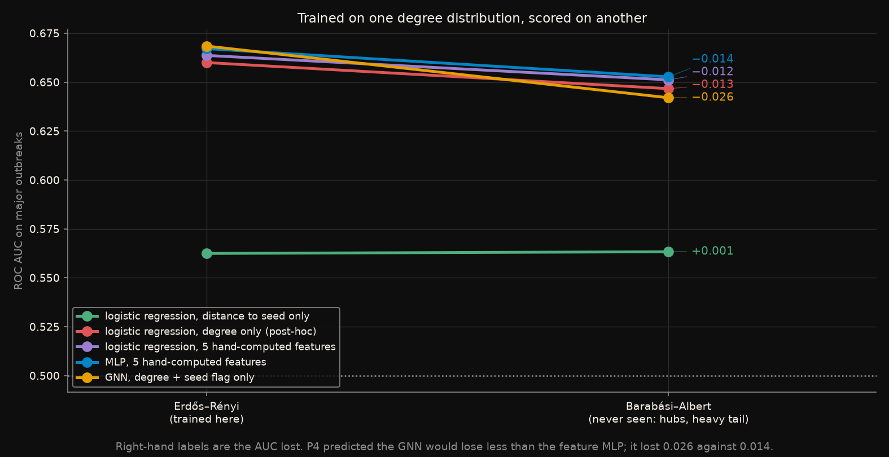

# The graph network learned the one feature it was handed

A graph neural network passes messages along edges, so what it computes for
a node depends on that node's neighbourhood. That is the pitch: it learns
from structure that a per-node model cannot see.

The honest question is how much of what it learns is structure that could
not have been written down by hand. So this experiment gives a GNN a task
that is *about* structure - who catches a disease spreading over a network -
and puts it against models that see only features a person would compute:
degree, distance from the patient zero, clustering, PageRank.

Rules frozen in [`CRITERIA.md`](CRITERIA.md) before any network was built.
Five predictions; **two held and three failed**, all three in the same
direction, and the direction is the finding.

## The short version

| model | sees | held-out AUC |
|---|---|---|
| logistic regression | distance from the seed, nothing else | 0.562 |
| logistic regression | **degree, nothing else** *(post-hoc)* | 0.660 |
| logistic regression | 5 hand-computed structural features | 0.664 |
| MLP | the same 5 features | 0.667 |
| **GNN**, up to 8 layers of message passing | degree and a seed flag, and the graph | **0.668** |
| *ceiling for any predictor that sees only degree* *(post-hoc)* | | *0.660* |

**The GNN beat the feature MLP by 0.001 AUC.** Depth bought nothing: one
message-passing layer scored 0.671 and eight scored 0.669. Its output is
rank-correlated **+0.95 with degree** on held-out nodes. And under
structural drift - trained on Erdős–Rényi graphs, scored on Barabási–Albert
- it lost **more** than every feature model, 0.026 against 0.014.

What happened is that the task turned out to be a degree task. In a major
outbreak on a random graph, the chance a node catches the disease is set
almost entirely by how many neighbours it has: 15% at degree 1, 57% at
degree 6, 83% at degree 14. Everything else - where the seed was, how
clustered the neighbourhood is - is worth 0.008 AUC on top. The GNN was
given degree as an input. It learned to use it, which is what the MLP did
too, and there was almost nothing further to learn.

## The task

[`generators/sir_on_graph`](../../generators/sir_on_graph/): SIR epidemics
on 300-node graphs with mean degree 6, one random patient zero, transmission
probability 0.06 per contact per step, recovery 0.2 per step. Two graph
families with the same mean degree and very different shapes - Erdős–Rényi
(degrees clustered around 6) and Barabási–Albert (hubs, a heavy tail). The
generator checks the epidemic threshold against Newman's formula on every
run: major outbreaks appear where `R0 = 1` says they should.

**Node-level, binary: did this node ever get infected?** Restricted to
**major outbreaks** - runs reaching at least 10% of the nodes - because in a
run that fizzled after three nodes there is nothing structural to predict.
123 of 300 graphs qualify in each family. Split by graph: 78 to fit, 20 for
validation (which chooses the GNN's depth), 25 held out - 7,500 held-out
nodes, 54.1% infected.

## Models

- Logistic regression on **one** feature, BFS distance from the seed - the
  feature `CRITERIA.md` bet a person would write down first.
- Logistic regression and a 64-unit MLP on **five** hand-computed features:
  degree, log degree, distance from the seed, local clustering, PageRank.
- A **GNN** in plain PyTorch, no graph library: `L` rounds of
  `h' = ReLU(W1 h + W2 · mean of h over neighbours)`, 64 units, one logit
  per node. Its input is **only** normalised degree and a seed indicator.
  Everything else it knows, it has to build by passing messages. `L` swept
  over {1, 2, 3, 4, 6, 8}, chosen on the validation graphs.

Same optimiser, three seeds, medians.

## What each figure shows

### One feature, five features, or the whole graph



*Held-out AUC on Erdős–Rényi graphs, three seeds per model. The green
dashed line is where distance alone gets; the red dotted line is the
empirical ceiling for any predictor that sees only degree.*

The spread that matters is not the one between the last three models - it
is 0.005 - but the one between the first column and everything else.
Distance from the seed, on its own, gets 37% of the way from chance to the
GNN. Degree, on its own, gets 95% of the way. **The obvious feature was the
wrong obvious feature**, and the pre-registration bet on it: P3 predicted
distance would cover more than half the gap.

The red line is the post-hoc analysis that explains the whole picture. It is
the infection rate at each degree, estimated on the training graphs and
applied to held-out nodes - the best any model can do from degree alone. It
sits at 0.660. Logistic regression on degree reaches 0.660. The full-feature
models and the GNN sit 0.004 to 0.008 above it. That 0.008 is the value of
every structural fact beyond "count your neighbours", and it is shared
between clustering, PageRank, distance and whatever message passing adds.

### More layers, more hops, nothing more



*Left: held-out AUC against message-passing depth, with the y-axis wide
enough that a 0.003 spread looks like what it is. Right: rank correlation of
the GNN's held-out logit with each hand-computed feature.*

The left panel is P5, and it passed in the least interesting way available:
the curve is flat. One layer scores 0.6706; eight score 0.6690. The band
marks the typical seed-to-node distance on these graphs, three to four hops,
and crossing it changes nothing. The validation split picked six, three and
six layers across the seeds; one layer would have scored 0.002 better on the
held-out graphs, which is inside the noise.

The right panel says why. **The GNN's output is rank-correlated +0.95 with
degree** and +0.93 with PageRank, which on these graphs is nearly degree.
Its correlation with distance from the seed is −0.38: it learned some of
that, and it did not need much, because distance is worth little here.
Given only degree and a seed flag, with the whole graph to pass messages
over, the network built a slightly smoothed degree.

### Trained on one degree distribution, scored on another



*Every model fitted on Erdős–Rényi major outbreaks and scored, unchanged, on
Barabási–Albert ones. Right-hand labels are the AUC lost.*

P4 predicted the GNN would lose less than the feature MLP, on the argument
that hand-computed features are calibrated to one degree distribution and
message passing is not. **It lost the most: 0.026, against 0.012 to 0.014
for every model with hand-computed features.**

The mechanism is visible in what each model was given. The feature models
see log degree and PageRank, both of which extrapolate the monotone
degree effect smoothly onto a hub with 50 contacts. The GNN sees degree
divided by ten - a number that never exceeded about 2 in training and
reaches 5.9 on a Barabási–Albert hub - and a mean over neighbours whose
composition is unlike anything it aggregated before. The architecture's
aggregation was tuned to one degree distribution after all.

Distance from the seed, the feature that predicted least, lost nothing:
−0.001. It is the one input that does not know what kind of graph it is on.

## What was predicted, and what happened

| | Prediction, written before any network was built | Outcome |
|---|---|---|
| **P1** | Threshold check passes; hand-computed features reach AUC > 0.6 | **passed** - 0.664 |
| **P2** | The GNN beats the feature MLP by ≥ 0.02 AUC | **FAILED** - by 0.001 |
| **P3** | Distance alone covers more than half the GNN's gain over chance | **FAILED** - 37% |
| **P4** | Under structural drift, the GNN loses less AUC than the feature MLP | **FAILED** - 0.026 against 0.014 |
| **P5** | Depth saturates: AUC at L = 8 no more than 0.01 above L = 4 | **passed** - it is 0.001 *below* |

Three failures with one cause. P2, P3 and P4 all assumed that structure
beyond degree matters for this task, and it does not: degree sets the
infection probability, degree was an input to every model, and every model
that could use it reached the same place. P3 failed specifically because the
"obvious" feature named in advance was distance, when the obvious feature
was degree - which is exactly the kind of mistake a pre-registration exists
to expose rather than let a write-up quietly repair.

## Full results

Median held-out AUC over 3 seeds, 25 Erdős–Rényi graphs, 7,500 nodes.

| model | AUC | seed range |
|---|---|---|
| logistic regression, distance to seed | 0.5625 | 0.5625 – 0.5625 |
| logistic regression, degree *(post-hoc)* | 0.6600 | 0.6600 – 0.6600 |
| logistic regression, 5 features | 0.6637 | 0.6636 – 0.6637 |
| MLP, 5 features | 0.6671 | 0.6671 – 0.6672 |
| GNN, chosen depth | 0.6685 | 0.6684 – 0.6701 |
| *empirical ceiling, degree only (post-hoc)* | *0.6601* | |

GNN by depth, median held-out AUC: L=1 0.6706, L=2 0.6709, L=3 0.6701,
L=4 0.6696, L=6 0.6684, L=8 0.6690.

Structural drift, trained on Erdős–Rényi:

| model | Erdős–Rényi | Barabási–Albert | lost |
|---|---|---|---|
| distance to seed | 0.5625 | 0.5633 | −0.001 |
| degree *(post-hoc)* | 0.6600 | 0.6467 | 0.013 |
| logistic regression, 5 features | 0.6637 | 0.6512 | 0.012 |
| MLP, 5 features | 0.6671 | 0.6527 | 0.014 |
| **GNN** | 0.6685 | 0.6420 | **0.026** |

Infection rate by degree, on the training graphs - the physics the whole
result rests on:

| degree | 1 | 2 | 3 | 4 | 5 | 6 | 7 | 8 | 10 | 12 | 14 |
|---|---|---|---|---|---|---|---|---|---|---|---|
| P(infected) | 0.15 | 0.23 | 0.35 | 0.43 | 0.50 | 0.57 | 0.62 | 0.68 | 0.75 | 0.79 | 0.83 |

A node of degree 6 - the mean - is a coin flip. That is the irreducible
noise, and it is why no model on this task gets far past 0.67.

## Reproduce

```bash
pip install -r ../../requirements.txt
python ../../generators/sir_on_graph/generate.py    # seven seconds
python run_all.py
```

About ten minutes. `run_all.py` checks `config.yaml` against the frozen
values and runs the implementation checks first. One of those is worth
reading: on a path graph with the seed at one end, an `L`-layer GNN must
produce different embeddings for the nodes `L` and `L+1` hops away, and
**identical** embeddings for `L+1` and `L+2`. Both directions are checked
with random weights, so it is a property of the wiring - if the layer did
not aggregate, the first would fail; if anything leaked past `L` hops, the
second would.

## Premises and warnings

**This is one process on one kind of graph, and the process happens to be a
degree process.** SIR from a single seed on a random graph is close to bond
percolation, and in percolation a node's fate depends on its degree. A
different dynamic on the same graphs - opinion spread with a threshold, a
cascade that needs two infected neighbours, anything where *which*
neighbours matters and not just how many - could reward message passing
very differently. This experiment says nothing about those.

**The hand-computed features were chosen with the answer in mind.** Degree,
distance and centrality are obvious *for this task*. A real argument for
graph networks is that in real problems nobody knows which feature is
obvious in advance. This experiment cannot measure that, and the fact that
the pre-registration itself guessed the wrong obvious feature is a small
demonstration of it.

**Graphs of 300 nodes, 123 of them for training.** Small. The GNN's seed
spread is tiny because the split is fixed and only the initialisation
varies; a different split would move every number by more than the gaps
between models.

**Stochastic labels.** Two identical graphs with the same seed can produce
different infection sets, and the empirical ceiling makes that concrete: no
degree-only model can beat 0.660, and the joint (degree, distance) ceiling
is 0.662. AUC is compared between models, not against 1.

**The drift result has a mundane component.** Part of the GNN's extra loss
under drift is that its degree input, `k / 10`, leaves the training range on
Barabási–Albert hubs. A log-degree input would likely close some of the gap.
That is still a property of the model as specified and as commonly built,
but it is not deep.

## Deviations from the pre-registration

`CRITERIA.md` was not edited after freezing.

**Two post-hoc additions, both marked as such in every table and figure.**
After the pre-registered models were scored, the GNN's logit was found to be
rank-correlated +0.95 with degree, so two things were added to explain the
result rather than to rescue a prediction: a logistic regression on degree
alone, and the empirical ceiling for any degree-only predictor - the
infection rate at each degree on the training graphs, applied to held-out
nodes. Neither is scored against a prediction. P3 is scored on the
pre-registered distance-only model and fails.

**The GNN's reported depth is the validation choice, not the best on the
held-out graphs.** The validation split chose six, three and six layers; one
layer would have scored 0.6706 on the held-out graphs against the reported
0.6685. The pre-registration says the depth is chosen on validation and it
was. The difference is inside the seed spread, and reporting the held-out
best would have been the wrong move for a reason unrelated to its size.
