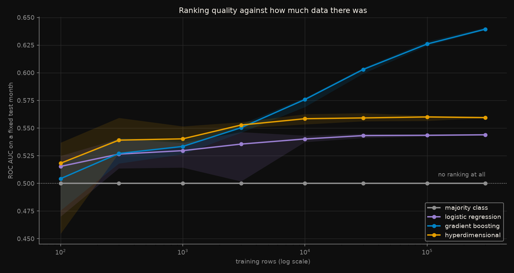
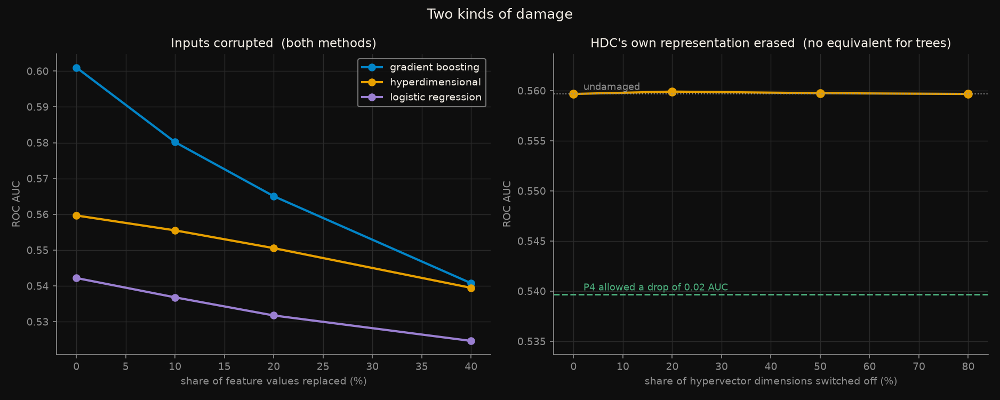
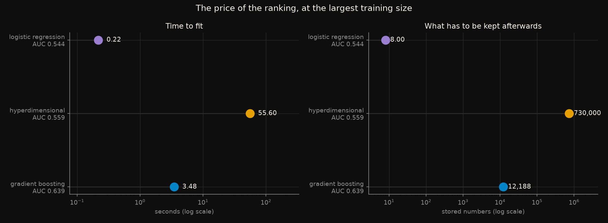

# What one pass of addition buys

Hyperdimensional computing does not have a loss function. Every feature and
every value becomes a random vector in a space wide enough that any two
random vectors are nearly orthogonal; a record is their elementwise product,
summed; a class is the sum of its records; a prediction is whichever class
vector is closest. **Training is one pass and consists of addition.**

Three claims are made for it, and all three are testable: that it learns from
very few examples, that it tolerates corruption of its own representation,
and that it is cheap. This measures all three against a gradient-boosted tree
on a real task.

Rules frozen in [`CRITERIA.md`](CRITERIA.md) before any model was fitted.
Five predictions; **all five held** - one of them by a margin of 270x, and
one in the opposite direction from the way it was phrased.

## The task, and the feature that had to be removed

**Was this taxi ride paid in cash?** From the NYC yellow taxi records in
[`datasets/us/nyc_taxi`](../../datasets/us/nyc_taxi/). Train on May 2024
(3,146,484 trips, 15.1% cash), test on a fixed 200,000-trip sample of June
(14.9% cash). A forward split, so nothing from the test month can inform the
fit.

`tip_amount` is excluded, and that decision matters more than any modelling
choice here. **It is exactly zero for 100% of cash trips**, because the TLC
records card tips and cannot see cash ones. The label is written into the
feature by the collection process. `total_amount` inherits the contamination
and is excluded too.

This is leakage of a family that a chronological split does not catch -
nothing reads the future, and the only defence is knowing how the data was
collected. [`test_leakage.py`](test_leakage.py) builds the leaky version
deliberately and measures it, because a check nobody has watched fail is not
a check:

```
tip_amount is zero for 100.0% of cash trips and 5.3% of card trips
balanced accuracy 0.509 honest, 0.964 with tip_amount      (+0.456)
balanced accuracy 0.509 honest, 0.888 with total_amount    (+0.379)
```

A model with the tip in it would look like a solved problem. It would be
reporting how the payment was recorded, not predicting how it was made.

Seven features remain: `trip_distance`, `fare_amount`, `passenger_count`,
`trip_duration_min`, `pickup_hour`, `pu_location`, `do_location`.

**The honest task is hard.** With the tip removed, a gradient booster on
300,000 rows reaches AUC 0.639. That is real signal, well above chance, and
nobody should read it as a solved problem.

## What each figure shows

### The claim about small data is true, and it stops mattering quickly



*Median ROC AUC over 5 seeds against training size, on a fixed test month.
The band is the range across seeds. Log x-axis.*

At the left end the claim holds. With **100 training rows the
hyperdimensional classifier scores 0.518 and the gradient booster 0.504** -
the booster is barely ranking at all, and HDC is ahead. It stays ahead
through 300, 1,000 and 3,000 rows.

Then the curves cross, at somewhere between 3,000 and 10,000 rows, and never
come back. By 300,000 rows the booster is at 0.639 and HDC at 0.559.

The shape of the HDC curve is the finding. **It flattens at about 0.56 and
stays there**: 0.558 at 10,000 rows, 0.559 at 300,000. Thirty times more data
buys it 0.001 AUC. One pass of addition extracts what it is going to extract
almost immediately, and then more data is simply more addition. The booster
keeps climbing over the same range.

So the small-data claim is real, and it is real in the region where the
absolute numbers are worst. HDC's advantage exists exactly where every method
is close to useless, and disappears once the task becomes learnable.

### Two kinds of damage, only one of which is a fair fight



*Left: a share of feature values replaced with draws from the training
distribution - damage anything can suffer. Right: a share of HDC's
hypervector dimensions switched off at prediction time - damage only a
distributed representation can be asked about. A gradient booster has no
analogue, and inventing one would compare two different things.*

On the left, gradient boosting has further to fall and falls further: from
AUC 0.601 to 0.541 as 40% of feature values are replaced, a loss of 0.060.
HDC goes from 0.560 to 0.539, a loss of 0.021. **At 40% corruption the two
methods meet.** The robustness claim has a real crossover - it is just that
the crossover happens where both models are nearly worthless, and the reason
HDC loses less is partly that it had less to lose.

The right panel is the claim HDC is best known for, and it is the one result
here that is genuinely striking. **Switching off 80% of the 10,000 dimensions
changes the AUC from 0.559673 to 0.559673** - identical to six decimal
places. At 50% it moves by 0.00007, and in the wrong direction: the damaged
model scores marginally *higher* than the undamaged one, which is noise, and
noise at that scale is the point.

The pre-registration allowed a drop of 0.02 AUC and the observed drop is
0.00007, roughly 270 times inside the tolerance. This is what a distributed
representation buys: no dimension is load-bearing, because the information
is in the pattern across all of them. It is a real and unusual property, and
it is worth being clear about what it is not - it is robustness of a model
that scores 0.559 against a booster that scores 0.639. The thing being
protected so effectively is the weaker model.

### What the ranking cost



*Wall-clock fit time and the number of values that must be stored afterwards,
at 300,000 training rows. Log scale on both.*

"Addition is cheap" is a statement about the operation, not the total. At
300,000 rows the gradient booster fits in **3.48 seconds** and the
hyperdimensional classifier in **55.60** - sixteen times slower, for 0.080
less AUC. Encoding a row means combining seven feature vectors and seven
level vectors in 10,000 dimensions, and doing that three hundred thousand
times is not free no matter how cheap each addition is.

The stored-size column is the sharper one. HDC keeps **730,000 numbers** and
the booster keeps **12,188**. The HDC figure is fixed by the configuration
rather than the data - 64 level vectors and 7 feature vectors of 10,000
dimensions, plus 2 class prototypes - so **it is the same 730,000 whether it
was trained on 100 rows or 300,000**. Logistic regression, which reached
0.544, keeps 8.

## What was predicted, and what happened

| | Prediction, written before any model was fitted | Outcome |
|---|---|---|
| **P1** | The majority-class predictor scores accuracy ≥ 0.84, AUC exactly 0.50, balanced accuracy exactly 0.50 | **passed** - 0.851, 0.500, 0.500 |
| **P2** | At the largest size, gradient boosting beats HDC by ≥ 0.03 AUC | **passed** - by 0.080 |
| **P3** | At ≤ 300 rows, HDC is within 0.03 AUC of gradient boosting | **passed** - it is 0.014 *ahead* at 100 rows and 0.012 ahead at 300 |
| **P4** | Zeroing 50% of HDC's dimensions costs < 0.02 AUC | **passed** - AUC moves by 0.00007, in the damaged model's favour; at 80% it does not move at six decimal places |
| **P5** | HDC does not train faster than gradient boosting at the largest size | **passed** - 55.60 s against 3.48 s |

P1 is worth its own line. The same useless predictor scores **0.851 accuracy,
0.500 AUC and 0.500 balanced accuracy**. Three numbers for one model, and
only two of them say what it is. At 15% prevalence, accuracy is not a weak
metric, it is an actively misleading one - which is why this experiment's
primary metric is AUC.

P3 passed in the direction that makes it interesting: HDC did not merely stay
close at small n, it won. That is the claim its advocates make, measured and
confirmed, on a real task.

## Full results

Median ROC AUC over 5 seeds, on the same 200,000-trip test sample throughout.

| training rows | majority | logistic | gradient boosting | hyperdimensional |
|---|---|---|---|---|
| 100 | 0.500 | 0.515 | 0.504 | **0.518** |
| 300 | 0.500 | 0.526 | 0.527 | **0.539** |
| 1,000 | 0.500 | 0.530 | 0.533 | **0.540** |
| 3,000 | 0.500 | 0.536 | 0.550 | **0.553** |
| 10,000 | 0.500 | 0.540 | **0.576** | 0.558 |
| 30,000 | 0.500 | 0.543 | **0.603** | 0.559 |
| 100,000 | 0.500 | 0.543 | **0.626** | 0.560 |
| 300,000 | 0.500 | 0.544 | **0.639** | 0.559 |

Input corruption, at 30,000 training rows:

| share of values replaced | logistic | gradient boosting | hyperdimensional |
|---|---|---|---|
| 0% | 0.542 | 0.601 | 0.560 |
| 10% | 0.537 | 0.580 | 0.556 |
| 20% | 0.532 | 0.565 | 0.551 |
| 40% | 0.525 | 0.541 | 0.539 |

Representation corruption - a share of HDC's 10,000 hypervector
dimensions zeroed at prediction time, at 30,000 training rows.
The pre-registration allowed a drop of 0.02 at the 50% row:

| dimensions switched off | AUC | cost against undamaged |
|---|---|---|
| 0% | 0.559673 | +0.00000 |
| 20% | 0.559908 | -0.00023 |
| 50% | 0.559747 | -0.00007 |
| 80% | 0.559673 | -0.00000 |

Cost at 300,000 rows:

| | AUC | fit time | numbers kept |
|---|---|---|---|
| gradient boosting | 0.639 | 3.48 s | 12,188 |
| hyperdimensional | 0.559 | 55.60 s | 730,000 |
| logistic regression | 0.544 | 0.22 s | 8 |
| majority class | 0.500 | 0.00 s | 1 |

## Reproduce

```bash
pip install -r ../../requirements.txt
python ../../datasets/us/nyc_taxi/load.py     # the months, cached and checksummed
python run_all.py
```

Roughly forty minutes, nearly all of it encoding: HDC scores the 200,000-row
test set in about 52 seconds per cell and there are many cells. `run_all.py`
checks `config.yaml` against the frozen values and runs the leakage
demonstration before anything else.

## Premises and warnings

**One task, one month pair, one encoding.** Record-based encoding is the
simplest of several; n-gram and permutation encodings exist and are not
tested here. A negative result is about this encoding on this task.

**One pass, deliberately.** `retrain_epochs = 0`. A corrective pass over
misclassified records usually lifts HDC's accuracy substantially, and it is
excluded because it is iterative learning - folding it in would answer a
different question than "what does one pass of addition buy".

**Location IDs are treated as numbers.** They are categorical, and neither
the quantiser nor the tree is told so. This handicaps both methods equally.

**The classes are imbalanced and the minority class is not oversampled.**
Small samples are drawn without stratifying, so a 100-row sample may contain
very few cash trips. That is deliberate - it is what a deployment faces - and
it is why the small-n end is reported as a median over five seeds and drawn
with its full seed range.

**Timings are wall-clock on one machine**, one run per cell, and include
encoding for HDC. Indicative, not benchmarks - and they were measured while
another experiment was using the same processor, which inflates them.

**Dimension count is not tuned.** 10,000 is the conventional figure. A
smaller space would cut both the storage and the encoding time, and the
accuracy cost of doing so is not measured here.

## Deviations from the pre-registration

`CRITERIA.md` was not edited after freezing.

**The metric was changed before the run, and the change is recorded inside
`CRITERIA.md` itself** rather than here, because it happened before freezing.
Balanced accuracy was the original primary metric; an exploratory probe
showed it is degenerate at 15% prevalence with a fixed 0.5 threshold, where a
booster with AUC 0.65 still scores 0.51. Every method would have tied and the
comparison would have measured the threshold.

**One bug, found while scoring P4.** The dimension-dropout arm originally
recorded only labels, writing `NaN` into the AUC column - so the arm could
report accuracy but not the quantity P4 is stated in. `predict_and_scores`
now accepts the dimension mask, and the arm reports AUC like every other
result. The numbers it had been producing were not wrong; they were simply
not an answer to the question that had been asked.
