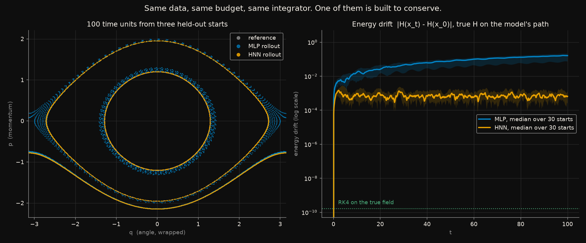
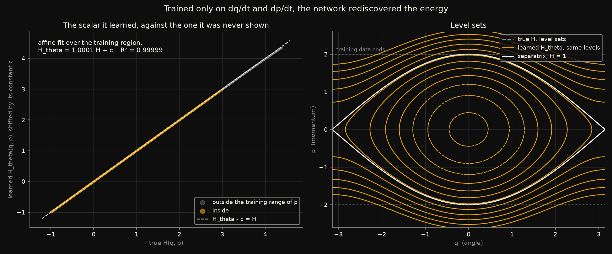
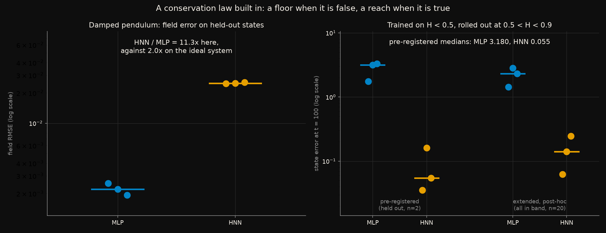

# A conservation law built into the architecture, tested where it is false

A Hamiltonian Neural Network does not learn a vector field. It learns a
single number, `H_theta(q, p)`, and *derives* the field from it:

```
dq/dt =  dH_theta/dp          dp/dt = -dH_theta/dq
```

Whatever `H_theta` turns out to be, that field conserves it exactly. The
conservation is a property of the wiring, not something the training has to
discover, and the claim is that this buys long-horizon stability an ordinary
network cannot have.

This measures what building the law in buys - and, on a system with
friction, what it costs when the law is false.

Rules frozen in [`CRITERIA.md`](CRITERIA.md) before any network was built.
Five predictions; **all five held**, one of them with a qualification that is
worth more than the pass.

## The short version

Same data, same 4,500 parameters, same optimiser, same budget, same RK4
integrator. Trained on the exact vector field of an ideal pendulum, never
shown a trajectory or an energy:

| | MLP | HNN |
|---|---|---|
| held-out field error, as a share of the field's RMS | **0.13%** | 0.26% |
| energy drift after 100 time units, rolled out | 0.0241 | **0.0007** |
| state error after 100 time units | 0.427 | **0.115** |
| learned scalar against the true energy | - | `H_theta = 1.0001 H + c`, R² 0.99999 |

The MLP fits the field *better* and rolls out *worse* - 33 times more
energy drift, four times more state error. One-step accuracy is not
trajectory accuracy, and the reason is visible in the first figure: the
MLP's tiny field error has a divergence, and a divergence compounds. The
HNN's cannot, by construction.

The fourth row is the one to sit with. The network was trained on `dq/dt`
and `dp/dt` and nothing else. It was never shown `H`. The scalar it learned
in order to generate that field is the pendulum's energy, to a slope of
1.0001, with the additive constant that a gradient cannot see.

Then friction is added to the pendulum, and **the HNN's field error rises
by 11 times** while the MLP's does not move. No `H_theta` can generate a
field that loses energy. The inductive bias that won above is now simply
wrong, and no amount of training removes the floor it puts under the error.

## The data

[`generators/hamiltonian_pendulum`](../../generators/hamiltonian_pendulum/):
200 trajectories of `H = p^2/2 - cos q`, 100 time units each - about
sixteen small-swing periods - with the **exact** vector field at every stored
state. The generator conserves energy to 1e-9 and reproduces the exact
elliptic-integral period to 1e-5. Initial conditions cover libration, the
separatrix, and rotation. A damped copy, `dp/dt = -sin q - 0.1 p`, loses
energy at the known rate `-0.1 p^2`.

Both models train on 20,000 states sampled from 140 trajectories, and are
evaluated on the other 60. Rollouts start from 30 held-out initial
conditions and run for the full 100 units with the generator's own RK4 at
the generator's own step, so any drift belongs to the learned field and not
to the integrator.

## The models

Identical bodies: `(cos q, sin q, p)` in, two hidden layers of 64 `tanh`
units. The MLP has a 2-unit head and outputs the field, 4,546 parameters.
The HNN has a 1-unit head and outputs `H_theta`, 4,481 parameters; its field
is the symplectic gradient by autograd, with respect to the original `(q, p)`
through the embedding.

The embedding is not decoration and the *Deviations* section says why.

## What each figure shows

### Where the two models go when left to run



*Left: three held-out initial conditions - a small swing, a large one, a
rotation - integrated for 100 time units. Grey is the reference; it is
entirely underneath the amber. Right: `|H(x_t) - H(x_0)|` with the true
energy evaluated on each model's own path, median and interquartile band
over 30 held-out starts, log scale.*

The HNN's orbits sit on the reference to the width of the line. The MLP's do
not: the inner swing broadens into a band, the large swing precesses, the
rotation slides off its level. On the right the MLP's energy error climbs
monotonically through 100 time units and is still climbing. The HNN's goes
to about 1e-3 in the first few steps - the size of its field error - and
then oscillates there, bounded, for the rest of the run.

The green dotted line is what the integrator does to the *true* field:
1.7e-10. Neither model is anywhere near it. The HNN's drift is not zero; it
is bounded, which over a long enough horizon is the property that matters.

### The scalar it learned



*Left: `H_theta` on a grid of phase space, shifted by its arbitrary
constant, against the true `H`. Amber points are inside the training range
of momentum, grey beyond it. Right: level sets of `H_theta` (amber) drawn
over level sets of `H` (grey dashed, at the same values); white is the
separatrix.*

This is P3. The affine fit over the training region has slope 1.0001 and
R² 0.99999 across three seeds - and the grey points, which the network was
never trained near, lie on the same line. The level sets on the right
coincide to the width of a stroke, including the separatrix, where the
dynamics change character.

The HNN did not fit a function that happens to produce the right
derivatives. It found the one scalar whose symplectic gradient is this field,
and that scalar is the energy. Nothing in the loss asked for that.

### The same law, on a system that breaks it, and beyond the data



*Left: held-out field error on the damped pendulum, three seeds each. Right:
state error after 100 time units for models trained only on energies below
0.5 and rolled out at energies between 0.5 and 0.9.*

The left panel is P4. With friction the true field has non-zero divergence,
and the HNN cannot represent that: its error floor is the size of the
friction term it is forced to leave out. **11.3 times the MLP's error**,
against 2.0 times on the ideal system - and that 2.0 is the HNN fitting
slightly worse while rolling out far better. On the damped system it fits
worse *and* would roll out worse, because the thing it conserves is not
conserved.

The right panel is P5. Trained on small swings only, then started from
larger ones it never saw: the HNN's state error after 100 time units is
0.055 against the MLP's 3.180. A learned scalar with the right structure
extrapolates in a way a learned field does not - the level sets in the
previous figure continue correctly past the edge of the data, and the field
follows them. The qualification: the pre-registered evaluation band held only
two trajectories, and the *Deviations* section has the extension to all of
them.

## What was predicted, and what happened

| | Prediction, written before any network was built | Outcome |
|---|---|---|
| **P1** | Both fit the ideal field to under 1% of its RMS | **passed** - 0.13% and 0.26% |
| **P2** | The MLP's rollout energy drift is ≥ 10× the HNN's | **passed** - 33× at the end of the rollout; 7.4× by the maximum along it |
| **P3** | `H_theta` matches `H` up to a constant: R² > 0.99, slope within 5% of 1 | **passed** - R² 0.99999, slope 1.0001 |
| **P4** | On the damped system the HNN's field error is ≥ 3× the MLP's | **passed** - 11.3× |
| **P5** | Trained on `H < 0.5`, rolled out at `0.5 < H < 0.9`, the HNN's state error is lower | **passed** - 0.055 against 3.180, on two trajectories |

**P2 was written ambiguously and both readings are reported.** "Energy
drift over the rollout" can mean the drift at the end or the largest drift
along the way. At the end the ratio is 33×. By the maximum it is 7.4× -
below the threshold - because the HNN's drift oscillates, so its maximum is
the amplitude of that oscillation rather than a trend, while the MLP's
maximum is simply its final value. The prediction was about the trend and
the trend is what 33× measures, but a reader who takes the other reading is
entitled to call it a near miss.

## Full results

Medians over 3 seeds. Field RMS on the ideal system is 1.048.

| | MLP | HNN |
|---|---|---|
| field RMSE, ideal, held out | 1.37e-3 | 2.71e-3 |
| energy drift at t = 100, median over 30 starts | 2.41e-2 | 7.28e-4 |
| energy drift, maximum over the rollout | 2.41e-2 | 3.25e-3 |
| state error at t = 100 | 0.427 | 0.115 |
| field RMSE, damped, held out | 2.21e-3 | 2.50e-2 |
| state error at t = 100, extrapolation band, pre-registered (n = 2) | 3.180 | 0.055 |
| state error at t = 100, extrapolation band, extended (n = 20) | 2.315 | 0.141 |

Learned energy, per seed: slope 1.0002 / 0.9969 / 1.0001, R² 1.00000 /
0.99996 / 0.99999.

Seed spread is real and worth stating: the MLP's end-of-rollout drift ranges
from 5.5e-3 to 1.6e-1 across three seeds, a factor of thirty, while the
HNN's ranges from 6.6e-4 to 1.8e-3. Medians are what was pre-registered and
medians are what is reported.

## Reproduce

```bash
pip install -r ../../requirements.txt
python ../../generators/hamiltonian_pendulum/generate.py   # fifteen seconds
python run_all.py
```

About twenty-five minutes, nearly all of it the HNN's rollouts: 10,000 RK4
steps, each needing autograd through the network, for 30 trajectories at a
time.

`run_all.py` checks `config.yaml` against the frozen values and runs the
implementation checks first. The one that matters most plugs the *true*
energy into the HNN in place of the network and asserts the exact pendulum
field comes out - signs and all. An HNN with the two partials swapped, or
the minus sign dropped, is still divergence-free, still conserves
*something*, and trains just as well on a loss over the field. It describes
a pendulum that swings the wrong way, and nothing in a loss curve would show
it.

## Premises and warnings

**One system, two dimensions.** The pendulum is the smallest interesting
Hamiltonian system. Nothing here speaks to high-dimensional or chaotic
dynamics, where both the difficulty and the value of a conservation law are
larger.

**The models see exact derivatives.** Real data comes as trajectories, and
derivatives have to be estimated from them - which is where
[`symbolic-regression-pde`](../symbolic-regression-pde/) found the whole
difficulty lives. This experiment removes that step on purpose, to isolate
the architecture; it is therefore an upper bound on what an HNN does with
measured data.

**RK4 is not symplectic**, and the HNN's bounded drift of 1e-3 is seven
orders of magnitude above the integrator's own floor. That drift is the
HNN's field error, not the integrator's. A symplectic integrator would not
change the comparison, since both models use the same one.

**The damped result is a floor, not a fit.** On the damped system the HNN is
not doing something wrong; it is doing the only thing it can. The friction
term has non-zero divergence and no scalar generates it. Extensions exist
that add a learned dissipative term alongside `H_theta`; they are not tested
here, and this result is the reason they exist.

**Three seeds, and a factor of thirty between them for the MLP.** The medians
are robust to that spread - every seed's HNN drift is below every seed's MLP
drift - but the ratio quoted should be read as "tens", not as 33.

## Deviations from the pre-registration

`CRITERIA.md` was not edited after freezing.

**The input embedding, and a control that did its job.** `CRITERIA.md`
describes the input as `(q, p)`. The first implementation used exactly that
and failed its own P1 control: 28% field error after 300 epochs, barely
better than after 30. The cause is that a rotating pendulum's angle grows
without bound - the generator's rotating trajectories reach ±234 radians -
and a `tanh` network cannot represent `sin q` over that range with 64 units.
The angle lives on a circle, and the fix is to say so: a fixed, parameter-free
embedding `(cos q, sin q, p)`, applied to both models. The HNN still
differentiates with respect to the original `(q, p)` through it, so its field
is still the symplectic gradient of a scalar.

The parameter counts `CRITERIA.md` states - 4,546 and 4,481 - are the counts
*with* the three-dimensional embedding; for a two-dimensional input they
would be 4,482 and 4,417. The counts were written with the embedding in mind
and the prose was not. The implementation follows the counts, and the
implementation check asserts them.

**The extrapolation band has two held-out trajectories in it.** With 60
held-out trajectories and energies spread over `[-1, 3]`, the pre-registered
band `0.5 < H < 0.9` caught only two. P5 is scored on those two, as written.
Because energy is conserved, a trajectory with `H_0 > 0.5` contributes no
state at all to a training set restricted to `H < 0.5` - every trajectory in
the band is unseen by these models, whichever split it was assigned to. The
run therefore also evaluates all 20 trajectories in the band, reported in
the table above as the extension and drawn in the third figure beside the
pre-registered pair. It is a post-hoc addition and is not what P5 is scored
on.

**P2's two readings**, above. The ambiguity is in the prediction's wording
and the fix is to report both numbers rather than pick one.
