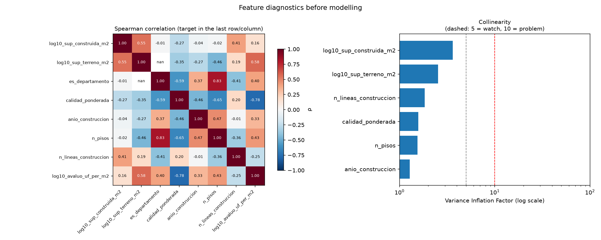
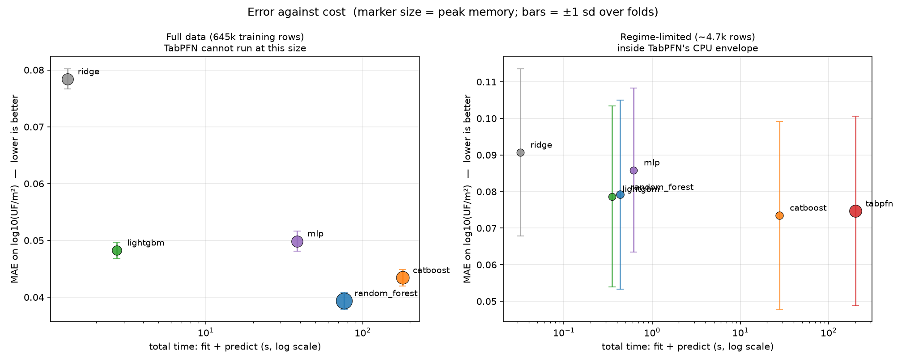
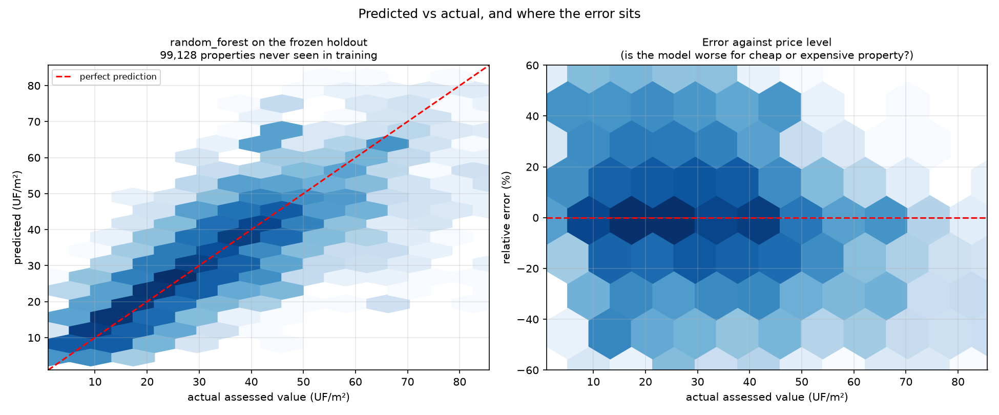
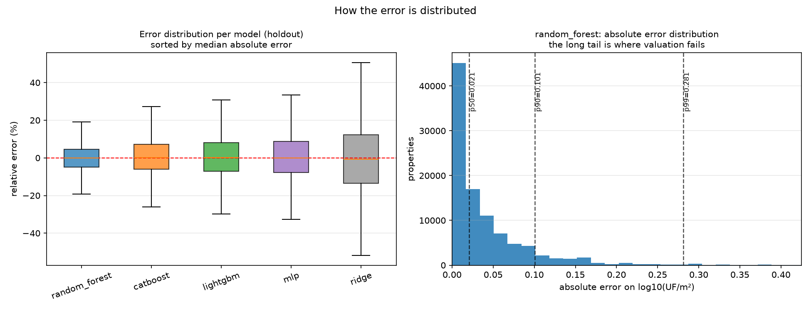
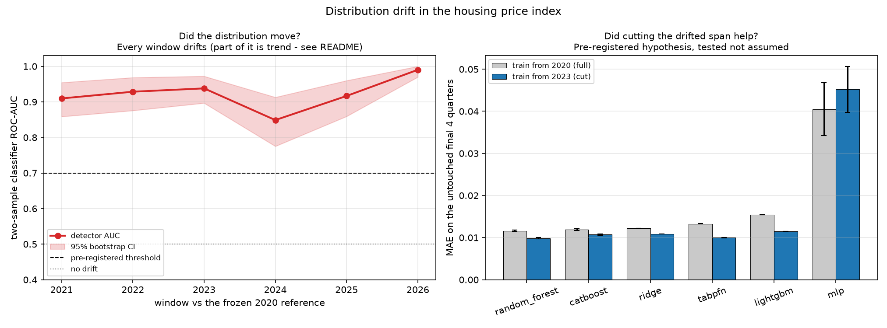
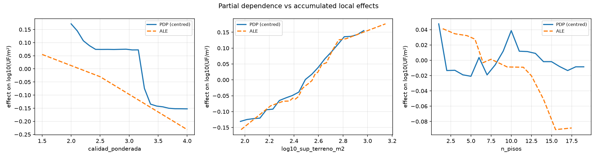

# Real estate valuation: classical ML vs a tabular foundation model

Does a tabular foundation model beat gradient-boosted trees on a real
administrative dataset, and what does the answer cost?

The thesis under test - from Grinsztajn et al. (2022) and Shwartz-Ziv & Armon
(2022) - is that classical methods still win on tabular data, and that the
decisive comparison is **error against cost**, not error alone. TabPFN v2
(Hollmann et al., *Nature* 2025) is the counterexample we test against, not a
foregone conclusion.

**Everything was decided before any result was seen.** The target, metrics,
win/loss rules, drift cutoff, held-out periods and leakage rules are frozen in
[`CRITERIA.md`](CRITERIA.md), committed before a line of modelling code
existed. That file was never edited; deviations are listed at the end here.

> **Assessed value is not market price.** The SII's *avalúo fiscal* is an
> administrative tax base set at *reavalúo*. It is not a transaction price, and
> nothing here estimates what a property would sell for.

---

## 1. Data

| Source | Role | Size |
|---|---|---|
| [SII cadastre](../../datasets/ch/sii_cadastre/) | Cross-sectional arm | 905,709 residential *roles*, 8 Metropolitan Region communes, cycle 2026-1 |
| [Central Bank HPI](../../datasets/ch/central_bank_hpi/) | Temporal / drift arm | 17 quarterly price series, 2002-2026 |

Both are credential-gated for bulk access, so the raw files are downloaded
manually; each dataset README documents the exact columns that arrive and when
they were retrieved.

### 1.1 Columns: used, created, dropped

The cadastre ships 19 columns in the roles file and 11 in the construction-lines
file. This is what happened to each one that mattered.

**Used as features (9).**

| Feature | Origin | Meaning |
|---|---|---|
| `log10_sup_construida_m2` | **created** - log10 of `Superficie de la línea`, summed per property | Built area. Logged because areas span three orders of magnitude |
| `log10_sup_terreno_m2` | **created** - log10 of `Superficie total del terreno`, 0 → NaN | Land area. Zero means "no land of its own", not "small", so it becomes NaN and is flagged instead |
| `es_departamento` | **created** - `Superficie del terreno == 0` | Apartment flag. Derived, not assumed: those rows carry a median 8 floors against 1, and 32.1 against 20.5 UF/m² |
| `calidad_ponderada` | **created** - area-weighted mean of `Código de calidad` across construction lines | Construction quality, 1 (Superior) to 5 (Inferior) |
| `anio_construccion` | original (`Año de la línea`), newest line kept | Construction year |
| `n_pisos` | original (`Número de Pisos`), max across lines | Floors |
| `n_lineas_construccion` | **created** - count of construction lines per property | Structural complexity of the property |
| `comuna_nombre` | original (`Código SII de la Comuna`, mapped to name) | Commune, 8 levels |
| `material_predom` | original (`Código de material estructural`), modal across lines | Dominant structural material |

**Target.** `log10_avaluo_uf_per_m2` - **created** as
`Avalúo fiscal total ÷ built area ÷ UF`, then log10. Deflation to UF is
mandatory, not stylistic: nominal pesos carry an inflationary trend that any
model would learn as signal.

**Dropped, and why.**

| Column | Why it was dropped |
|---|---|
| `Avalúo fiscal total` | It is the target's numerator - using it reconstructs the target exactly |
| `Avalúo exento` | Same, indirectly: it **equals** the total assessed value in 51% of rows, and there `exento / area / UF` correlates 1.000000 with the target |
| `Contribución semestral` | The property tax is a fixed rate times the avalúo, so it is the target times a constant |
| `edad_anios` | A feature we created and then removed: age is exactly `2026 − year`, so it duplicated `anio_construccion` (Spearman −1.000, VIF ≈ 10¹⁵). See §1.2 |
| `Dirección`, `Rol Bien Común`, `Rol Padre`, `Código de Ubicación` | Identifiers and cross-references, not property attributes |
| Agrícola files | Empty for all eight communes, which are urban |
| Non-residential *roles* | Only `destino = H` (residential) with positive built area is modelled |

**Rows dropped:** 741 of 905,709 (0.08%) - 724 with built area under 10 m²
(where value per m² is dominated by rounding) and 17 outside the plausibility
band. Construction years outside 1900-2026 (34 rows) were set to NaN, quality
clipped to 1-5 (405 rows), floors capped at 70 (3 rows; the raw maximum was 224,
and no building in Chile exceeds ~64).

### 1.2 Correlation and collinearity

Run before any model is fitted, because correlated features make individual
importances non-separable and collinear ones make linear coefficients unstable.



This diagnostic **found a defect in our own feature engineering**:
`edad_anios` and `anio_construccion` were perfectly collinear (ρ = −1.000
exactly, VIF ≈ 10¹⁵), because age was defined as `2026 − year`. The redundant
column was removed and every result below was regenerated from scratch with the
9-feature set. After the fix the maximum VIF is **3.62**, comfortably below the
usual warning line of 5.

Construction quality is by far the strongest single correlate of the target
(Spearman −0.780); built area, surprisingly, is the weakest (0.162) - the
target is already *per m²*, so size mostly divides out.

---

## 2. Models

Five classical models plus one tabular foundation model, each given the data
representation it is designed for. Hyperparameters are library defaults - the
"competent engineer in ten minutes" baseline the thesis is about.

| Model | What it is |
|---|---|
| **Ridge** | Linear regression with L2 shrinkage. The floor: whatever a straight line can do. |
| **Random Forest** | Hundreds of deep decision trees on bootstrapped samples, averaged. Low bias, high memory. |
| **LightGBM** | Gradient-boosted trees built leaf-wise with histogram binning. Consumes categoricals and missing values natively. |
| **CatBoost** | Gradient boosting with ordered target statistics for categoricals, designed for exactly the high-cardinality categorical case. |
| **MLP** | A small feedforward neural network - the deep-learning arm on tabular data. |
| **TabPFN v2** | A transformer pre-trained on millions of synthetic tabular tasks. It does not train on your data: it conditions on it in-context, so "fitting" is nearly free and all the work happens at prediction. |

### Validation

Grouped 5-fold cross-validation **by manzana** (city block) × 5 seeds, on a
development split only. Rows from the same block never span train and test. A
frozen **10% of manzanas** (1,882) was set aside before any modelling and used
exactly once, at the very end.

Two arms are needed because TabPFN cannot see the full dataset: its
architectural ceiling is 10,000 rows, and on CPU it refuses more than 5,000.

- **Full** - the five classical models on all 645k training rows.
- **Regime-limited** - all six on ~4.7k rows, inside TabPFN's envelope, so the
  comparison is like-for-like rather than against models that saw 170× more data.

### Leakage checks

Three rules are enforced before any fit, and [`test_leakage.py`](test_leakage.py)
proves each fires by injecting real leaks. That test earned its place
immediately: the first empirical detector **missed the real leak**.
`avaluo_exento` reconstructs the target exactly in 51% of rows and differs in
the rest, so a global-R² detector saw nothing unusual while half the dataset was
exactly recoverable. A partial-leak detector - the share of rows collapsing onto
one constant residual - now catches it.

---

## 3. Results

### 3.1 Which model, and at what cost

Both arms, mean ± standard deviation over 25 folds. The left panel is the
realistic problem; the right is the only place all six models can be compared.



**Full data** - the five classical models on 645k training rows. Lower MAE is
better; fit time and memory are what that accuracy costs.

| Model | MAE (log10) | R² | MdAPE | Fit s | Peak MB |
|---|---|---|---|---|---|
| random_forest | **0.0394 ± 0.0015** | 0.893 | 4.7% | 75 | 2,260 |
| catboost | 0.0434 ± 0.0015 | 0.902 | 6.6% | 179 | 664 |
| lightgbm | 0.0483 ± 0.0014 | 0.889 | 7.7% | **2.2** | **79** |
| mlp | 0.0499 ± 0.0018 | 0.882 | 7.9% | 38 | 312 |
| ridge | 0.0784 ± 0.0018 | 0.735 | 13.4% | 1.2 | 323 |

**Regime-limited** - all six on ~4.7k rows. Note TabPFN's split: its fit is
nearly free, and its entire cost sits in prediction.

| Model | MAE (log10) | R² | Fit s | Predict s | Peak MB |
|---|---|---|---|---|---|
| catboost | **0.0735 ± 0.0256** | 0.692 | 27.7 | 0.006 | 2 |
| tabpfn | 0.0747 ± 0.0259 | 0.674 | 1.2 | **198.4** | 507 |
| lightgbm | 0.0787 ± 0.0247 | 0.649 | 0.34 | 0.011 | 0.1 |
| random_forest | 0.0792 ± 0.0258 | 0.630 | 0.38 | 0.059 | 4 |
| mlp | 0.0859 ± 0.0225 | 0.610 | 0.61 | 0.009 | 0.2 |
| ridge | 0.0907 ± 0.0228 | 0.603 | 0.02 | 0.008 | 0.2 |

### 3.2 The pre-registered decision: classical methods win

Evaluated on the 20 paired (seed, fold) cells where every model ran:

- best classical (**catboost**): E_c = 0.0704 ± 0.0259
- TabPFN: E_t = 0.0747 ± 0.0259
- pooled spread s = 0.0518; |E_c − E_t| = **0.0043**

Accuracy is statistically indistinguishable, and CatBoost gets there with
**7.1× less total time** and **224× less peak memory**. That triggers rule 2 of
the pre-registration: **classical methods win**.

The paired subset matters: TabPFN could not run on 5 of 25 folds (whole-manzana
subsampling overshot its 5,000-row ceiling), and fold-to-fold variance in this
arm is large, so comparing a 20-fold mean against 25-fold means would compare
different folds.

### 3.3 The finding that actually matters

**TabPFN's binding constraint is not accuracy - it is that it cannot ingest the
data.** Inside its envelope it is genuinely competitive (second place,
statistically tied with the winner), consistent with what Hollmann et al.
report. But the best any model achieves at its 4.7k-row ceiling is 0.0735, while
a random forest given all 645k rows reaches **0.0394**.

The data TabPFN cannot see is worth roughly **twice** as much as any difference
between architectures.

The cost asymmetry is also structural rather than incidental. TabPFN's fit takes
1.2s because it does no training; the work happens at inference, where it needs
**198s** to predict what CatBoost predicts in 0.006s. For batch valuation of a
national cadastre, that is disqualifying regardless of accuracy.

### 3.4 Final evaluation on the frozen holdout

The holdout was untouched through every decision above and used once. If the
pre-registration worked, these numbers should match the cross-validated ones -
and they do, to within ~0.002 everywhere.

| Model | Holdout MAE | R² | MdAPE | CV MAE (for comparison) |
|---|---|---|---|---|
| random_forest | **0.0401 ± 0.0001** | 0.895 | 4.9% | 0.0394 |
| catboost | 0.0425 ± 0.0001 | 0.912 | 6.7% | 0.0434 |
| lightgbm | 0.0469 ± 0.0003 | 0.899 | 7.6% | 0.0483 |
| mlp | 0.0479 ± 0.0014 | 0.896 | 8.0% | 0.0499 |
| ridge | 0.0768 ± 0.0000 | 0.746 | 12.9% | 0.0784 |

TabPFN is absent from this table, and that absence *is* the result: 806k
development rows against a 5,000-row ceiling.

How the winning model's predictions actually land on 99,128 unseen properties:



The error is roughly symmetric and does not blow up at either end of the price
range - the model is not systematically mispricing cheap or expensive property.

### 3.5 How the error is distributed

A mean error hides whether a model is reliably decent or usually excellent with
occasional disasters. This is the difference between the two.



For the best model, half of all properties are predicted within **0.021** on the
log10 scale (~5%), 90% within 0.101 (~26%), but the worst 1% exceed 0.281
(~91%). Valuation failures live in that tail, not in the average.

### 3.6 Drift

Against a **frozen** 2020 reference window (fixed, never rolling):

- **Univariate**: 5-6 of 6 features flagged per window by KS + PSI. The
  Benjamini-Hochberg correction cut significant KS results from 16 to 14 -
  which is exactly why it is applied.
- **Multivariate**: classifier two-sample AUC 0.85-0.99; every window drifted.

The pre-registered hypothesis was that cutting the drifted 2020-2022 span would
help. It was tested, not assumed - and it holds for 5 of 6 models.



| Model | Train from 2020 | Train from 2023 | Improvement |
|---|---|---|---|
| lightgbm | 0.01546 | **0.01147** | +0.0040 |
| tabpfn | 0.01326 | **0.00999** | +0.0033 |
| random_forest | 0.01163 | **0.00987** | +0.0018 |
| ridge | 0.01219 | **0.01083** | +0.0014 |
| catboost | 0.01192 | **0.01070** | +0.0012 |
| mlp | **0.04048** | 0.04523 | −0.0048 |

One caveat on the detector: `level_lag1` is a rising index, so a classifier can
separate windows by level alone and part of that AUC is mechanical trend. The
stationary-by-construction `dlog_*` features drift too - and the 2023 detector
leans entirely on them - so the drift is real, but the AUC alone overstates it.

---

## Structure, not just error



SHAP on the best tree model: **`calidad_ponderada` dominates at 0.181 mean
|SHAP|, five times the next feature** (comuna = Las Condes, 0.034). The model is
largely recovering the structure of the SII's own valuation instrument, whose
unit-construction-value tables are indexed by quality - not a market regularity.
(A SHAP value is a local linear attribution, not the model.)

Symbolic regression found a readable closed form (complexity 5):

```
log10(UF/m²) = 1.8227 − 0.1021 × calidad
```

On held-out manzanas, given the same rows and the same numeric-only features,
this **beats a random forest**: MAE 0.0381 vs 0.0760 (0.50×). With few rows and
no locational feature the forest overfits; the two-term formula generalises.

Getting that number required fixing the comparison twice, and both versions
flattered the forest: first it was scored in-sample, then it was still trained on
the rows the expression was tested on. The reference is now a forest fit on
exactly PySR's training rows and feature set, scored on the same held-out
manzanas.

---

## Reproduce

```bash
pip install -r ../../requirements.txt
python run_all.py
```

~4.5 hours on 6 CPU cores, dominated by the CV sweep. Both data sources are
credential-gated, so raw files are downloaded manually first - see each
dataset's README - and `TABPFN_TOKEN=<key>` goes in a local `.env`.

**Do not run anything CPU-heavy alongside it.** Training time is a reported
metric and contention inflates it. This is not hypothetical: an early sweep
overlapped with TabPFN probes and showed spikes up to 7.5× (LightGBM 14.2s
against a 1.9s median). Those results were discarded and re-run clean; every fit
now records `started_at` so contention is auditable rather than invisible.

## Limitations and deviations from the pre-registration

`CRITERIA.md` was never edited. These are recorded here instead, as it requires.

1. **The SII bulk download is not "public, no authentication"** as the brief
   assumed. It sits behind an SII login (RUT + Clave Tributaria), so raw files
   are downloaded manually; the loaders never automate a login.
2. **`área homogénea` is unavailable** - it is not in the bulk download (it lives
   in the map viewer's WMS layers), so locational features are commune plus the
   manzana grouping key. No geocoding was available either.
3. **TabPFN is capped at 5,000 training rows, not 10,000.** Its config documents
   10k, but on CPU it refuses more than 5,000 "due to slow performance". We
   respected that rather than overriding it, so TabPFN runs in the configuration
   its authors support on this hardware.
4. **TabPFN ran on 20 of 25 regime-limited folds** - whole-manzana subsampling
   overshot the ceiling on five. The decision rule uses the paired subset; both
   figures are reported.
5. **Energy was not measurable** on this machine (no RAPL/NVML on Windows) and is
   recorded as such rather than estimated. FLOPs are derived only where the
   algorithm makes that meaningful (Ridge, MLP); for tree ensembles a FLOP count
   would be theatre.
6. **The IPV export omits the three non-RM national zones** - the cuadro was
   exported from the Metropolitan Region section onward. All eight cadastre
   communes are in the RM, so the drift panel is 16 series rather than 19.
7. **Part of the drift AUC is mechanical**, as described in §3.6.
8. **Interpretability ran on a declared 20k-row subsample**, symbolic regression
   on 3,433 training rows. PySR is an evolutionary search that needs small data
   by design.
9. **A redundant feature was present in an earlier run.** `edad_anios` duplicated
   `anio_construccion` exactly. It was removed and every number above was
   regenerated; the published results come from the corrected 9-feature set.
10. **Single dataset, single country, single reavalúo cycle.** Nothing here shows
    that trees beat foundation models in general - only that on this problem, at
    this scale, the cost asymmetry decides it.
