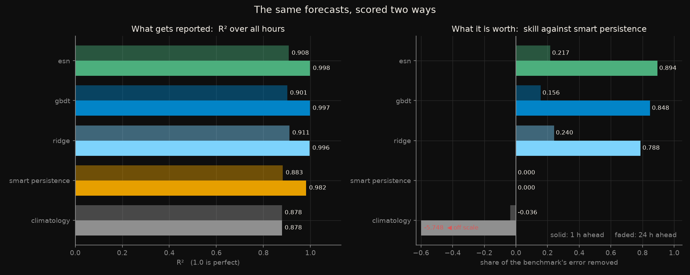
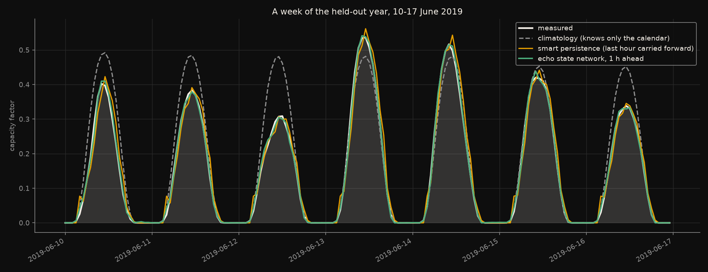
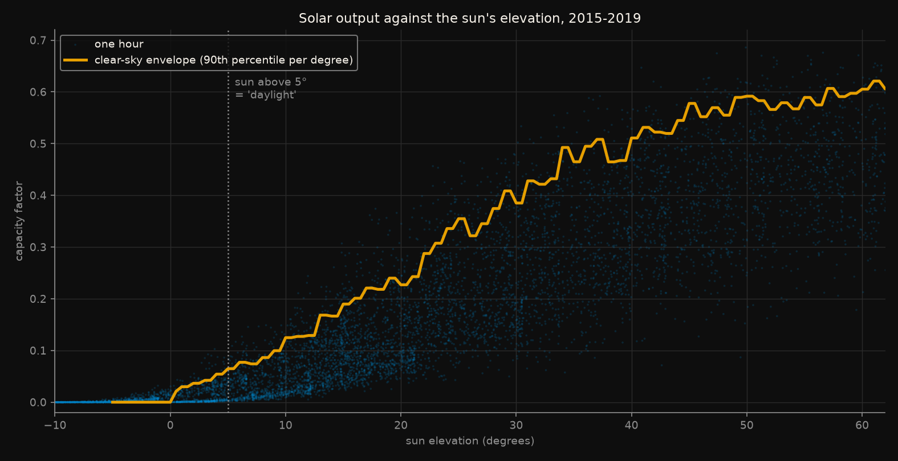

# How much of a solar forecast is just the sunrise?

Solar forecasting papers report R² above 0.90 routinely. This asks what that
number is made of, on five years of **measured** German solar generation.

Rules frozen in [`CRITERIA.md`](CRITERIA.md) before anything was fitted. Five
predictions were written down; **two held and three failed**, and the failures
changed what the experiment is about.

## The short version

**Reporting R² and reporting skill are two different descriptions of the same
forecast, and they disagree completely about which model is worth anything.**



*Left: R² over all hours, the number the literature reports. Right: the same
forecasts, scored against the benchmark they have to beat. Solid bars are one
hour ahead, faded bars twenty-four. Climatology's skill at one hour is −5.75
and runs off the axis; the bar is clipped and marked.*

On the left everything is crushed between 0.878 and 0.998 - five predictors
that look nearly identical. On the right the same five spread from −5.75 to
+0.89.

The single most useful number in this experiment:

> **Climatology - the average output for that day of the year and hour, taken
> from the training years - scores R² = 0.878 on the held-out year.**

It cannot see a cloud. It makes the identical prediction for 15 June 2019 as
it did for 15 June 2015. It contains no forecast information of any kind, and
it lands within 0.12 R² of a tuned gradient booster.

## What each figure shows

### The two framings

Reading the left panel alone, a reader would conclude the models add almost
nothing over persistence: 0.982 → 0.998 at one hour ahead. Reading the right
panel, the same comparison is an **89% reduction in error**. Both are computed
from the same predictions on the same hours. R² compresses everything near 1.0
because the denominator, the total variance, is dominated by the daily rise
and fall of the sun - which no one has to forecast.

### A week of the held-out year



*10-17 June 2019, one hour ahead. Grey dashed is climatology, amber is smart
persistence, green is the echo state network, and the filled shape is what
Germany actually produced.*

This is what R² = 0.878 looks like. Climatology draws the same smooth bell
every day: too high on 10, 11 and 12 June, close by accident on the 13th,
too high again on the 16th. It is visibly wrong almost every day and still
scores 0.878, because it gets the shape and the timing right and only the
weather wrong - and the weather is the small part of the variance.

The two real forecasts track the measured curve closely enough to be hard to
separate by eye. That similarity is exactly why a metric that cannot separate
them is not useful.

### The clear-sky envelope



*Every hour of 2015-2019 plotted against the sun's elevation, with the
envelope used by the persistence baseline.*

The curve is what a cloudless hour gives. The vertical spread underneath it is
the weather, and it is the only thing a forecast has to predict. The envelope
is estimated as the 90th percentile of output within each 1-degree elevation
bin, on the training split only, so the held-out year cannot set the level of
the baseline it is later scored against.

## What was predicted, and what happened

| | Prediction, written before fitting | Outcome |
|---|---|---|
| **P1** | Climatology reaches R² ≥ 0.85 over all hours | **passed** - 0.878 at both horizons |
| **P2** | Daylight-only R² is at least 0.15 lower for every model | **FAILED** |
| **P3** | No model exceeds skill 0.35 at 1 hour ahead | **FAILED, badly** |
| **P4** | Persistence is worse than climatology at 24 hours | **FAILED** |
| **P5** | The echo state network and the booster differ by < 0.10 daylight R² | **passed** - 0.002 |

### P3 failed, and it is the best thing here

I expected the models to add little over persistence. They add a great deal:
skill of **0.79 (ridge), 0.85 (gradient boosting) and 0.89 (echo state
network)** one hour ahead.

That is a real result and it runs against the framing I set up. A national
aggregate is smooth - clouds over Bavaria do not cover Schleswig-Holstein - so
the hour-to-hour ramp is learnable, and a model with four lags and the
clear-sky index beats carrying the last observation forward by a wide margin.

At twenty-four hours it collapses to **0.16-0.24**, which is the number an
operational forecaster would recognise.

### P2 failed because the premise was too crude

I predicted that removing night would knock at least 0.15 off every R². It
does for climatology (0.878 → 0.755) and for the constant baseline
(−0.002 → −0.504), but barely touches the good models:

| | R² all hours | R² daylight only | drop |
|---|---|---|---|
| climatology | 0.878 | 0.755 | 0.124 |
| smart persistence, 1 h | 0.982 | 0.965 | 0.017 |
| echo state network, 1 h | 0.998 | 0.997 | 0.001 |

Night is not where the inflation lives. A good model is good in daylight too,
so masking the dark hours takes away easy wins from *both* the numerator and
the denominator. **The inflation is the diurnal and seasonal cycle as a whole,
not the night**, and climatology scoring 0.755 in daylight alone is the
evidence for that. Comparing against a no-information baseline exposes it;
masking hours does not.

### P4 failed

At twenty-four hours, carrying yesterday's weather forward is slightly
*better* than knowing only the calendar - persistence scores 0.883 against
climatology's 0.878, a skill of +0.035. I predicted the sign would flip. It
does not, quite. Weather autocorrelation at one day is weak but not gone.

### P5 held

The echo state network - 400 randomly wired units with only a ridge readout
fitted, no backpropagation through time - matched the tuned gradient booster
to 0.002 R² and beat it on skill at both horizons, in comparable wall-clock
time (1.5 s against 2.2 s at one hour). For a model whose recurrent weights
are never trained, that is the interesting half of the architecture question.

## Full results

Held-out year 2019, 8,758 hours, of which 3,954 are daylight.

| Horizon | Predictor | R² all | R² day | nRMSE day | Skill vs persistence | Fit |
|---|---|---|---|---|---|---|
| 1 h | training mean | −0.002 | −0.504 | 0.189 | −54.60 | - |
| 1 h | climatology | 0.878 | 0.755 | 0.076 | −5.75 | - |
| 1 h | smart persistence | 0.982 | 0.965 | 0.029 | 0.000 | - |
| 1 h | ridge | 0.996 | 0.994 | 0.012 | 0.788 | 0.03 s |
| 1 h | gradient boosting | 0.997 | 0.995 | 0.011 | 0.848 | 2.20 s |
| 1 h | **echo state network** | **0.998** | **0.997** | **0.009** | **0.894** | 1.48 s |
| 24 h | climatology | 0.878 | 0.755 | 0.076 | −0.036 | - |
| 24 h | smart persistence | 0.883 | 0.763 | 0.075 | 0.000 | - |
| 24 h | **ridge** | **0.911** | **0.820** | **0.065** | **0.240** | 0.01 s |
| 24 h | gradient boosting | 0.901 | 0.800 | 0.069 | 0.156 | 0.62 s |
| 24 h | echo state network | 0.908 | 0.815 | 0.066 | 0.217 | 1.44 s |

At twenty-four hours **ridge regression wins**. A linear model on lags and
solar geometry beats both the gradient booster and the reservoir. Whatever
structure the nonlinear models find one hour out has decayed by the next day.

## Reproduce

```bash
pip install -r ../../requirements.txt
python ../../datasets/de/opsd_solar/load.py            # ~130 MB, cached, checksummed
python ../../datasets/de/opsd_solar/load.py --check-sun # geometry vs PVGIS
python run_all.py
```

About 20 seconds after the download. `run_all.py` checks `config.yaml`
against the frozen values, then runs the leakage checks, and stops if either
fails.

The leakage checks are the part worth reading. The third builds the broken
feature builder on purpose - one lag shifted the wrong way, which is a single
character in the source - and the fifth reports what that would have bought:

```
R2 0.918 -> 0.976: the leak removes 71% of the error the honest model
could not explain, 24 hours ahead
```

## Premises and warnings

**The target is a national aggregate, not a panel.** Germany's output is the
sum of about 2 million installations spread over 800 km. Clouds average out.
Skill numbers here are an upper bound on what a single rooftop would see, not
a typical value.

**Capacity grew 36% over the period**, from 37.2 to 50.5 GW. The target is
therefore the capacity factor, not megawatts. A model fitted to raw output
would be rewarded for learning the build-out, which is not forecasting.

**Solar elevation is computed at Germany's centroid.** Panels run from 47.3°N
to 55.1°N, so twilight is off by up to about twenty minutes at the extremes.
The implementation agrees with PVGIS's independent one to 0.13° mean absolute
error over a year, so the error is the single-location assumption, not the
astronomy.

**One country, five years, two horizons.** Nothing here transfers
automatically to a sunnier grid, a smaller balancing area, or a sub-hourly
horizon.

**No weather forecast is used.** A real day-ahead operational system ingests
numerical weather prediction, which is the single biggest input at 24 hours.
The 24-hour numbers here are what is achievable from the generation history
alone, and are correspondingly pessimistic against an operational system.

**"Skill" always names its benchmark.** Every skill figure in this write-up is
against smart persistence. Against climatology the same models score higher,
and against nothing at all they score R² 0.99. That is the whole point.

## Deviations from the pre-registration

`CRITERIA.md` was not edited after freezing.

**The leakage test's first two checks were rewritten before the experiment
ran**, because they were wrong rather than because the features were. The
static check flagged `out["y"] = d["cf"].shift(-horizon)` - the target, which
must read ahead. The statistical check assumed the last observation was the
best legitimate predictor, and failed on `cs_now`: clear-sky output tracks the
target better than the last observation does, and is entirely legitimate
because the sun's position is known centuries in advance. Both were replaced
by a causal check - corrupt every observation after the issue time, rebuild,
and flag any feature that moved - which needs no such assumption.

**The leak-magnitude check was rescaled.** It demanded a gain of 0.10 R²,
which is unreachable when the honest model already sits at 0.918 and only
0.082 is left to win. It now measures the share of remaining error the leak
removes, which is 71%.

**`early_stopping=False` on the gradient booster** is set explicitly, as
`CRITERIA.md` specified. sklearn's default enables it above 10,000 samples,
which would have made the model quietly different between the two horizons.
