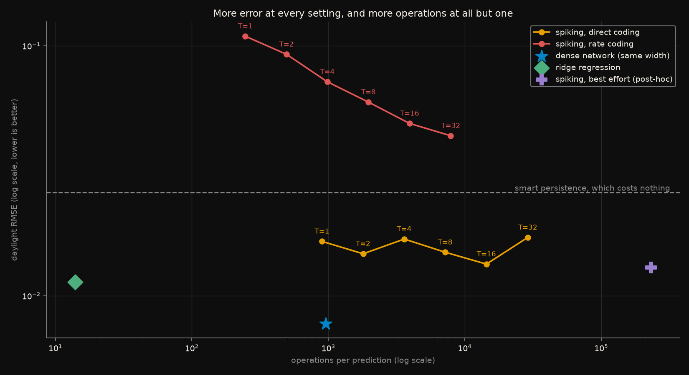
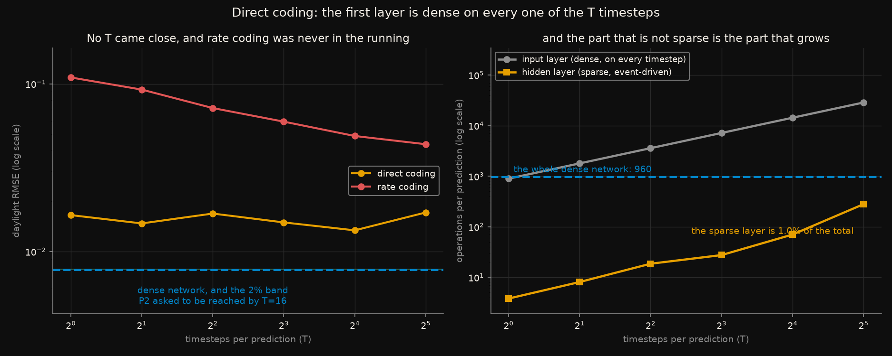
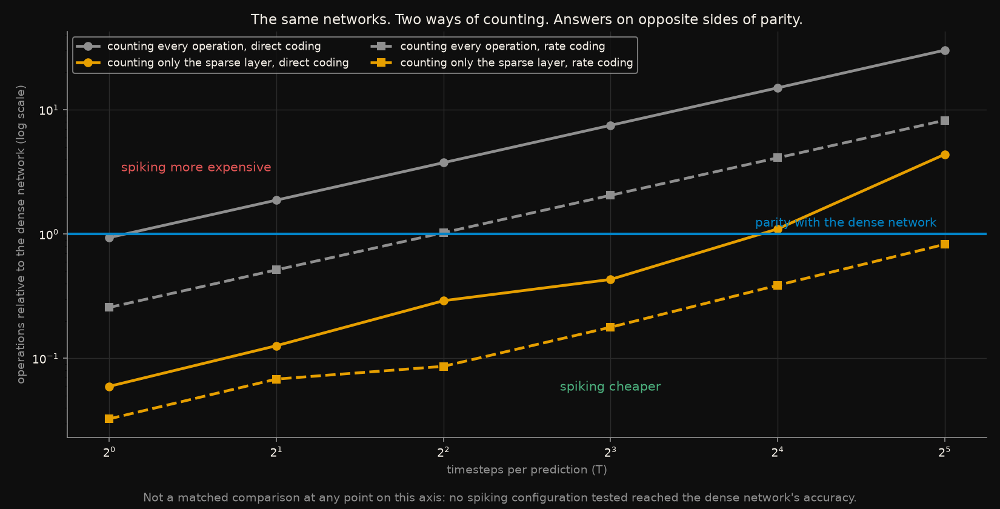

# The spiking energy argument, with the timesteps counted

Spiking neural networks are not usually sold on accuracy. They are sold on
energy. The argument is clean: a spiking neuron that does not fire costs
nothing, so the right unit of cost is the **synaptic operation** - one
accumulate per spike per outgoing synapse - rather than the dense
multiply-accumulate an ordinary network pays whether or not anything
interesting happened. Quoted savings are one to two orders of magnitude.

There is a factor the headline usually leaves out. **A spiking network runs
for `T` timesteps per prediction.** Whatever the sparsity buys has to beat
that `T` first. And with the input encoding most implementations actually
use - repeating the analogue input at every timestep, "direct coding" - the
first layer is a dense matrix multiply on *every one* of those timesteps, so
it costs `T` times what the dense network's first layer costs.

This measures both numbers on one task, with the operation counter reading
the spikes that actually happened rather than assuming a firing rate.

Rules frozen in [`CRITERIA.md`](CRITERIA.md) before any network was built.
Six predictions; **four held, one failed, and one turned out to be
unanswerable as written.**

## The short version

The sparsity is real. The hidden layer fires on **1.3% to 13.9%** of
neuron-timesteps, comfortably inside what the energy argument assumes. It
does not help, because of where the operations actually are:

> Under direct coding, **99.0% to 99.8% of the spiking network's operations
> are in the input layer** - the dense one, repeated `T` times. The sparse,
> event-driven part that the entire argument is about is under one percent of
> the total.

And the accuracy never arrived. No configuration reached the dense network's
error at any `T`:

| | daylight RMSE | operations |
|---|---|---|
| dense network, 64 hidden units | **0.00774** | 960 |
| ridge regression | 0.01134 | **14** |
| spiking, direct coding, best `T` | 0.01338 | 14,406 |
| spiking, best effort (post-hoc, 512 units, `T`=32) | 0.01297 | 230,949 |
| smart persistence | 0.02588 | 0 |

The line that is hardest to argue with is the second one. **Ridge regression
beat every spiking configuration tested, including the post-hoc one, using
16,496 times fewer operations.** Fourteen multiply-accumulates, no timesteps,
no neurons.

## The task

Next-hour German solar capacity factor, from
[`datasets/de/opsd_solar`](../../datasets/de/opsd_solar/). Train 2015-2017,
validate on 2018, test on 2019 - split by calendar year and never shuffled.
Scored on daylight hours only, because predicting zero at night is not
forecasting and including those hours lets any model look good for getting
the easy half right.

The forecasting question itself - how much of a reported solar R² is just the
sun rising on schedule - is the subject of
[`solar-forecast-skill`](../solar-forecast-skill/). Here the forecast is only
a task on which two architectures can be compared at a known level of
usefulness, with **smart persistence** as the line any real forecast has to
clear. The dense network clears it by 70%.

Both networks get **the same hidden width**, so the comparison is between
architectures rather than between capacities.

## How the operations are counted

Fixed in advance, and deliberately generous to the spiking side.

| | operations per prediction |
|---|---|
| dense network | `n_in * H + H * n_out`, always, regardless of input |
| spiking, input layer, direct coding | `T * n_in * H` - dense, every timestep |
| spiking, input layer, rate coding | `(input spikes) * H` |
| spiking, hidden layer | `(hidden spikes, summed over T) * n_out` |

A multiply-accumulate and a synaptic accumulate are counted as **one
operation each**. In hardware an accumulate is the cheaper of the two, so
this convention favours the spiking network; the point is whether the
conclusion survives it.

The counter is measured, not estimated. `count_ops` runs the network and adds
up the spike tensors it actually produced, and [`test_snn.py`](test_snn.py)
drives it to two cases whose answer is known exactly - every neuron firing on
every timestep, and none ever firing - and checks it returns `T * H` and `0`.

## What each figure shows

### Both axes at once



*Error against operations per prediction, both on log scales. Down and left
is better. Each spiking point is labelled with its `T`.*

A claim about energy is only interesting at a given accuracy, and a claim
about accuracy is only interesting at a given cost, so neither can be quoted
alone here. **Every spiking configuration sits up and to the right of the
dense network**: more error and, from `T` = 2 onwards, more operations.

The green diamond is the one that should give a practitioner pause. Ridge
regression - fourteen operations, no hidden layer, no timesteps - lands below
and far to the left of every point on both spiking curves. It is not a
sophisticated baseline. It is the least sophisticated baseline available, and
on this task it wins.

The two spiking curves also separate cleanly. Rate coding (red) makes the
input layer sparse and does buy a genuine reduction in operations, and it
costs so much accuracy that the whole curve sits above smart persistence -
above the free baseline that a forecast has to beat to be worth running.

### More timesteps do not buy accuracy, and do buy operations



*Left: error against `T`, log scale, with the dense network and P2's 2%
tolerance drawn as one band because they are within a hair of each other.
Right: where the operations go, under direct coding.*

The left panel is the failure of P2. Direct-coded medians wander between
0.01338 and 0.01711 across a 32-fold change in `T` - a 28% range, while the
spread across three seeds within a single cell reaches 18%. **The differences
between timestep counts are not clearly larger than the noise between
seeds.** The honest statement is not "more timesteps help a little", it is
that over this range `T` bought nothing measurable.

The right panel is the mechanism, and it is the figure this experiment exists
for. The two lines are plotted separately rather than stacked, because they
differ by more than two orders of magnitude. The grey line - the dense input
layer, paid `T` times - climbs straight through the dense network's entire
cost at `T` = 2 and keeps going. The amber line is the sparse, event-driven
part. At `T` = 32 it is **1.0% of the total**.

The energy argument is a true statement about the amber line and a
description of almost none of the work.

### The same networks, counted two ways



*Cost relative to the dense network under both conventions, at every `T`.
Above the blue line the spiking network is more expensive; below it, cheaper.
Solid is direct coding, dashed is rate coding.*

This is P5, and it is drawn across the whole sweep rather than at one chosen
`T` on purpose - the two conventions do not disagree everywhere, they
disagree over a range, and picking a single `T` would have let the figure say
whatever that `T` said.

Take direct coding at `T` = 8. Counting every operation, the spiking network
costs **7.5 times** the dense one. Counting only the sparse hidden layer - as
energy comparisons routinely do - it costs **0.43 times**, a 2.3x saving.
Same two networks, same run, same data. The conclusion is chosen by the
convention.

The amber lines also show where the convenient convention stops working: the
hidden layer's own cost grows with `T` too, and by `T` = 16 direct coding has
crossed parity even under the favourable count.

## What was predicted, and what happened

| | Prediction, written before any network was built | Outcome |
|---|---|---|
| **P1** | The dense network beats smart persistence | **passed** - 0.00774 against 0.02588, by 70% |
| **P2** | Spiking comes within 2% of the dense network by `T` = 16 | **FAILED** - the closest was 1.73x its error |
| **P3** | At the `T` where it matches, spiking performs more operations | **unanswerable** - no such `T` exists |
| **P4** | Hidden spike rate below 20% | **passed** - 1.3% to 13.9% across all 36 cells |
| **P5** | Counting only the sparse layer reverses the verdict | **passed in 10 of 12 cells** |
| **P6** | Rate coding needs a larger `T` than direct coding | **passed** - decisively |

**P3 could not be scored, and the reason matters more than a verdict would
have.** It was conditioned on a matched-accuracy point that never occurred.
The weaker statement that survives is still worth having: with direct coding
the spiking network performs more operations than the dense one at every
`T` ≥ 2, from 1.88x to 30.16x. It is cheaper at exactly one setting, `T` = 1
(0.94x), where its error is 2.13 times the dense network's. Had a matched
point existed anywhere in this sweep, it would have been more expensive.

**P5 passed for 10 of the 12 configurations**, with ratios as low as 0.03x.
The two exceptions are direct coding at `T` = 16 (1.10x) and `T` = 32
(4.37x), where the hidden layer's own spike count has grown enough to pass
the dense layer it was being compared against. The convention flips the
answer over most of the sweep, which is what the prediction claimed.

**P6 passed by a wider margin than intended.** Rate coding does not merely
need a larger `T` - at every `T` tested it is between 3 and 8 times worse
than direct coding at the same `T`, and its best result (0.04367 at `T` = 32)
is still 5.6 times the dense network's error and worse than smart
persistence. The encoding that fixes the energy problem destroys the
accuracy, which is the trade-off in its sharpest form.

## Full results

Medians over 3 seeds. Daylight RMSE on the 2019 test year; operations per
prediction, measured from the spikes produced.

| encoding | `T` | RMSE | × dense | ops, input | ops, hidden | ops, total | × dense | spike rate |
|---|---|---|---|---|---|---|---|---|
| direct | 1 | 0.01650 | 2.13x | 896 | 3.8 | 900 | 0.94x | 0.060 |
| direct | 2 | 0.01472 | 1.90x | 1,792 | 8.1 | 1,800 | 1.88x | 0.063 |
| direct | 4 | 0.01686 | 2.18x | 3,584 | 18.6 | 3,603 | 3.75x | 0.073 |
| direct | 8 | 0.01493 | 1.93x | 7,168 | 27.6 | 7,196 | 7.50x | 0.054 |
| direct | 16 | **0.01338** | 1.73x | 14,336 | 70.3 | 14,406 | 15.01x | 0.069 |
| direct | 32 | 0.01711 | 2.21x | 28,672 | 280.0 | 28,952 | 30.16x | 0.137 |
| rate | 1 | 0.10926 | 14.12x | 244 | 2.1 | 247 | 0.26x | 0.033 |
| rate | 2 | 0.09246 | 11.95x | 490 | 4.4 | 494 | 0.52x | 0.034 |
| rate | 4 | 0.07177 | 9.28x | 980 | 5.5 | 985 | 1.03x | 0.022 |
| rate | 8 | 0.05955 | 7.70x | 1,960 | 11.4 | 1,968 | 2.05x | 0.022 |
| rate | 16 | 0.04891 | 6.32x | 3,918 | 24.8 | 3,943 | 4.11x | 0.024 |
| rate | 32 | 0.04367 | 5.64x | 7,833 | 52.9 | 7,893 | 8.22x | 0.026 |

References, same test year and same metric:

| | RMSE | operations |
|---|---|---|
| persistence | 0.06386 | 0 |
| smart persistence | 0.02588 | 0 |
| ridge regression | 0.01134 | 14 |
| dense network (64 hidden) | 0.00774 | 960 |

The post-hoc best-effort configuration, 512 hidden units at `T` = 32 with
direct coding: **RMSE 0.01297, which is 1.68x the dense network's, at 230,949
operations, which is 241x**. Eight times the width and thirty-two timesteps
did not close a gap that width alone had already failed to close.

## Reproduce

```bash
pip install -r ../../requirements.txt
python ../../datasets/de/opsd_solar/load.py   # cached and checksummed
python run_all.py
```

Roughly forty minutes on four CPU threads, nearly all of it the `T` = 32
cells: a spiking network with 32 timesteps does 32 sequential forward passes
per batch, which is the whole point of the experiment showing up as wall
clock.

`run_all.py` checks `config.yaml` against the frozen values and runs the
implementation checks first. Those checks are the part worth reading. The two
that matter most:

- **the forward pass must be binary and the backward pass must not be.** A
  network that leaked its surrogate gradient into the forward pass would
  train beautifully, produce every number in this experiment, and not be a
  spiking network. The check drives a range of membrane potentials through
  the spike function and asserts the outputs are in `{0, 1}` while the
  gradient is non-zero and peaks at the threshold.
- **the module must reproduce its own stated recurrence, exactly.** The LIF
  update is written out independently in numpy and the spike counts compared.
  An off-by-one in the reset - using this timestep's spike instead of the
  previous one - changes the dynamics and is invisible in a loss curve.

## Premises and warnings

**Operations are not joules.** This counts operations, which is what the
energy argument counts too, and it is a long way from a real energy
measurement. Memory traffic usually dominates both architectures on real
hardware, and neuromorphic chips have cost structures that a MAC-versus-SynOp
tally does not capture. A result about operation counts is a result about
operation counts.

**No neuromorphic hardware is involved.** Both networks run on a CPU. The
spiking network's wall-clock time here says nothing about what it would cost
on hardware built for it - which is precisely why the comparison is made in
operations rather than seconds.

**One task, one architecture, one neuron model.** A single hidden layer of
LIF neurons with a non-spiking readout, on a tabular regression problem.
Spiking networks are at their most convincing on genuinely event-driven
inputs - a silicon retina, an audio stream - where the encoding cost this
experiment charges to the input layer is paid by the sensor instead. **Nothing
here speaks to that case, and it is the case their advocates have in mind.**

**Regression may be the unfavourable framing.** The readout integrates
membrane potential without firing, but the hidden layer is still binary, and
a target needing fine amplitude resolution is a harder thing to build out of
spike counts than a class label is. A classification version could come out
differently, and the flat `T` curve here is consistent with a representation
bottleneck rather than a training one - the post-hoc arm, which multiplied
the width by eight and moved the error by 3%, points the same way.

**Three seeds is few.** The within-cell spread reaches 18% at `T` = 32, which
is why the `T` curve is described as flat within noise rather than as having
a shape. More seeds would sharpen that, and would not change a gap of 1.7x.

**Surrogate-gradient training is one option among several.** Converting a
trained dense network to a spiking one (ANN-to-SNN conversion) is the other
main route and typically needs far larger `T`, which would make the operation
counts worse rather than better. It is not tested here.

**Hyperparameters are not tuned for the spiking network.** Leak, threshold
and learning rate are fixed at conventional values for both architectures. A
tuned spiking network would do better than this one; whether it would close a
1.7x gap while paying 15x the operations is not something this experiment
can say.

**The sweep shared the machine with another experiment.** Wall-clock numbers
are indicative only. The operation counts are unaffected - they are
properties of the network, not of the run.

## Deviations from the pre-registration

`CRITERIA.md` was not edited after freezing.

**One arm was added after the results were seen, and it is marked as such.**
The pre-registered sweep holds the hidden width at 64 for both architectures.
When no `T` reached the dense network's accuracy at that width, a single
further configuration was run - eight times the width and the longest `T` -
to find out whether the gap was the architecture or the budget. It appears in
`config.yaml` under `best_effort`, is drawn in a different colour and
labelled post-hoc in the figures, and **no prediction is scored on it**. P2,
P3, P5 and P6 are scored on the pre-registered sweep alone.

**P3 is reported as unanswerable rather than reinterpreted.** It was
conditioned on a matched-accuracy point, and no such point exists. The
weaker claim that does hold is stated above and labelled as the weaker claim.
Rewriting P3 into something the data happens to support would have been the
easy move and would have made the pre-registration decorative.
