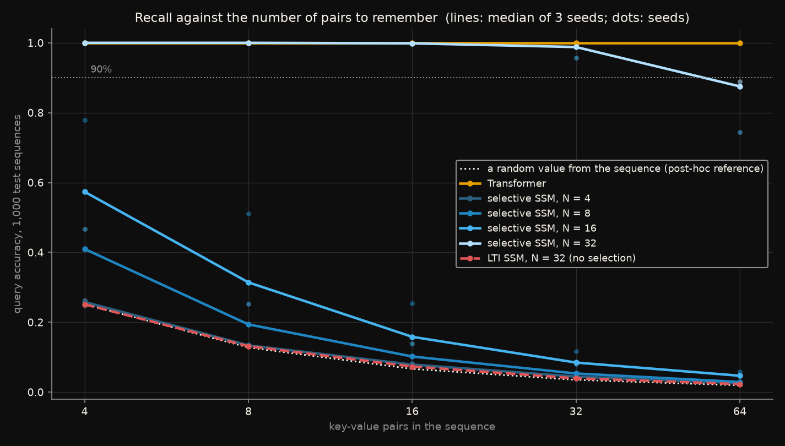
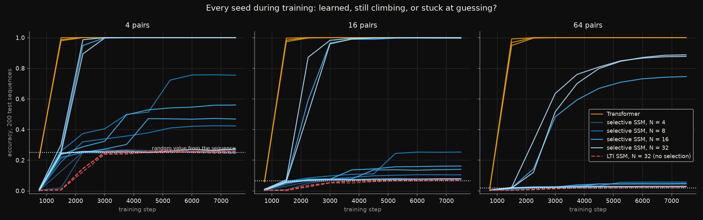
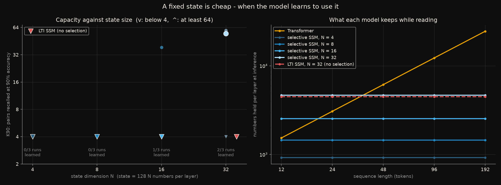

# How many facts fit in a fixed state? First the model has to learn to use it

State-space models of the Mamba family (Gu & Dao, 2023; Dao & Gu, 2024)
are sold as Transformers at linear cost. They read a sequence with a
recurrence over a state of fixed size, so their memory does not grow with
the length of what they read. The counter-argument (Arora et al., 2023;
Jelassi et al., 2024) is that this is exactly their limit: attention keeps
every token and can look any of them up, while a fixed state has to
compress, and recalling `N` arbitrary facts needs a state that grows with
`N`.

The usual evidence is one curve where the SSM falls away and the
Transformer does not. This experiment tries to make the argument
measurable: it turns the state size alone - the dimension `N` of the
SSM's read and write vectors, everything else fixed - and asks how many
key-value pairs each size can recall. If the limit is the state, capacity
should grow with `N`.

Rules frozen in [`CRITERIA.md`](CRITERIA.md) before any network was
trained. Five predictions; **four held**. The one that failed is the one
the experiment was built around, and it failed because these runs could not
answer the question it asks - not because the answer came out the other
way. What decided the comparison was something the pre-registration
treated as a nuisance.

## The short version

Multi-query associative recall: up to 64 key-value pairs, then every key
again; the model must answer each with its value. Two-layer models of the
same width, three seeds each:

| | runs that learned the task | `K90`, median | numbers held per layer, at 192 tokens |
|---|---|---|---|
| Transformer | **3 of 3** | at least 64 - 100% at every count | 24,576, growing with length |
| selective SSM, `N = 32` | 2 of 3 | 55 | 4,672 |
| selective SSM, `N = 16` | 1 of 3 | below 4 (the one that learned: 39) | 2,528 |
| selective SSM, `N = 8` | 0 of 3 | below 4 | 1,456 |
| selective SSM, `N = 4` | 0 of 3 | below 4 | 920 |
| LTI SSM, `N = 32` (selection off) | 0 of 3 | below 4 | 4,480 |

*"Learned" is 95% or more at 4 pairs. `K90` is the number of pairs
recalled at 90% accuracy.*

The Transformer learned the task in every seed, within 1,500 training
steps, and it learned 64 pairs as fast as 4.

The selective SSM, where it learned, recalled a great deal: 87.5-89% of
64 pairs at `N = 32`, holding a fifth of the numbers attention holds at that
length, and more the larger its state. But it learned in only three runs of
twelve. The other nine settled on a cheaper solution, or barely above it -
answer each query with *some* value that appeared in the sequence - and
stayed there for thousands of steps. That solution scores exactly what
guessing among the sequence's values scores. Five of the nine never did
better; the other four crept a few pairs past it.

So the comparison was decided by whether training found the key-value
binding at all, not by how much the state could hold once it had. And
finding it got likelier as the state grew: **0 of 6 runs at `N` of 8 or
less, 1 of 3 at 16, 2 of 3 at 32**. A larger state seems to make the
solution easier to reach, not only bigger once reached - which is a
different argument for large states than the one this experiment set out
to test.

## The data

[`generators/associative_recall`](../../generators/associative_recall/):
`k1 v1 ... kN vN` then the same keys in a new order, 256 keys and 256
values, the pairing random in every sequence. The generator checks that a
lookup in the sequence answers every query, and that the best fixed
key-to-value table and position-to-value table both score chance, 1/256.

Pair counts 4, 8, 16, 32 and 64 - sequences of 12 to 192 tokens. Test: the
generator's 1,000 fixed sequences per count. Training: fresh sequences
every step, one pair count per step in rotation, on a seed stream the test
sets never use.

## The models

Two-layer language models, `d_model = 64`, identical except the mixer -
the part that moves information between positions:

- **Transformer**: causal softmax attention, 4 heads of 16, rotary
  positions. 166,144 parameters.
- **Selective SSM**, Mamba-2 style: 8 heads of 16; per head a recurrence
  over a state of `16 x N` numbers, whose write vector `B_t`, read vector
  `C_t` and decay depend on the input; a short causal convolution in
  front. `N` = 4, 8, 16, 32: 185,728 to 193,456 parameters.
- **LTI SSM**: the same block at `N = 32` with `B`, `C`, the step size and
  the decays learned as constants. 185,120 parameters.

AdamW at 1e-3 with 300 warm-up steps and cosine decay, 7,500 steps of batch
64, cross-entropy at the query positions only.

The SSM is trained through Mamba-2's chunked algorithm, which computes the
recurrence exactly without stepping through it; `test_models.py` checks it
against an explicit step-by-step recurrence over the state, to `1e-15`.
The capacity being measured is the recurrence's.

## What each figure shows

### Recall against the number of pairs



*Query accuracy on 1,000 test sequences per pair count. Lines are medians
over three seeds, dots the seeds. Dotted white: the accuracy of answering
each query with a random value from its own sequence - computed from the
test sets, no model involved, and added after the results.*

The Transformer is a flat line at 100%. The selective SSM at `N = 32`
follows it to 32 pairs and falls to 88% at 64 - the state filling up,
which is what the experiment was built to see. Every other line is at or
near the dotted one. They are not models with too small a state recalling
a few pairs; they are models that, apart from a run or two, never learned
which value belongs to which key.

### Every seed during training



*Each run's test accuracy every 750 steps, at 4, 16 and 64 pairs. Dotted:
the guess level.*

This is the figure that explains the result. The Transformer jumps from
chance to 99% between steps 750 and 1,500, at every pair count at once.
The three SSM runs that learned jump between steps 1,500 and 3,000 at 4 and
16 pairs, then climb slowly at 64 until the learning rate runs out. The
stuck runs reach the guess level by about step 2,250 and stay on it - flat
from there to step 4,500, while the learning rate is still between 83% and
37% of its peak, long before the schedule could be blamed. Four runs crept
partway off it, by one to three and a half pairs, and were still creeping
when the learning rate decayed.

The LTI model reaches the guess level a little later and never leaves it.

### Capacity, and what each model keeps



*Left: `K90` for each state size; triangles pointing down are runs below 4
pairs, large markers the medians. Beneath each size, how many of its three
runs learned the task. Right: the numbers each model holds per layer while
reading, against sequence length.*

On the left, the measurement the experiment was designed for has one
point: the median at `N = 32`. The single `N = 16` run that learned sits at
39 pairs, below both `N = 32` runs (55 and 60). On the right is the
efficiency claim, and it holds as advertised: the SSM's state is the same
size at every length, while attention's key-value cache grows with it. At
`N = 32` the fixed state only becomes the smaller of the two past about 36
tokens; at 192 it is five times smaller.

## What was predicted, and what happened

| | Prediction, written before any network was trained | Outcome |
|---|---|---|
| **P1** | Control: the Transformer and the `N = 32` SSM reach 95% at 4 pairs | **passed** - 100% and 100% (medians; one `N = 32` seed did not) |
| **P2** | The Transformer reaches 95% at every pair count up to 64 | **passed** - 100% at every count, every seed |
| **P3** | At 64 pairs every selective SSM is below 90% | **passed** - 2.6%, 2.9%, 4.7% and 87.5% |
| **P4** | `K90` grows with `N`: slope of `log K90` on `log N` between 0.5 and 1.5, over at least three uncensored sizes | **failed** - one uncensored size; the scaling was not measured |
| **P5** | The LTI SSM's `K90` is at most a quarter of the selective one's at `N = 32` | **passed** - below 4 against 55 |

**Two of the passes mean less than they say.** P3 passed narrowly at
`N = 32` - 87.5% and 89.0% in the two seeds that learned, against a 90%
threshold - and for `N = 4` to `16` it passed because those models never
learned the task, not because their state filled. P5 passed, but the LTI
model's failure looks exactly like the nine selective runs that also never
left the guess level. The evidence that selection is what makes recall
possible is 0 runs of 3 without it against 2 of 3 with it, at the same
state size. That points the predicted way; it is not much.

**P4 failed for want of data.** It needed the median `K90` to be measurable
at three state sizes. It was measurable at one. The runs that would have
measured it at `N = 4`, `8` and `16` did not fail to hold pairs; they failed
to learn the task.

## Three analyses added afterwards

Not pre-registered; [`posthoc.py`](posthoc.py) reproduces them from the
saved outputs.

**The guess level.** A model that knows which tokens are values but not
which key each belongs to can still answer with a random value from the
sequence. Computed from the test sets: 25.2% at 4 pairs, 12.8% at 8, 6.6%
at 16, 3.5% at 32, 1.9% at 64. Every run classed as stuck scores within a
point or two of it.

**Pairs recalled, corrected for guessing** - `N_pairs x (accuracy - g) /
(1 - g)`, the pairs a run holds beyond what guessing gives, at the pair
count where it is largest:

| | seed 0 | seed 1 | seed 2 |
|---|---|---|---|
| Transformer | 64.0 | 64.0 | 64.0 |
| selective SSM, `N = 4` | 0.4 | 0.4 | 0.5 |
| selective SSM, `N = 8` | 3.5 | 0.5 | 0.8 |
| selective SSM, `N = 16` | 1.7 | 1.8 | 47.4 |
| selective SSM, `N = 32` | 55.9 | 56.8 | 0.5 |
| LTI SSM, `N = 32` | 0.2 | 0.2 | 0.1 |

The distribution is bimodal. A selective-SSM run holds about 50 pairs, or
three and a half at most.

**Capacity among the runs that learned.** `K90` of 39 at `N = 16` (one
run) and 55 and 60 at `N = 32` (two). Doubling the state raised capacity by
about half. That is the direction the fixed-state argument predicts, from
three runs at two sizes, and it should be read as nothing firmer than that.

## Full results

Median query accuracy over three seeds, 1,000 test sequences per count.

| | 4 | 8 | 16 | 32 | 64 |
|---|---|---|---|---|---|
| Transformer | 1.000 | 1.000 | 1.000 | 1.000 | 1.000 |
| selective SSM, `N = 4` | 0.258 | 0.134 | 0.079 | 0.044 | 0.026 |
| selective SSM, `N = 8` | 0.410 | 0.194 | 0.102 | 0.053 | 0.029 |
| selective SSM, `N = 16` | 0.574 | 0.314 | 0.158 | 0.085 | 0.047 |
| selective SSM, `N = 32` | 1.000 | 1.000 | 0.999 | 0.988 | 0.875 |
| LTI SSM, `N = 32` | 0.251 | 0.132 | 0.073 | 0.040 | 0.023 |
| *guess level* | *0.252* | *0.128* | *0.066* | *0.035* | *0.019* |

The runs that learned, individually:

| | 4 | 8 | 16 | 32 | 64 | `K90` |
|---|---|---|---|---|---|---|
| `N = 16`, seed 2 | 1.000 | 1.000 | 0.996 | 0.957 | 0.745 | 38.5 |
| `N = 32`, seed 0 | 1.000 | 1.000 | 0.999 | 0.988 | 0.875 | 55.0 |
| `N = 32`, seed 1 | 1.000 | 1.000 | 0.999 | 0.990 | 0.890 | 59.6 |

Every run is in `outputs/accuracy.csv`, every training curve in
`outputs/curves.csv`, and each run's classification in
`outputs/posthoc_runs.csv`.

## Reproduce

```bash
pip install -r ../../requirements.txt
python ../../generators/associative_recall/generate.py    # twenty seconds
python run_all.py
```

About six and a half hours on a six-core laptop CPU, three trainings at a
time, measured while another experiment shared the processor. The selective
SSMs are most of it: 70 to 94 minutes each against 25 for a Transformer.
That is the chunked algorithm in plain PyTorch on a CPU, not a speed
comparison between the architectures - fused GPU kernels are what make
Mamba fast, and none is used here.

`run_all.py` checks `config.yaml` against the frozen values and runs the
implementation checks first. The one that matters most compares the
chunked SSM with an explicit recurrence over the state. If the chunked
algorithm computed something other than a fixed-state recurrence - a
cross-chunk term with the wrong decay, say - the model could quietly be
more than a recurrence, and its capacity would say nothing about fixed
states.

## Premises and warnings

**One learning rate.** Published comparisons on this task sweep the
learning rate for each model and report the best. This used one, the same
for all, and the pre-registration said why: so that a model that trains at
4 pairs and fails at 64 cannot be explained away as badly tuned. It did not
anticipate models that fail to train at 4 pairs, and that is what most of
the SSM runs did. A different learning rate, a longer warm-up, or a
curriculum from small pair counts to large might well get every SSM run off
the guess level. **The trainability gap measured here is a property of
this setup, not established as a property of the architecture.** What it
does establish is that, at equal and ordinary settings, attention found
the solution every time and the SSM mostly did not.

**Small models.** `d_model = 64`, two layers. At this size every
architecture is near the edge of what it can learn, which is where
trainability differences show most.

**A finite vocabulary.** With 256 possible values a state only has to hold
each value well enough to pick it out of 256. Capacity measured this way is
an upper bound on what the same state would hold of open-ended content.

**A re-implementation.** The SSM follows Mamba-2's block and
initialisation (decays drawn in `[1, 16]`, step sizes in `[1e-3, 1e-1]`) in
plain PyTorch, verified against its own recurrence. It is not the official
kernel, and it is two layers deep where the published models are dozens.

## Deviations from the pre-registration

`CRITERIA.md` was not edited after freezing, and the experiment ran as
written. The three analyses above, and the guess level drawn in the first
two figures, are additions made after the results were in, and are not
part of what was scored.
