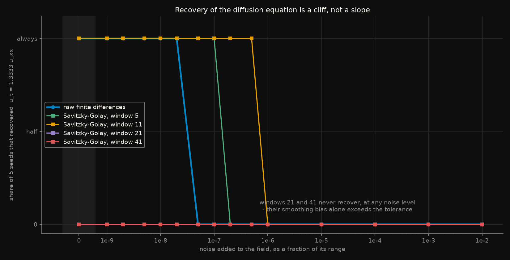
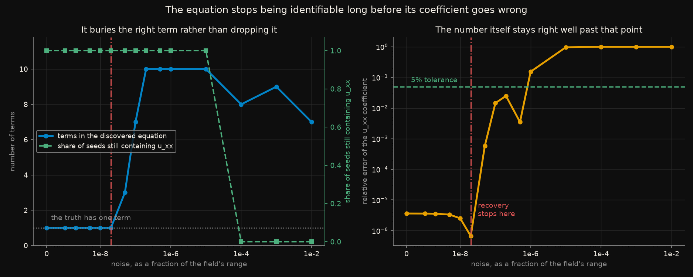
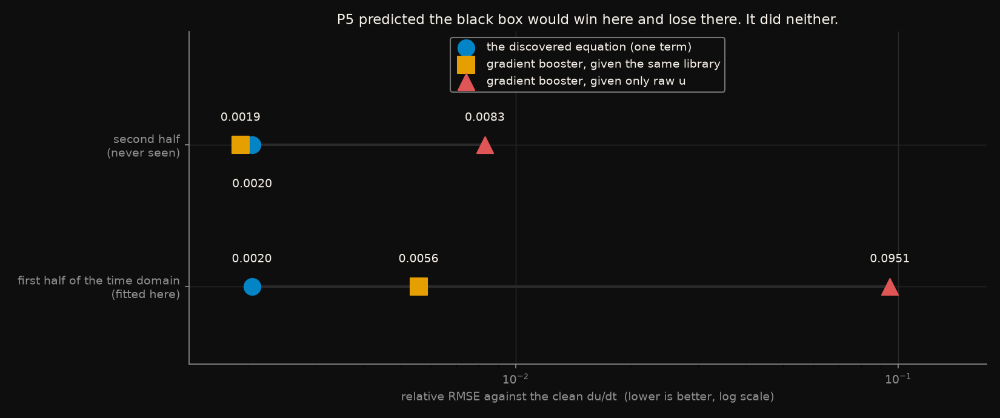

# Symbolic regression rediscovers the equation. Then a rounding error kills it.

Symbolic regression is the part of "symbolic AI" that still wins arguments:
instead of fitting a function you cannot read, it searches a space of
expressions and hands back an equation. Sparse identification (SINDy, and its
PDE form PDE-FIND) is the cheapest version — build a library of candidate
terms, regress the time derivative on it, and throw away every coefficient
that is small.

This repository already contains a field generated by an equation that is
known exactly, so the answer exists before the method runs:

```
dc/dt = D d2c/dx2        D = 4.0e-14 m^2/s,  L = 6.0e-6 m,  T = 1200 s
```

**The question is therefore not whether it works. It is where it stops
working, and what it hands you at the moment it stops.**

Rules frozen in [`CRITERIA.md`](CRITERIA.md) before the library was built.
Five predictions; **four held and one failed**.

## The short version

In the units the method sees, the correct answer is one term with one
coefficient, `D T / L^2`, which is exactly `4/3`. On the clean field:

```
found      u_t = +1.3333 u_xx
truth      u_t = +1.3333 u_xx        relative error 3.6e-06
```

Exact, from 120,900 grid points, with no tuning. Then noise was added to the
field as a fraction of its range:

| noise added | what came back |
|---|---|
| `2e-8` | `u_t = +1.3333 u_xx` |
| `5e-8` | `u_t = +0.0273 u +1.3341 u_xx -0.0466 u*u_xx` |
| `5e-7` | `u_t = -0.0207 1 +1.1658 u +0.5240 u^2 -0.4917 u^3 -0.2448 u_x +1.3278 u_xx +1.4136 u*u_x -2.0263 u*u_xx -1.0537 u^2*u_x +0.3423 (u_x)^2` |

**Between `2e-8` and `5e-8` — a factor of 2.5 — it goes from perfect to
wrong.** That threshold is two parts in a hundred million. For scale, a
measurement good to 1% carries five hundred thousand times more noise than
this method can absorb.

The uncomfortable part is the third row. That ten-term expression still
contains `u_xx` with a coefficient of 1.3278 — **0.4% from the truth**.
Someone who went looking for a diffusion coefficient, and reported the one
they found, would be quoting a number accurate to a fraction of a percent
out of an equation that is nonsense.

## What each figure shows

### Where it stops



*Share of 5 seeds that recovered exactly `u_t = 1.3333 u_xx`, against the
noise added to the field. Blue is raw finite differences; the other lines
smooth the field first. Sigma = 0 is drawn in the shaded strip on the left,
since it has no place on a log axis.*

The transition is a cliff. Raw finite differences recover the equation in
5 of 5 seeds at `sigma = 2e-8` and in 0 of 5 at `5e-8`; there is no noise
level in between where it half-works. **P2 predicted the transition would
span less than one decade. It spans less than half of one.**

Smoothing before differentiating moves the cliff, and then stops helping and
starts hurting. Savitzky-Golay with a window of 11 points buys a factor of 25
in noise tolerance. Windows of 21 and 41 never recover the equation **at any
noise level, including none at all**: at that width the smoothing bias by
itself pushes the answer outside the tolerance. The useful range of the
standard remedy is about one setting wide, and nothing in the output tells
you which side of it you are on.

### What it does when it stops



*Left: how many terms the discovered equation has (blue, left axis) and
whether `u_xx` is still among them (green, right axis). Right: the relative
error of the `u_xx` coefficient. The red line marks where recovery stops.*

These two panels disagree, and that is the finding. **The method does not
lose the right term — it buries it.** At the cliff the term count goes from
1 to 3 and then to 10, while `u_xx` stays in the model in 5 of 5 seeds for
nearly four more decades of noise. **P3 predicted exactly this failure mode**
and it is the one that matters, because it is the one that produces a
publishable-looking wrong answer rather than an obvious one.

The right panel is the trap drawn out: the coefficient stays inside a 5%
tolerance for more than a decade past the point where the equation stopped
being identifiable. A study that reports "we recovered the diffusion
coefficient to within 1%" has reported something true and something
irrelevant at the same time.

### The prediction that failed



*All three models fitted on the first half of the time domain only, then
scored on both halves against the clean `du/dt`. Log scale, so the values
are marked; a bar would have had a meaningless length.*

**P5 failed in both directions.** It predicted the gradient booster would
beat the equation on the data it was fitted on and lose on the data it was
not. Given the same library columns, it did neither: it was **worse** where
it trained (0.0056 against 0.0020) and **tied** where it did not (0.0019
against 0.0020).

The prediction was badly designed, and the figure shows why. Handing a
gradient booster the library columns hands it the answer — `u_xx` is right
there as an input, and all it has to learn is to multiply it by 1.33. The
third row is what a black box on this data actually looks like: given only
the raw five-point stencil of `u`, with no derivatives computed for it, the
same booster is **47 times worse** (0.0951 against 0.0020). A second
difference is a part in ten thousand of the values it is a difference of, and
a tree that splits on those values cannot see it.

The other half of the design was wrong too. 49.4% of the held-out `u` values
are larger than anything in training, so this looked like a real
extrapolation test — but every model does *better* on the later half, because
the flux switches on at `t = 0` and the hard transient is in the training
half. The second half is an easier problem, not an unseen one.

What survives is smaller and still worth having: the equation scores 0.0020
and 0.0020 on the two halves. It is the only one of the three whose error
does not move, because it is the only one that is a law rather than a fit.

## What was predicted, and what happened

| | Prediction, written before the library was built | Outcome |
|---|---|---|
| **P1** | Noiseless data recovers exactly `u_xx`, coefficient within 1% of `4/3` | **passed** - 3.6e-06 |
| **P2** | The failure is a cliff spanning less than one decade of sigma | **passed** - 5/5 at `2e-8`, 0/5 at `5e-8` |
| **P3** | At the cliff it adds spurious terms rather than dropping `u_xx` | **passed** - 1 term to 3, `u_xx` kept in 5/5 |
| **P4** | Smoothing moves the cliff by at least one order of magnitude | **passed at one of four windows** |
| **P5** | The black box wins in-sample and loses out-of-sample | **FAILED** - it lost in-sample and tied out-of-sample |

P1 is the control and the run aborts if it fails.

P4 passed, but narrowly enough to be worth stating precisely: of the four
windows tested, only window 11 moved the cliff a full decade (a factor of
25). Window 5 gained a factor of 5, and windows 21 and 41 destroyed recovery
entirely. `CRITERIA.md` did not pre-specify a window, so the honest reading
is that the prediction holds for one setting out of four and there was no
principled way to have chosen it in advance.

## Full results

Field 801 x 161, trimmed to 120,900 points. Threshold 0.01, 5 seeds,
medians. "Recovered" means the term set is exactly `{u_xx}` **and** the
coefficient is within 5% of `4/3`.

| noise | recovered | still has `u_xx` | median terms | median coefficient error |
|---|---|---|---|---|
| 0 | 5/5 | 5/5 | 1 | 3.6e-06 |
| 1e-9 | 5/5 | 5/5 | 1 | 3.6e-06 |
| 1e-8 | 5/5 | 5/5 | 1 | 2.5e-06 |
| **2e-8** | **5/5** | 5/5 | 1 | 6.6e-07 |
| **5e-8** | **0/5** | 5/5 | 3 | 5.8e-04 |
| 1e-7 | 0/5 | 5/5 | 7 | 0.015 |
| 5e-7 | 0/5 | 5/5 | 10 | 0.0035 |
| 1e-6 | 0/5 | 5/5 | 10 | 0.15 |
| 1e-5 | 0/5 | 5/5 | 10 | 0.96 |
| 1e-4 | 0/5 | **0/5** | 8 | 1.0 |
| 1e-2 | 0/5 | 0/5 | 7 | 1.0 |

Noise tolerance by treatment:

| | cliff | against raw |
|---|---|---|
| raw finite differences | `2e-8` | - |
| Savitzky-Golay, window 5 | `1e-7` | 5x |
| Savitzky-Golay, window 11 | `5e-7` | **25x** |
| Savitzky-Golay, window 21 | never | - |
| Savitzky-Golay, window 41 | never | - |

And by threshold, the one hyperparameter with no principled setting:

| sparsity threshold | cliff |
|---|---|
| 1e-4 | `5e-9` |
| 1e-3 | `1e-8` |
| **1e-2** (reported) | `2e-8` |
| 1e-1 | `1e-7` |

**The reported noise tolerance is a property of that threshold as much as of
the data** — it moves by a factor of 20 across the range swept. A higher
threshold tolerates more noise here only because this equation has one term
and pruning aggressively can only help; on a two-term equation the same
setting would delete the smaller term. There is no free choice available.

## Why the tolerance is so small

It is not the regression. It is the derivatives, and `test_sindy.py`
measures it rather than asserting it. Adding noise of `1e-5` to the field and
comparing each derivative against the clean one:

```
u_x    0.4% relative error
u_xx   190%
u_xxx  2160%
```

Each derivative divides by `dx`, and `dx = 1/160`. The library needs three
orders of it. By the time the third derivative is computed, noise 100,000
times smaller than the signal has become 20 times larger than the quantity
it is supposed to be.

One thing that does *not* break it: storing the field in float32 instead of
float64. The round trip changes the values by up to `3e-8`, larger than the
`2e-8` of random noise that is fatal, and recovery is unaffected. Rounding
error is spatially correlated and differencing mostly cancels it; random
noise is not, and differencing amplifies it. The distinction is the whole
mechanism.

## Reproduce

```bash
pip install -r ../../requirements.txt
python ../../generators/diffusion_1d/generate.py   # the reference field
python run_all.py
```

About three minutes. `run_all.py` checks `config.yaml` against the frozen
values, runs the implementation checks, and stops if either fails.

The six implementation checks are the part worth reading, because a symbolic
regression that returns a plausible equation is very hard to falsify by
inspection. Two of them exist specifically to stop this experiment from
fooling itself:

- **a two-term target must come back as two terms.** Sparsity has to be a
  finding, not a habit. A solver that always returns one term would have
  "confirmed" the diffusion equation for the wrong reason.
- **`u -> 3u + 7` must not move the `u_xx` coefficient.** This is what
  licenses rescaling the concentration to [0, 1], and it is the assumption
  most likely to break silently if the scaling code is ever edited.

## Premises and warnings

**This is simulation output, not a measurement.** The field came from a
Crank-Nicolson solver on a uniform grid with no gaps, no sensor drift and no
missing points. Every number here is an upper bound on what the method would
do with data from an instrument.

**And the upper bound is discouraging.** The tolerance is `2e-8` of the
field's range. Real concentration or temperature measurements are good to
perhaps `1e-2` or `1e-3` — five to six orders of magnitude past the cliff.
Nothing in this experiment suggests sparse identification of this equation
would survive contact with a laboratory, and the smoothing arm shows the
obvious remedy has a useful range about one setting wide. Practitioners use
weak-form and integral formulations for exactly this reason; those are not
tested here, and they are the right next thing to test.

**The equation is unusually kind.** One term, linear, constant coefficient,
no forcing inside the domain. Recovery of a nonlinear or multi-term equation
would be harder in ways this design cannot see, and P3's "it buries the true
term" failure mode may not generalise to a case where several true terms
compete with the spurious ones.

**The library contains the answer.** Eleven candidate terms, one of which is
exactly right. That is the favourable case, and enlarging the library makes
the identification problem harder in a way not measured here.

**Nonlinear library terms are not invariant to the rescaling.** Shifting `u`
by a constant leaves `u_xx` untouched but changes `u`, `u^2` and `u^3`. The
true coefficients on those are zero so the answer is unaffected, but the
*identifiability* of the spurious terms does depend on the choice, and a
different scaling would produce a different wrong equation past the cliff.

**Noise is white and additive.** Correlated noise behaves very differently
under differencing — the float32 result above is a small demonstration of
exactly that — and real sensor noise is rarely white.

**Recovery is defined strictly.** Exact term set and a coefficient within 5%.
A looser definition would move every cliff in this README to the right. The
definition was frozen before the run and the raw coefficients are in
`outputs/sweep.csv` for anyone who wants to apply a different one.

## Deviations from the pre-registration

`CRITERIA.md` was not edited after freezing.

**The sigma grid was refined.** CRITERIA froze one level per decade, and P2
asks whether the transition is narrower than a decade — which one point per
decade cannot answer. All eight frozen levels are still in the grid;
intermediate 2x and 5x points were added around the transition. `run_all.py`
checks that none of the frozen levels went missing.

**The threshold normalisation was underspecified.** CRITERIA says the
threshold is applied to coefficients "normalised by column scale". It is
implemented as normalising the columns *and* the target to unit norm, so that
the threshold is dimensionless and 0.01 means "this term moves the target by
less than 1% of its norm". Without normalising the target too, the threshold
would have been compared against coefficients carrying the units of `du/dt`.
Decided at implementation time, before any result was seen.

**One bug, caught because the smoothing arm failed on noiseless data.** The
first version trimmed only `n_edge = 3` points from each side of the domain
regardless of the smoothing window. Savitzky-Golay pads at the edges, so a
band of `window // 2` points is a polynomial fit to invented data — and with
window 11 that band survived into the regression. The result was that
smoothing appeared to destroy recovery even with no noise at all, producing
a five-term equation from a clean field. It looked like a finding about
over-smoothing. It was a finding about the trim. The trim is now widened to
cover the window, and windows 5 and 11 recover the equation cleanly.

The lesson is the one this repository keeps re-learning: the check that
caught it was running the noiseless case through every arm, where the answer
was already known.

**Arm D gained a third model after P5 failed.** CRITERIA specifies only a
gradient booster on the library columns. The raw-stencil arm was added after
seeing that comparison come out flat, to find out why. It is reported as
what it is — an explanation of a failed prediction, not a rescue of it. P5
is scored on the arm that was pre-registered, and it failed.
