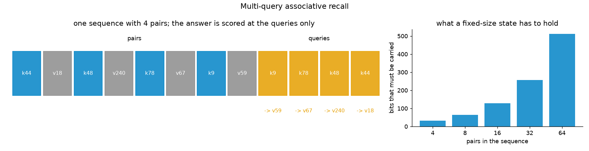

# associative_recall

Sequences of key-value pairs followed by every key again, where the task
is to answer each key with its value. The plainest test of whether a
sequence model can carry arbitrary facts from where they are stated to
where they are asked for.

```
k1 v1  k2 v2  ...  kN vN   q1 q2 ... qN          q = the same keys, reshuffled
                           ^  ^      ^
                           answer: the value that followed q_i above
```

This is *multi-query associative recall* (MQAR) from Arora et al. (2023),
"Zoology: Measuring and Improving Recall in Efficient Language Models", in
its simplest form.

| | |
|---|---|
| keys | 256 tokens, ids 0-255; distinct within a sequence |
| values | 256 tokens, ids 256-511; drawn independently, so two keys may share a value |
| queries | the same N keys, in a fresh random order |
| scored | the query positions only; every other target is `-1` |
| pair counts | 4, 8, 16, 32, 64 - sequences of 12 to 192 tokens |

**Nothing about the pairing can be learned.** It is random in every
sequence. A model can only do well by remembering what *this* sequence
said - which is the point. A model that keeps every token, as attention
does, can look the answer up. A model that reads the sequence into a
fixed-size state has to fit `N` bindings - `8N` bits, since each value is
one of 256 - into that state before the queries arrive.



## Checks against the task's own definition

Run on every generation and reported to stdout:

```
oracle (look-up in the sequence's own first half): 1.000 at every pair count
keys distinct within every sequence: True; queries a permutation of them: True
shortcuts, fitted on 200,000 fresh sequences, scored on 124,000 test queries (chance 0.0039):
  best fixed key -> value table        0.0039   (binomial p vs chance 0.84)
  best fixed position -> value table   0.0040   (binomial p vs chance 0.47)
values uniform: chi-square p = 0.26
```

1. **Well posed.** A lookup table built from each sequence's own first half
   answers every query.
2. **Distinct keys, complete queries.** No key repeats within a sequence,
   so every query has exactly one right answer; the queries are a
   permutation of the keys, so every pair is asked for.
3. **No shortcut.** The best *fixed* table from key to value, and from
   query position to value, are fitted on 200,000 fresh sequences and scored
   on the test sets. Both score chance. A model above chance is using the
   sequence, not a regularity of the generator.
4. **Uniform values.** Chi-square on the test sets' answers.

## Usage

```bash
python generate.py                        # the defaults above
python generate.py --pair_counts 4 16 64  # any field of RecallParams
```

Outputs, in `outputs/`:

- `recall_test.npz` - `tokens_{N}` and `targets_{N}` (1,000 x 3N, int16)
  for each pair count, and `pair_counts`. The fixed test sets.
- `recall_params.json` - the parameters, the bits each pair count requires,
  and the check results.
- `recall_overview.png` - the figure above.

Training data is not stored: it is drawn on the fly from `sample()`, which
experiments import.

## Reuse in an experiment

```python
import sys, numpy as np
sys.path.insert(0, "generators/associative_recall")
from generate import sample

tokens, targets = sample(np.random.default_rng([seed, 1, run]), 64, n_pairs=16)
```

The test sets were drawn from the stream `default_rng([seed, 0, N])`.
Training streams should use a second seed word other than 0 - and 2, which
the shortcut check uses - so the two can never coincide.

Used by [`experiments/ssm-vs-attention-recall`](../../experiments/ssm-vs-attention-recall/).
