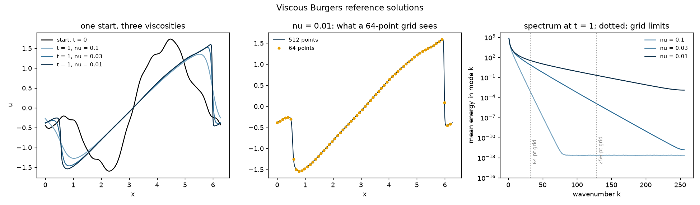

# burgers_1d

Viscous Burgers' equation on a periodic line: random smooth starts, solved
to a fixed time, at three viscosities that turn the solution's fine-scale
detail up by a dial.

```
u_t + u u_x = nu u_xx          x in [0, 2 pi), periodic,  t from 0 to 1
```

The nonlinear term `u u_x` steepens every downhill slope into a front;
viscosity `nu` smears it back out, to a width of about `4 nu / (jump in u)`.
It is the simplest equation with both, and the standard first test for
neural operators.

| `nu` | what the solution at `t = 1` looks like |
|---|---|
| 0.1 | broad, smooth fronts; any reasonable grid holds them |
| 0.03 | fronts about one cell of a 64-point grid wide |
| 0.01 | fronts much narrower than one cell of a 64-point grid |



**The starts are band-limited on purpose.** Each uses Fourier modes 1 to 16
only, amplitude falling as `k^-2`, zero mean, normalised to RMS 1. A grid of
64 points samples every one of them exactly. Whatever fine structure the
solution has at `t = 1` was made by the equation, not put there by the
start - so a model that is shown the start on 64 points has been shown
everything there is to know about it.

## Method

Pseudo-spectral in space on 2,048 points with the 2/3 dealiasing rule;
fourth-order exponential time differencing in time (ETDRK4, Kassam &
Trefethen 2005), which integrates the stiff diffusion exactly and the
nonlinear term to fourth order, step `5e-4`. Stored on every fourth point,
512, which nests the 256-, 128- and 64-point grids exactly: a coarser grid
is a subsample, never an interpolation.

## Three checks against known results

Run on every generation and reported to stdout:

```
nu = 0.1    exact (Hopf) solution, 24 starts: max |error| 3.8e-12  (2.9e-12 of max |u|)
           mass drift 1.7e-16   energy law: max |dE/dt + nu int u_x^2| 4.0e-05 (law RMS 1.37)
nu = 0.03   exact (Hopf) solution, 24 starts: max |error| 1.2e-09  (8.4e-10 of max |u|)
           mass drift 2.2e-16   energy law: max |dE/dt + nu int u_x^2| 2.2e-05 (law RMS 1.20)
nu = 0.01   exact (Hopf) solution, 24 starts: max |error| 1.1e-06  (7.4e-07 of max |u|)
           mass drift 2.2e-16   energy law: max |dE/dt + nu int u_x^2| 1.9e-04 (law RMS 1.23)
```

1. **The exact solution.** The Cole-Hopf transform `u = -2 nu (log phi)_x`
   turns Burgers into the heat equation, which gives `u(x, t)` in closed
   form as a ratio of two integrals (the Hopf formula). It is evaluated by
   quadrature over three periods, with the exponent shifted by its maximum
   before exponentiating - at `nu = 0.01` it spans hundreds of units, and
   the textbook form overflows. Compared with the solver point by point on
   24 starts per viscosity, on the stored grid.
2. **Mass.** The mean of `u` is conserved exactly by the equation.
3. **The energy law.** `d/dt (1/2) int u^2 = -nu int u_x^2`: the nonlinear
   term moves energy between scales and viscosity removes it. Checked at
   every step on 32 starts, with `dE/dt` from finite differences.

The error against the exact solution grows as the viscosity falls - the
fronts get narrower and the 2,048-point solver grid holds less of them - but
at `nu = 0.01` it is still a millionth of the solution's size. Mass is
conserved to rounding, and the energy law holds to the finite-difference
error of measuring `dE/dt`, four orders of magnitude below the signal.

The generator also reports how much of each solution's energy lies above
the highest wavenumber each grid can hold - a grid of `n` points holds
wavenumbers up to `n/2`:

```
energy share above the highest mode a grid holds
            64-pt     128-pt    256-pt    512-pt
nu = 0.1    1.8e-08   4.2e-15   4.5e-28   5.2e-32
nu = 0.03   5.4e-04   5.9e-06   1.0e-09   5.5e-17
nu = 0.01   5.6e-03   9.8e-04   4.7e-05   1.5e-07
```

## Usage

```bash
python generate.py                              # the defaults above
python generate.py --viscosities 0.05 0.005     # any field of BurgersParams
```

About forty minutes on a laptop CPU, nearly all of it the solver. At
smaller viscosities raise `--n_fine` as well: the exact-solution check will
say when the grid stops resolving the fronts.

Outputs, in `outputs/`:

- `burgers.npz` - `x` (512,), `u0` (1200, 512), `viscosities`, and
  `uT_nu{nu}` (1200, 512) for each viscosity. Float32.
- `burgers_params.json` - the parameters, the check results and the
  spectral tails.
- `burgers_overview.png` - the figure above.

## Reuse in an experiment

```python
import numpy as np
z = np.load("generators/burgers_1d/outputs/burgers.npz")
u0, uT = z["u0"], z["uT_nu0.01"]              # (1200, 512)
u0_64, uT_64 = u0[:, ::8], uT[:, ::8]         # the same data on 64 points
```

Used by [`experiments/fno-super-resolution`](../../experiments/fno-super-resolution/).
