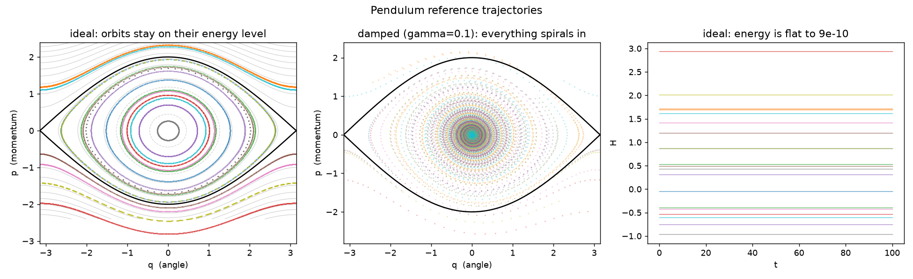

# hamiltonian_pendulum

Reference trajectories of a pendulum, in two versions: one that conserves
energy exactly and one that loses it at a known rate.

```
H(q, p) = p^2 / 2  -  cos(q)            energy

dq/dt =  dH/dp =  p                     ideal
dp/dt = -dH/dq = -sin(q)

dp/dt = -sin(q) - gamma * p             damped, gamma = 0.1
```

Units are chosen so mass, length and gravity are all 1, which makes the
small-swing period exactly `2 pi`.

| Symbol | Meaning |
|---|---|
| `q` | angle from the bottom, in radians |
| `p` | angular momentum |
| `H` | total energy; conserved by the ideal system, lost by the damped one at `dH/dt = -gamma p^2` |

**Energy sorts the motion into two kinds.** Below `H = 1` the pendulum swings
back and forth (libration). Above `H = 1` it goes over the top (rotation).
`H = 1` itself is the *separatrix*, the orbit of a pendulum balanced exactly
at the top, which takes infinitely long to fall. Initial conditions are drawn
from a box in phase space that covers all three: with the defaults, 119
trajectories librate and 81 rotate.

**The damped system is not Hamiltonian.** No scalar function generates the
vector field `(p, -sin q - gamma p)`, because it has non-zero divergence:
phase-space volume shrinks. It is here so that an architecture which builds
conservation in can be tested on a system that does not conserve.



## Method

Classical fourth-order Runge-Kutta with a fixed step `dt = 0.01`, integrated
to `t = 100` (about sixteen small-swing periods). RK4 is not symplectic, and
that is deliberate: the experiments that consume this data integrate their
*learned* vector fields with the same RK4 at the same step, so any energy
drift they show belongs to the learned field and not to a mismatch of
integrators. At this step the reference itself conserves energy to about
`1e-9` over the whole horizon.

Every state in ten is stored, in float32, so the two files together are
about 6.5 MB instead of 140. The physics checks run on every step before the
thinning.

## Three checks against known physics

Run on every generation and reported to stdout:

```
ideal:  max |H(t) - H(0)| = 9.25e-10
        period from rest at 0.5 rad: measured 6.382857, exact 6.382790,
        rel. error 1.1e-05
damped: max |dH/dt + gamma p^2| = 2.17e-05  (law RMS 0.052)
```

1. **Energy conservation.** For the ideal system, `|H(t) - H(0)|` over all
   trajectories and all steps.
2. **The period.** One trajectory is released from rest at 0.5 radians. Its
   period, measured from zero crossings, is compared with the exact value
   `2 pi (1 + theta0^2/16 + 11 theta0^4/3072 + ...)`, the series expansion of
   the complete elliptic integral. This is the check that would catch a wrong
   sign or a wrong factor in the equations: a pendulum with the wrong
   restoring force has the wrong period.
3. **The damping law.** For the damped system, `dH/dt` from finite
   differences against `-gamma p^2` pointwise. The residual is the truncation
   error of `np.gradient`, three orders of magnitude below the signal.

## Usage

```bash
python generate.py                          # the defaults below
python generate.py --gamma_damped 0.3       # any field of PendulumParams
```

Outputs, in `outputs/`:

- `pendulum_ideal.npz`, `pendulum_damped.npz` - `t` (T,), `q`, `p`, `dq`,
  `dp`, `H` (T, N), the initial conditions `q0`, `p0` (N,), `gamma`, and
  every generation parameter. `dq` and `dp` are the **exact** time
  derivatives evaluated at the stored states, not finite differences, so a
  model trained on them is trained on the vector field itself.
- `pendulum_params.json` - the parameters, the physics-check results, the
  energy range and the libration/rotation split.
- `pendulum_overview.png` - the figure above.

## Reuse in an experiment

```python
import numpy as np
z = np.load("generators/hamiltonian_pendulum/outputs/pendulum_ideal.npz")
q, p, dq, dp, H = z["q"], z["p"], z["dq"], z["dp"], z["H"]     # (T, N)
```

Used by [`experiments/hnn-energy-conservation`](../../experiments/hnn-energy-conservation/).
