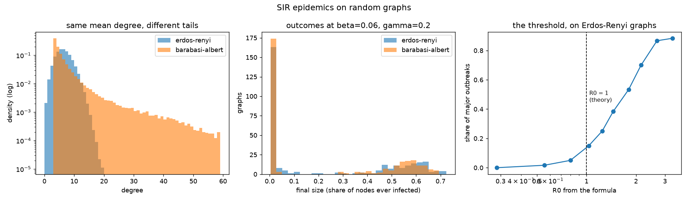

# sir_on_graph

Epidemics on random graphs, simulated exactly, with a threshold that theory
predicts and the generator checks.

## The process

Discrete-time SIR. Every node is susceptible, infected or recovered. Each
step, every infected node passes the infection to each susceptible neighbour
independently with probability `beta`, then recovers with probability
`gamma`. Recovered nodes are immune. One node is infected at the start,
chosen at random; the run ends when nobody is infected.

Two graph families, **same mean degree (6), very different shape**:

| Family | How it is built | Degrees |
|---|---|---|
| Erdős–Rényi | every pair connected with probability `<k> / (n-1)` | tightly clustered around 6; the largest is about 14 |
| Barabási–Albert | grown by preferential attachment, 3 edges per new node | a heavy tail; the largest is about 52 |



## The known result

On a random graph, SIR is bond percolation. The probability that an infected
node passes the disease across a given edge before recovering - the
*transmissibility* - is, for a geometric infectious period,

```
T = 1 - gamma (1 - beta) / (1 - (1 - gamma)(1 - beta))
```

and the epidemic threshold is (Newman, *Phys. Rev. E* 66, 2002)

```
R0 = T * (<k^2> - <k>) / <k>           a major outbreak needs R0 > 1
```

The second moment `<k^2>` is what separates the two families. Hubs raise it,
so at the same `beta` and `gamma` the Barabási–Albert graphs sit at
`R0 = 2.67` while the Erdős–Rényi graphs sit at `1.44`. That is the
structural fact an experiment on these graphs is about: **the same disease
on the same number of people with the same average number of contacts
behaves differently, because of who is connected to whom.**

## The check against theory

`check_threshold` sweeps `beta` on Erdős–Rényi graphs, 60 graphs per value,
and counts major outbreaks - those reaching at least 10% of the nodes:

```
beta 0.01  R0  0.28  major   0%
beta 0.02  R0  0.55  major   2%
beta 0.03  R0  0.80  major   5%   ##
beta 0.04  R0  1.03  major  15%   ######
beta 0.05  R0  1.25  major  25%   ##########
beta 0.06  R0  1.45  major  38%   ###############
beta 0.08  R0  1.80  major  53%   #####################
beta 0.10  R0  2.15  major  70%   ############################
beta 0.14  R0  2.68  major  87%   ##################################
beta 0.20  R0  3.33  major  88%   ###################################
PASS: rare below R0 = 0.6, common above R0 = 2
```

The transition sits where the formula puts it. On a graph of 300 nodes it is
smeared rather than sharp, so the check asserts the two ends and the
ordering, not a crossing point. A simulator with a bug in the transmission
step - the wrong exponent in `(1 - beta)^count`, say - would pass a smoke
test and fail this.

**Why not every run is an outbreak.** With `R0 > 1` an epidemic *can* take
off, not *must*: a single seed can recover before infecting anyone. At the
default `beta = 0.06` about 41% of runs in each family become major
outbreaks and the rest fizzle within a few nodes. Both outcomes are stored;
an experiment that wants only the outbreaks filters on `graph_final_size`.

## Usage

```bash
python generate.py                    # the defaults below
python generate.py --beta 0.10        # any field of SIRParams
```

Defaults: 300 nodes, mean degree 6, 300 graphs per family, `beta = 0.06`,
`gamma = 0.2`. About seven seconds. Deterministic given the seed.

Outputs, in `outputs/`:

- `sir_erdos_renyi.npz`, `sir_barabasi_albert.npz`:
  - `edges` (E, 2) and `edge_graph` (E,) - every edge of every graph, with
    the graph it belongs to
  - `node_graph`, `node_node`, `node_degree`, `node_is_seed`,
    `node_infected`, `node_t_infected` - one entry per node per graph;
    `node_t_infected` is the step at which it caught the disease, or -1
  - `graph_n_edges`, `graph_seed_node`, `graph_final_size`, `graph_R0`,
    `graph_mean_degree`, `graph_max_degree` - one entry per graph
- `sir_params.json` - the parameters, the threshold sweep, and per-family
  summaries
- `sir_overview.png` - the figure above

## Reuse in an experiment

```python
import numpy as np
z = np.load("generators/sir_on_graph/outputs/sir_erdos_renyi.npz")
g = 17
edges = z["edges"][z["edge_graph"] == g]              # (E_g, 2)
infected = z["node_infected"][z["node_graph"] == g]   # (300,) bool
seed = z["graph_seed_node"][g]
```

Used by [`experiments/gnn-epidemic-structure`](../../experiments/gnn-epidemic-structure/).
